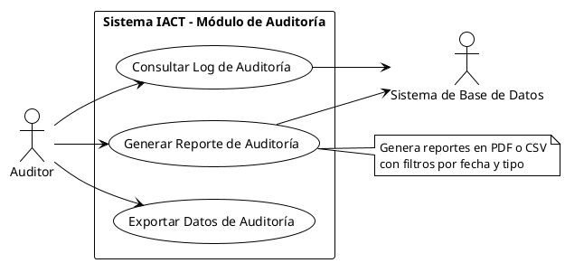
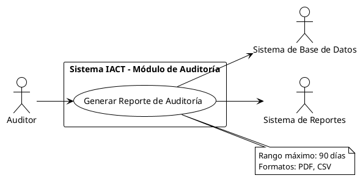
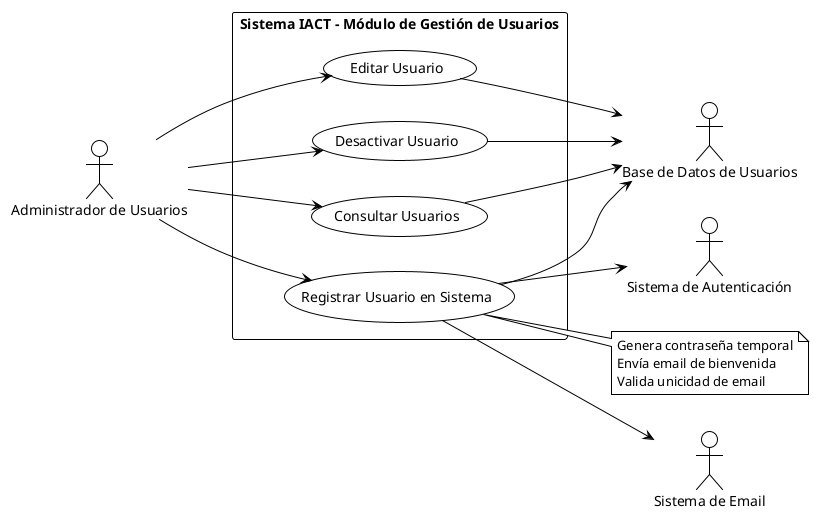

# PROCED-GOB-004: Crear Caso de Uso

## Objetivo

Crear una especificación completa de caso de uso siguiendo el formato de dos columnas (Actor | Sistema) establecido en ADR-GOB-007, con nomenclatura VERBO+OBJETO, trazabilidad completa y diagrama UML complementario.

## Pre-requisitos

Antes de comenzar este procedimiento, debe:

- Haber leído ADR-GOB-005 (Jerarquía de Requerimientos)
- Haber leído ADR-GOB-007 (Especificación de Casos de Uso)
- Haber leído ADR-GOB-008 (Diagramas UML de Casos de Uso)
- Tener identificadas las Reglas de Negocio (RN) relacionadas
- Tener acceso al repositorio del proyecto
- Conocer el dominio al que pertenece el caso de uso

## Resultado Esperado

Al completar este procedimiento tendrá:

- Una especificación completa de caso de uso en formato markdown
- Nombre siguiendo patrón VERBO+OBJETO
- ID único asignado (UC-DOMINIO-###)
- Flujo normal en formato dos columnas
- Flujos alternos y excepciones documentados
- Trazabilidad con RN, RNEG, RF, RNF
- Diagrama UML complementario (opcional pero recomendado)
- Commit en git

## PASO 1: Identificar Actor Primario y Objetivo

### Objetivo del Paso

Determinar quién ejecuta el caso de uso y qué objetivo de valor busca lograr.

### Conceptos Clave

**Actor Primario**:
- Persona, sistema o dispositivo que EJECUTA el caso de uso
- Tiene un objetivo que se cumple mediante el caso de uso
- Es quien DISPARA la interacción

**Actor Secundario**:
- Proporciona servicio o información al sistema
- Soporte, no ejecuta el caso de uso
- Sistema externo, base de datos, otro usuario

**Objetivo de Valor**:
- Resultado que el actor primario busca lograr
- Debe ser observable y medible
- Agrega valor al negocio o al usuario

### Preguntas Guía

1. ¿Quién interactúa con el sistema para lograr algo?
2. ¿Qué quiere lograr esa persona/sistema?
3. ¿Qué otros actores proporcionan soporte?
4. ¿El objetivo agrega valor medible?

### Ejemplos

#### Ejemplo 1: Sistema de Auditoría
```
Actor Primario: Auditor
Objetivo: Generar reporte de transacciones para cumplir con auditoría trimestral
Actores Secundarios: Sistema de Base de Datos, Sistema de Reportes
```

#### Ejemplo 2: Sistema de Laboratorio
```
Actor Primario: Solicitante (investigador, técnico de laboratorio)
Objetivo: Solicitar producto químico para experimento
Actores Secundarios: Comprador, Sistema de Inventario
```

#### Ejemplo 3: Sistema de Autenticación
```
Actor Primario: Usuario
Objetivo: Iniciar sesión para acceder al sistema
Actores Secundarios: Sistema de Autenticación LDAP, Base de Datos de Usuarios
```

### Validación

- [ ] Actor primario identificado (persona, rol o sistema)
- [ ] Objetivo claro y medible
- [ ] Actores secundarios identificados (0 o más)
- [ ] El objetivo agrega valor al actor primario

## PASO 2: Nombrar con Patrón VERBO+OBJETO

### Objetivo del Paso

Crear un nombre que siga la nomenclatura obligatoria VERBO+OBJETO.

### Patrón de Nomenclatura

```
VERBO + OBJETO
```

O equivalentemente:

```
ACCIÓN + OBJETO
```

### Reglas

1. **Verbo**: Acción que el usuario realiza (infinitivo)
2. **Objeto**: Sobre qué actúa la acción
3. **Sin artículos**: "Registrar Vuelo" NO "Registrar el Vuelo"
4. **Singular o Plural**: Según contexto ("Imprimir Pases" está bien)
5. **Capitalizar palabras**: Cada palabra con mayúscula inicial

### Proceso de Generación

1. Identificar la acción principal del objetivo
2. Identificar el objeto sobre el que actúa
3. Combinar en formato VERBO+OBJETO
4. Validar que no incluya sujeto

### Ejemplos Correctos

**Sistema de Aeropuerto**:
- Registrar Vuelo
- Imprimir Pases de Abordar
- Cambiar Asientos
- Registrar Equipaje
- Comprar Actualización de Asiento

**Sistema de Punto de Venta**:
- Procesar Venta
- Aplicar Descuento
- Registrar Pago
- Generar Factura
- Consultar Inventario

**Sistema IACT**:
- Iniciar Sesión
- Gestionar Permisos
- Cambiar Contraseña
- Solicitar Producto Químico
- Generar Reporte de Auditoría

### Ejemplos INCORRECTOS y Corrección

| Incorrecto | Problema | Correcto |
|---|---|---|
| Login | No es verbo+objeto | Iniciar Sesión |
| El usuario inicia sesión | Incluye sujeto | Iniciar Sesión |
| Sistema de autenticación | No es acción | Autenticar Usuario |
| Autenticarse | Solo verbo, falta objeto | Autenticar Usuario |
| Guardar | Solo verbo | Guardar Documento |

### Validación

- [ ] Formato VERBO+OBJETO
- [ ] Sin artículos (el, la, los, las)
- [ ] Sin sujeto (usuario, sistema)
- [ ] Capitalización correcta
- [ ] Descriptivo del objetivo

## PASO 3: Asignar ID Único

### Objetivo del Paso

Generar un identificador único que no se reutilizará nunca.

### Patrón de Nomenclatura de Archivo

```
UC-DOMINIO-###-verbo-objeto.md
```

Donde:
- **UC**: Use Case
- **DOMINIO**: BACK | FRONT | DEVOPS | QA | AI | GOB
- **###**: Número secuencial 001-999
- **verbo-objeto**: En snake_case (minúsculas con guiones)

### Acciones

1. Identificar último número usado en el dominio:

```bash
ls docs/gobernanza/requisitos/requerimientos_usuario/casos_uso/UC-BACK-*.md | sort | tail -1
# Ejemplo salida: UC-BACK-009-cambiar-contrasena.md
# Siguiente número: 010
```

2. Convertir nombre VERBO+OBJETO a snake_case:
   - "Generar Reporte de Auditoría" → "generar-reporte-auditoria"
   - Minúsculas
   - Guiones en lugar de espacios
   - Sin acentos (ó → o, í → i)

3. Formar ID completo

### Ejemplos de IDs Correctos

```
UC-BACK-001-iniciar-sesion.md
UC-BACK-010-gestionar-permisos.md
UC-BACK-015-solicitar-producto-quimico.md
UC-FRONT-001-registrar-vuelo.md
UC-BACK-020-generar-reporte-auditoria.md
```

### Validación

- [ ] ID no existe previamente
- [ ] Número es consecutivo al último del dominio
- [ ] verbo-objeto en snake_case (minúsculas, guiones)
- [ ] Formato correcto: UC-DOMINIO-###-verbo-objeto.md

## PASO 4: Identificar Precondiciones

### Objetivo del Paso

Determinar qué condiciones deben ser verdaderas ANTES de que el caso de uso pueda iniciar.

### Conceptos Clave

**Precondición**:
- Estado que debe existir antes de iniciar el caso de uso
- NO es parte del caso de uso
- Puede haber 0 o más precondiciones (no son obligatorias)

**NO son precondiciones**:
- Pasos del caso de uso
- Acciones del actor
- Resultados del caso de uso

### Preguntas Guía

1. ¿Qué debe existir antes de iniciar?
2. ¿En qué estado debe estar el sistema?
3. ¿Qué permisos/autorizaciones se requieren?
4. ¿Qué datos deben estar disponibles?

### Ejemplos de Precondiciones Válidas

```markdown
## Precondiciones

- El usuario debe estar autenticado en el sistema
- Debe existir al menos un producto en el catálogo
- El usuario debe tener rol de "Administrador"
- La base de datos debe estar disponible
- El módulo de reportes debe estar configurado
```

### Ejemplos de NO Precondiciones

```markdown
## NO son Precondiciones

- El usuario inicia sesión (esto es parte del flujo)
- El sistema valida credenciales (esto es paso del caso de uso)
- Se genera un token (esto es resultado)
```

### Casos Sin Precondiciones

Es válido no tener precondiciones:

```markdown
## Precondiciones

Ninguna. Este caso de uso puede ejecutarse en cualquier momento.
```

### Validación

- [ ] Precondiciones son estados previos, no acciones
- [ ] Precondiciones son verificables
- [ ] Si no hay precondiciones, documentar explícitamente "Ninguna"

## PASO 5: Escribir Flujo Normal en Formato Dos Columnas

### Objetivo del Paso

Documentar el camino feliz (happy path) usando formato de dos columnas que separa claramente Actor y Sistema.

### Formato de Dos Columnas

```markdown
## Flujo Normal (Happy Path)

| ACCIONES DEL ACTOR | RESPONSABILIDADES DEL SISTEMA |
|---|---|
| [Paso del actor] | [Pasos del sistema] |
```

### Reglas de Escritura

1. **Numerar pasos secuencialmente**: 1, 2, 3, ...
2. **Un paso = una acción concreta**: No "el sistema hace A, B, C y D" en un paso
3. **Separar claramente**: Actor en columna izquierda, Sistema en columna derecha
4. **Perspectiva del usuario**: Describir comportamiento observable
5. **Principio QUÉ vs CÓMO**: Describir QUÉ hace el sistema, NO CÓMO lo hace

### Plantilla de Inicio

```markdown
| ACCIONES DEL ACTOR | RESPONSABILIDADES DEL SISTEMA |
|---|---|
| 1. El [actor] [acción inicial] | |
| 2. El [actor] [proporciona información] | 3. El sistema [valida información]<br>4. El sistema [procesa información] |
| 5. El [actor] [confirma acción] | 6. El sistema [ejecuta acción]<br>7. El sistema [muestra resultado] |
```

### Ejemplo Completo: UC-BACK-020 Generar Reporte de Auditoría

```markdown
## Flujo Normal (Happy Path)

| ACCIONES DEL ACTOR | RESPONSABILIDADES DEL SISTEMA |
|---|---|
| 1. El Auditor accede al módulo de reportes | 2. El sistema muestra opciones de reportes disponibles |
| 3. El Auditor selecciona "Reporte de Auditoría" | 4. El sistema muestra formulario con filtros (fecha inicio, fecha fin, tipo de transacción) |
| 5. El Auditor ingresa rango de fechas y selecciona tipo de transacción | 6. El sistema valida que fecha inicio < fecha fin<br>7. El sistema valida que rango no exceda 90 días |
| 8. El Auditor hace clic en "Generar Reporte" | 9. El sistema consulta transacciones en el rango especificado<br>10. El sistema genera reporte en formato PDF<br>11. El sistema muestra vista previa del reporte |
| 12. El Auditor revisa el reporte | |
| 13. El Auditor hace clic en "Descargar" | 14. El sistema descarga el archivo PDF<br>15. El sistema registra la generación del reporte en log de auditoría |
```

### Principio QUÉ vs CÓMO

**CORRECTO (QUÉ)**:
```
4. El sistema valida credenciales
9. El sistema consulta transacciones
14. El sistema genera reporte
```

**INCORRECTO (CÓMO)**:
```
4. El sistema ejecuta SELECT * FROM users WHERE username=? AND password_hash=SHA256(?)
9. El sistema hace query a PostgreSQL con índice btree en fecha_transaccion
14. El sistema usa biblioteca PDFKit para generar reporte con fuente Arial 12pt
```

### Validación

- [ ] Pasos numerados secuencialmente
- [ ] Separación clara entre actor y sistema
- [ ] Un paso = una acción concreta
- [ ] Describe QUÉ, no CÓMO
- [ ] Comportamiento observable por el usuario
- [ ] Flujo lleva a un resultado exitoso

## PASO 6: Identificar Flujos Alternos y Excepciones

### Objetivo del Paso

Documentar caminos alternativos válidos (flujos alternos) y situaciones de error (excepciones).

### Diferencia entre Flujos Alternos y Excepciones

| Aspecto | Flujo Alterno | Excepción |
|---|---|---|
| Resultado | Éxito (puede haber postcondición diferente) | Error o fallo |
| Validez | Camino válido | Situación anormal |
| Ejemplo | "Pago con tarjeta" vs "Pago en efectivo" | "Tarjeta rechazada" |

### Formato de Flujo Alterno

```markdown
## Flujos Alternos

### Flujo Alterno #.#: [Nombre descriptivo]

**Punto de entrada**: Después del paso # del flujo normal

**Condición**: [Qué condición dispara este flujo alterno]

**Pasos**:
- #.#.1 [Paso 1]
- #.#.2 [Paso 2]
- ...

**Punto de retorno**: [Paso al que regresa, o "El caso de uso termina"]
```

### Formato de Excepción

```markdown
## Excepciones

### Excepción #.#: [Nombre de la excepción]

**Punto de entrada**: Durante el paso #

**Condición**: [Condición de error]

**Pasos**:
- #.#.1 [Paso de manejo de error]
- #.#.2 [...]

**Resultado**: [El caso de uso termina | Regresa a paso #]
```

### Ejemplo: UC-BACK-020 Generar Reporte de Auditoría

```markdown
## Flujos Alternos

### Flujo Alterno 13.1: Auditor Exporta a CSV en Lugar de PDF

**Punto de entrada**: Después del paso 11 del flujo normal (vista previa mostrada)

**Condición**: El Auditor requiere formato CSV para análisis en Excel

**Pasos**:
- 13.1.1 El Auditor selecciona "Exportar a CSV" en menú de opciones
- 13.1.2 El sistema genera reporte en formato CSV
- 13.1.3 El sistema descarga el archivo CSV
- 13.1.4 El sistema registra la generación del reporte en log de auditoría

**Punto de retorno**: El caso de uso termina

### Flujo Alterno 5.1: Sin Transacciones en Rango Seleccionado

**Punto de entrada**: Después del paso 7 del flujo normal (validación de rango)

**Condición**: No existen transacciones en el rango de fechas especificado

**Pasos**:
- 5.1.1 El sistema consulta transacciones y obtiene resultado vacío
- 5.1.2 El sistema muestra mensaje "No se encontraron transacciones en el rango seleccionado"
- 5.1.3 El Auditor puede ajustar filtros o cancelar

**Punto de retorno**: Regresa al paso 4 (formulario con filtros) o el caso de uso termina

## Excepciones

### Excepción 7.1: Rango de Fechas Excede 90 Días

**Punto de entrada**: Durante el paso 7 del flujo normal

**Condición**: El rango entre fecha inicio y fecha fin es mayor a 90 días

**Pasos**:
- 7.1.1 El sistema detecta que rango > 90 días
- 7.1.2 El sistema muestra mensaje de error "El rango de fechas no puede exceder 90 días. Por favor ajuste las fechas."
- 7.1.3 El Auditor debe ajustar las fechas

**Resultado**: Regresa al paso 4 (formulario con filtros)

### Excepción 9.1: Error de Conexión a Base de Datos

**Punto de entrada**: Durante el paso 9 del flujo normal

**Condición**: El sistema no puede conectarse a la base de datos

**Pasos**:
- 9.1.1 El sistema detecta error de conexión
- 9.1.2 El sistema registra el error en log del sistema
- 9.1.3 El sistema muestra mensaje "Error al generar reporte. Por favor intente nuevamente o contacte a soporte técnico."
- 9.1.4 El Auditor puede reintentar o cancelar

**Resultado**: El caso de uso termina
```

### Preguntas para Identificar Flujos Alternos

1. ¿Hay diferentes formas de lograr el mismo objetivo?
2. ¿Hay opciones que el usuario puede elegir?
3. ¿Qué pasa si ciertos datos no están disponibles pero el caso de uso puede continuar?

### Preguntas para Identificar Excepciones

1. ¿Qué puede salir mal en cada paso?
2. ¿Qué validaciones pueden fallar?
3. ¿Qué errores de sistema pueden ocurrir?
4. ¿Qué pasa si un servicio externo no responde?

### Validación

- [ ] Al menos 1 flujo alterno o 1 excepción identificado
- [ ] Punto de entrada claro para cada flujo/excepción
- [ ] Condición de activación especificada
- [ ] Punto de retorno o terminación especificado
- [ ] Diferencia clara entre alternos (éxito) y excepciones (error)

## PASO 7: Listar Reglas de Negocio Relacionadas

### Objetivo del Paso

Establecer trazabilidad con Reglas de Negocio (RN) que influyen en este caso de uso.

### Preguntas Guía

1. ¿Qué reglas de negocio restringen este caso de uso?
2. ¿Qué políticas debe cumplir este caso de uso?
3. ¿Hay regulaciones externas que aplican?
4. ¿Qué hechos del negocio son relevantes?
5. ¿Hay desencadenadores que se activan en este caso de uso?

### Formato

```markdown
## Reglas de Negocio Relacionadas

- RN-DOMINIO-###: [Nombre de la regla]
- RN-DOMINIO-###: [Nombre de la regla]
```

### Ejemplo: UC-BACK-020 Generar Reporte de Auditoría

```markdown
## Reglas de Negocio Relacionadas

- RN-BACK-001: Usuario debe estar autenticado
- RN-BACK-015: Solo usuarios con rol Auditor pueden generar reportes de auditoría
- RN-BACK-040: Toda generación de reporte debe registrarse en log de auditoría
- RN-BACK-051: Rango de fechas de reportes no puede exceder 90 días
- RN-GOB-005: Reportes deben cumplir con formato estándar de auditoría interna
```

### Nota Importante

Si las reglas de negocio aún no están documentadas, crear placeholder:

```markdown
## Reglas de Negocio Relacionadas

- RN-BACK-015: [Pendiente documentar] Solo Auditores pueden generar reportes
- RN-BACK-051: [Pendiente documentar] Rango máximo 90 días
```

Y luego crear las RN usando PROCED-GOB-003.

### Validación

- [ ] Al menos 1 regla de negocio relacionada identificada
- [ ] IDs correctos (RN-DOMINIO-###)
- [ ] Nombres descriptivos
- [ ] Si RN no existe, marcada como [Pendiente]

## PASO 8: Derivar Requisitos Funcionales Necesarios

### Objetivo del Paso

Identificar qué requisitos funcionales (RF) debe implementar el sistema para que este caso de uso funcione.

### Proceso de Derivación

1. Revisar cada paso en "RESPONSABILIDADES DEL SISTEMA"
2. Por cada responsabilidad, preguntar: ¿Qué funcionalidad específica se necesita?
3. Documentar como RF

### Relación UC → RF

```
UC describe QUÉ hace el usuario y QUÉ hace el sistema (observable)
RF describe QUÉ funcionalidad específica debe tener el sistema (implementable)
```

### Ejemplo de Derivación

**Del Flujo Normal**:

```
Paso 6: El sistema valida que fecha inicio < fecha fin
Paso 7: El sistema valida que rango no exceda 90 días
    ↓
RF-BACK-060: Validar que fecha inicio sea anterior a fecha fin
RF-BACK-061: Validar que rango de fechas no exceda 90 días

Paso 9: El sistema consulta transacciones en el rango especificado
    ↓
RF-BACK-062: Consultar transacciones por rango de fechas y tipo

Paso 10: El sistema genera reporte en formato PDF
    ↓
RF-BACK-063: Generar reporte de auditoría en formato PDF

Paso 15: El sistema registra la generación del reporte en log
    ↓
RF-BACK-064: Registrar evento de generación de reporte en log de auditoría
```

### Formato

```markdown
## Requisitos Funcionales Derivados

- RF-BACK-060: Validar que fecha inicio sea anterior a fecha fin
- RF-BACK-061: Validar que rango de fechas no exceda 90 días
- RF-BACK-062: Consultar transacciones por rango de fechas y tipo
- RF-BACK-063: Generar reporte de auditoría en formato PDF
- RF-BACK-064: Registrar evento de generación de reporte en log de auditoría
```

### Nota Importante

En este paso, solo LISTAR los RF. No es necesario escribir especificación completa de cada RF (eso se hace después en documentos separados).

### Validación

- [ ] Al menos 1 RF derivado por cada responsabilidad del sistema
- [ ] RF describe funcionalidad específica
- [ ] RF es implementable por desarrolladores
- [ ] IDs correctos (RF-DOMINIO-###)

## PASO 9: Validar Principio QUÉ vs CÓMO

### Objetivo del Paso

Asegurar que el caso de uso describe comportamiento esperado, no implementación técnica.

### Checklist de Validación QUÉ vs CÓMO

#### Revisar Flujo Normal

- [ ] NO menciona tecnologías específicas (SQL, PostgreSQL, Redis, JWT)
- [ ] NO menciona componentes internos (clases, módulos, servicios)
- [ ] NO menciona algoritmos (SHA256, AES, RSA)
- [ ] NO menciona estructuras de datos (arrays, hash maps, árboles)
- [ ] SÍ describe comportamiento observable
- [ ] SÍ describe resultados visibles para el usuario

#### Ejemplos de Corrección

**INCORRECTO (CÓMO)**:
```
6. El sistema ejecuta SELECT * FROM transacciones WHERE fecha BETWEEN ? AND ?
```

**CORRECTO (QUÉ)**:
```
6. El sistema consulta transacciones en el rango especificado
```

---

**INCORRECTO (CÓMO)**:
```
10. El sistema usa PDFKit para generar PDF con fuente Arial 12pt
```

**CORRECTO (QUÉ)**:
```
10. El sistema genera reporte en formato PDF
```

---

**INCORRECTO (CÓMO)**:
```
15. El sistema escribe evento en tabla audit_log con timestamp UTC
```

**CORRECTO (QUÉ)**:
```
15. El sistema registra la generación del reporte en log de auditoría
```

### Proceso de Corrección

1. Identificar pasos que mencionan CÓMO
2. Reformular describiendo QUÉ se logra
3. Mover detalles técnicos a RF o diseño de arquitectura

### Validación

- [ ] Ningún paso menciona tecnologías específicas
- [ ] Ningún paso describe algoritmos
- [ ] Todo describe comportamiento observable
- [ ] Un stakeholder no técnico puede entender el caso de uso

## PASO 10: Crear Diagrama UML Complementario

### Objetivo del Paso

Ilustrar visualmente el caso de uso mediante diagrama UML usando PlantUML (ver ADR-GOB-008).

### Cuándo Crear Diagrama

**Siempre recomendado**, pero especialmente si:
- El caso de uso forma parte de un módulo con múltiples casos de uso
- Hay múltiples actores involucrados
- Hay relaciones include/extend con otros casos de uso

### Nomenclatura del Archivo

```
UCD-DOMINIO-###-descripcion.puml
```

Ejemplo:
```
UCD-BACK-003-modulo-auditoria.puml
```

### Template PlantUML



### Reglas de Dirección de Flechas

```
Actor → Caso de Uso = Actor PRIMARIO (ejecuta el UC)
Caso de Uso → Actor = Actor SECUNDARIO (soporte)
```

### Ejemplo: UC-BACK-020



### Generar SVG

```bash
# Instalar PlantUML (si no está instalado)
# Ver ADR-GOB-004 para instrucciones

# Generar SVG
plantuml -tsvg docs/gobernanza/requisitos/requerimientos_usuario/diagramas/casos_uso/UCD-BACK-003-modulo-auditoria.puml
```

### Ubicación de Archivos

```
docs/gobernanza/requisitos/requerimientos_usuario/
├── casos_uso/
│   └── UC-BACK-020-generar-reporte-auditoria.md
└── diagramas/
    └── casos_uso/
        ├── UCD-BACK-003-modulo-auditoria.puml
        └── UCD-BACK-003-modulo-auditoria.svg
```

### Referenciar Diagrama en Especificación

Agregar al inicio del archivo del caso de uso:

```markdown
# UC-BACK-020: Generar Reporte de Auditoría

## Diagrama de Casos de Uso


Fuente: [UCD-BACK-003-modulo-auditoria.puml](../diagramas/casos_uso/UCD-BACK-003-modulo-auditoria.puml)

## Información General
...
```

### Validación

- [ ] Archivo .puml creado
- [ ] SVG generado correctamente
- [ ] Actores primarios con flecha Actor → UC
- [ ] Actores secundarios con flecha UC → Actor
- [ ] Diagrama referenciado en especificación del caso de uso

## PASO 11: Commit y Push

### Objetivo del Paso

Versionar el caso de uso y diagrama en git.

### Acciones

1. **Verificar archivos creados**:

```bash
ls -la docs/gobernanza/requisitos/requerimientos_usuario/casos_uso/UC-BACK-020-generar-reporte-auditoria.md
ls -la docs/gobernanza/requisitos/requerimientos_usuario/diagramas/casos_uso/UCD-BACK-003-modulo-auditoria.*
```

2. **Agregar al staging**:

```bash
git add docs/gobernanza/requisitos/requerimientos_usuario/casos_uso/UC-BACK-020-generar-reporte-auditoria.md
git add docs/gobernanza/requisitos/requerimientos_usuario/diagramas/casos_uso/UCD-BACK-003-modulo-auditoria.puml
git add docs/gobernanza/requisitos/requerimientos_usuario/diagramas/casos_uso/UCD-BACK-003-modulo-auditoria.svg
```

3. **Verificar status**:

```bash
git status
```

4. **Crear commit descriptivo**:

```bash
git commit -m "$(cat <<'EOF'
docs(requisitos): agregar UC-BACK-020 Generar Reporte de Auditoría

- Actor primario: Auditor
- Objetivo: Generar reporte de transacciones para auditoría
- Formato: Dos columnas (Actor | Sistema)
- Flujos alternos: Exportar a CSV, Sin transacciones
- Excepciones: Rango excede 90 días, Error de conexión
- Trazabilidad: RN-BACK-001, RN-BACK-015, RN-BACK-040, RN-BACK-051
- RF derivados: RF-BACK-060 a RF-BACK-064
- Diagrama UML: UCD-BACK-003

Relacionado: ADR-GOB-007, ADR-GOB-008
EOF
)"
```

5. **Push al repositorio**:

```bash
git push origin [nombre-branch]
```

### Formato de Mensaje de Commit

```
docs(requisitos): agregar [ID] [Nombre del Caso de Uso]

- Actor primario: [Actor]
- Objetivo: [Objetivo de valor]
- Formato: Dos columnas (Actor | Sistema)
- Flujos alternos: [Lista breve]
- Excepciones: [Lista breve]
- Trazabilidad: [IDs de RN relacionadas]
- RF derivados: [Rango de IDs]
- Diagrama UML: [ID del diagrama]

Relacionado: ADR-GOB-007, ADR-GOB-008
```

### Validación

- [ ] Todos los archivos agregados a git
- [ ] Commit creado con mensaje descriptivo
- [ ] Push exitoso

## Ejemplo Completo: UC-BACK-010 Registrar Usuario en Sistema

### PASO 1: Actor y Objetivo

```
Actor Primario: Administrador
Objetivo: Registrar un nuevo usuario en el sistema con permisos específicos
Actores Secundarios: Sistema de Autenticación, Base de Datos de Usuarios
```

### PASO 2: Nombre

```
VERBO: Registrar
OBJETO: Usuario en Sistema

Nombre: Registrar Usuario en Sistema
```

### PASO 3: ID Asignado

```
UC-BACK-010-registrar-usuario-sistema.md
```

### PASO 4: Precondiciones

```markdown
## Precondiciones

- El Administrador debe estar autenticado en el sistema
- El Administrador debe tener rol "Administrador de Usuarios"
- El módulo de gestión de usuarios debe estar disponible
```

### PASO 5: Flujo Normal

```markdown
## Flujo Normal (Happy Path)

| ACCIONES DEL ACTOR | RESPONSABILIDADES DEL SISTEMA |
|---|---|
| 1. El Administrador accede al módulo de gestión de usuarios | 2. El sistema muestra el dashboard de usuarios |
| 3. El Administrador hace clic en "Registrar Nuevo Usuario" | 4. El sistema muestra formulario de registro (nombre, email, rol, departamento) |
| 5. El Administrador completa el formulario:<br>- Nombre: Juan Pérez<br>- Email: juan.perez@ejemplo.com<br>- Rol: Analista<br>- Departamento: Laboratorio A | 6. El sistema valida formato de email<br>7. El sistema verifica que email no esté registrado<br>8. El sistema valida que todos los campos requeridos estén completos |
| 9. El Administrador hace clic en "Guardar" | 10. El sistema crea el registro de usuario<br>11. El sistema genera contraseña temporal<br>12. El sistema envía email de bienvenida con contraseña temporal<br>13. El sistema muestra mensaje "Usuario registrado exitosamente" |
| 14. El Administrador confirma el mensaje | 15. El sistema actualiza la lista de usuarios mostrando el nuevo usuario |
```

### PASO 6: Flujos Alternos y Excepciones

```markdown
## Flujos Alternos

### Flujo Alterno 9.1: Administrador Asigna Contraseña Personalizada

**Punto de entrada**: Después del paso 8 del flujo normal

**Condición**: El Administrador prefiere asignar contraseña inicial en lugar de usar generada automáticamente

**Pasos**:
- 9.1.1 El Administrador marca checkbox "Asignar contraseña personalizada"
- 9.1.2 El sistema muestra campos de contraseña y confirmación
- 9.1.3 El Administrador ingresa contraseña y confirmación
- 9.1.4 El sistema valida que contraseña cumple política de seguridad (mínimo 8 caracteres, 1 mayúscula, 1 número)
- 9.1.5 El sistema valida que contraseña y confirmación coinciden
- 9.1.6 El Administrador hace clic en "Guardar"
- 9.1.7 El sistema crea el registro con la contraseña especificada

**Punto de retorno**: Continúa en paso 12 (enviar email)

## Excepciones

### Excepción 7.1: Email Ya Está Registrado

**Punto de entrada**: Durante el paso 7 del flujo normal

**Condición**: El email ya existe en la base de datos

**Pasos**:
- 7.1.1 El sistema detecta email duplicado
- 7.1.2 El sistema muestra mensaje de error "El email juan.perez@ejemplo.com ya está registrado en el sistema"
- 7.1.3 El Administrador puede modificar el email o cancelar

**Resultado**: Regresa al paso 4 (formulario de registro)

### Excepción 12.1: Error al Enviar Email

**Punto de entrada**: Durante el paso 12 del flujo normal

**Condición**: El sistema de correo no responde o falla

**Pasos**:
- 12.1.1 El sistema detecta error al enviar email
- 12.1.2 El sistema registra el error en log
- 12.1.3 El sistema muestra advertencia "Usuario registrado pero no se pudo enviar email. La contraseña temporal es: [XXXXX]. Por favor comuníquela al usuario."
- 12.1.4 El Administrador copia la contraseña temporal

**Resultado**: Continúa en paso 13 (mensaje de éxito con advertencia)
```

### PASO 7: Reglas de Negocio

```markdown
## Reglas de Negocio Relacionadas

- RN-BACK-001: Usuario debe estar autenticado
- RN-BACK-015: Solo Administradores de Usuarios pueden registrar usuarios
- RN-BACK-025: Email debe ser único en el sistema
- RN-BACK-030: Contraseña debe cumplir política de seguridad (8 caracteres, 1 mayúscula, 1 número)
- RN-BACK-035: Nuevo usuario debe recibir notificación de bienvenida
```

### PASO 8: Requisitos Funcionales

```markdown
## Requisitos Funcionales Derivados

- RF-BACK-030: Validar formato de email según RFC 5322
- RF-BACK-031: Verificar unicidad de email en base de datos
- RF-BACK-032: Validar completitud de campos requeridos
- RF-BACK-033: Crear registro de usuario en base de datos
- RF-BACK-034: Generar contraseña temporal aleatoria
- RF-BACK-035: Enviar email de bienvenida con contraseña temporal
- RF-BACK-036: Validar política de seguridad de contraseñas
- RF-BACK-037: Registrar evento de creación de usuario en log de auditoría
```

### PASO 9: Validación QUÉ vs CÓMO

```
Revisión:
✓ No menciona base de datos específica (PostgreSQL, MySQL)
✓ No menciona algoritmo de generación de contraseña (random(), UUID)
✓ No menciona tecnología de email (SendGrid, SMTP)
✓ Describe comportamiento observable
✓ Stakeholder no técnico puede entender

Aprobado: Cumple principio QUÉ vs CÓMO
```

### PASO 10: Diagrama UML



### PASO 11: Commit

```bash
git add docs/gobernanza/requisitos/requerimientos_usuario/casos_uso/UC-BACK-010-registrar-usuario-sistema.md
git add docs/gobernanza/requisitos/requerimientos_usuario/diagramas/casos_uso/UCD-BACK-002-gestion-usuarios.puml
git add docs/gobernanza/requisitos/requerimientos_usuario/diagramas/casos_uso/UCD-BACK-002-gestion-usuarios.svg

git commit -m "$(cat <<'EOF'
docs(requisitos): agregar UC-BACK-010 Registrar Usuario en Sistema

- Actor primario: Administrador de Usuarios
- Objetivo: Registrar nuevo usuario con permisos específicos
- Formato: Dos columnas (Actor | Sistema)
- Flujos alternos: Asignar contraseña personalizada
- Excepciones: Email duplicado, Error al enviar email
- Trazabilidad: RN-BACK-001, RN-BACK-015, RN-BACK-025, RN-BACK-030, RN-BACK-035
- RF derivados: RF-BACK-030 a RF-BACK-037
- Diagrama UML: UCD-BACK-002

Relacionado: ADR-GOB-007, ADR-GOB-008
EOF
)"

git push origin main
```

## Problemas Comunes y Soluciones

### Problema 1: Confusión entre Actor Primario y Secundario

**Síntoma**: No sé si un actor es primario o secundario.

**Solución**: Preguntar "¿Quién EJECUTA el caso de uso para lograr un objetivo?". Ese es el primario. Los demás son secundarios.

**Ejemplo**:
```
UC: Solicitar Producto Químico
¿Quién ejecuta? El Solicitante (investigador)
Actor Primario: Solicitante

¿Quién proporciona soporte? Comprador, Sistema de Inventario
Actores Secundarios: Comprador, Sistema de Inventario
```

### Problema 2: Flujo tiene demasiados pasos

**Síntoma**: El flujo normal tiene 30+ pasos.

**Solución**: Probablemente el caso de uso es demasiado grande. Considerar dividir en 2 o más casos de uso más pequeños, o usar relación <<include>>.

### Problema 3: No sé si algo es flujo alterno o excepción

**Síntoma**: Tengo un camino que no sé cómo clasificar.

**Solución**: Preguntar "¿El resultado es exitoso?". Si SÍ = Flujo Alterno. Si NO = Excepción.

**Ejemplo**:
```
"Pagar con tarjeta" vs "Pagar en efectivo" → Ambos exitosos → Flujos Alternos
"Tarjeta rechazada" → Error → Excepción
```

### Problema 4: Estoy describiendo CÓMO en lugar de QUÉ

**Síntoma**: Mi flujo menciona SQL, algoritmos, tecnologías.

**Solución**: Reformular cada paso respondiendo "¿Qué se logra?" en lugar de "¿Cómo se hace?".

**Incorrecto**: "El sistema ejecuta SHA256(password)"
**Correcto**: "El sistema valida la contraseña"

## Referencias

- [ADR-GOB-005: Jerarquía de Requerimientos en 5 Niveles](/home/user/IACT---project/docs/gobernanza/adr/ADR-GOB-005-jerarquia-requerimientos-5-niveles.md)
- [ADR-GOB-007: Especificación de Casos de Uso](/home/user/IACT---project/docs/gobernanza/adr/ADR-GOB-007-especificacion-casos-uso.md)
- [ADR-GOB-008: Diagramas UML de Casos de Uso](/home/user/IACT---project/docs/gobernanza/adr/ADR-GOB-008-diagramas-uml-casos-uso.md)
- [ADR-GOB-009: Trazabilidad entre Artefactos de Requisitos](/home/user/IACT---project/docs/gobernanza/adr/ADR-GOB-009-trazabilidad-artefactos-requisitos.md)
- [PROCED-GOB-003: Documentar Regla de Negocio](/home/user/IACT---project/docs/gobernanza/procedimientos/PROCED-GOB-003-documentar-regla-negocio.md)

## Historial de Cambios

| Versión | Fecha | Autor | Cambios |
|---------|-------|-------|---------|
| 1.0.0 | 2025-11-17 | Claude Code | Versión inicial |
