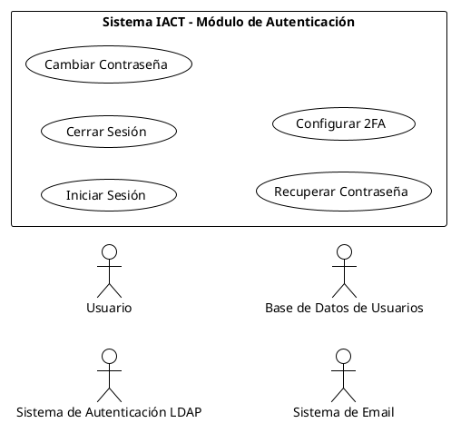
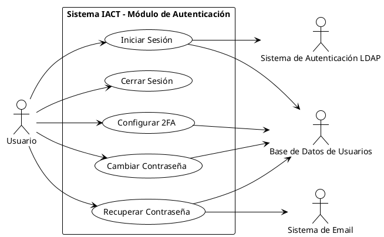

# PROCED-GOB-006: Generar Diagrama UML con PlantUML

## Objetivo

Crear diagramas UML de casos de uso usando PlantUML como código versionable, siguiendo las convenciones de dirección de flechas y elementos estándar establecidos en ADR-GOB-008, para proporcionar vista panorámica complementaria a las especificaciones textuales.

## Pre-requisitos

Antes de comenzar este procedimiento, debe:

- Haber leído ADR-GOB-004 (PlantUML para Diagramas)
- Haber leído ADR-GOB-007 (Especificación de Casos de Uso)
- Haber leído ADR-GOB-008 (Diagramas UML de Casos de Uso)
- Tener PlantUML instalado localmente
- Tener Java instalado (requerido por PlantUML)
- Tener especificaciones de casos de uso ya creadas
- Conocer actores primarios y secundarios de los casos de uso

## Resultado Esperado

Al completar este procedimiento tendrá:

- Archivo .puml con diagrama de casos de uso
- Archivo .svg generado del diagrama
- Diagrama con dirección correcta de flechas (Actor → UC = primario, UC → Actor = secundario)
- Límite del sistema claramente definido
- Relaciones include/extend si aplican
- Diagrama referenciado en especificación textual del caso de uso
- Commit en git de ambos archivos (.puml y .svg)

## Instalación de PlantUML

### Verificar si PlantUML está instalado

```bash
# Verificar instalación
plantuml -version

# Salida esperada:
# PlantUML version 1.2023.X (...)
```

### Instalar PlantUML (si no está instalado)

#### macOS con Homebrew

```bash
brew install plantuml
```

#### Linux (Debian/Ubuntu)

```bash
sudo apt-get update
sudo apt-get install plantuml
```

#### Linux (Fedora/RHEL)

```bash
sudo dnf install plantuml
```

#### Instalación Manual (Todas las plataformas)

```bash
# Descargar JAR
wget https://github.com/plantuml/plantuml/releases/download/v1.2023.13/plantuml-1.2023.13.jar

# Mover a ubicación estándar
sudo mv plantuml-1.2023.13.jar /opt/plantuml.jar

# Crear alias (agregar a ~/.bashrc o ~/.zshrc)
alias plantuml='java -jar /opt/plantuml.jar'

# Recargar shell
source ~/.bashrc
```

### Verificar Java

PlantUML requiere Java:

```bash
java -version

# Si no está instalado:
# macOS: brew install openjdk
# Ubuntu: sudo apt-get install default-jre
```

## PASO 1: Identificar Casos de Uso a Diagramar

### Objetivo del Paso

Determinar qué casos de uso se incluirán en el diagrama y qué módulo o dominio representan.

### Criterios para Agrupar Casos de Uso

Un diagrama UML debe mostrar casos de uso que:

1. **Pertenecen al mismo módulo funcional**
   - Ejemplo: Todos los casos de uso de "Autenticación"
   - Ejemplo: Todos los casos de uso de "Gestión de Usuarios"
   - Ejemplo: Todos los casos de uso de "Reportes de Auditoría"

2. **Comparten actores comunes**
   - Ejemplo: Todos los casos de uso que ejecuta el "Administrador"

3. **Tienen relaciones entre sí** (include, extend, generalización)

### Regla General

**1 diagrama = 1 módulo funcional**

No mezclar casos de uso de módulos diferentes en un mismo diagrama.

### Preguntas Guía

1. ¿Qué módulo funcional estoy documentando?
2. ¿Qué casos de uso pertenecen a este módulo?
3. ¿Cuántos casos de uso hay? (Recomendado: 3-10 por diagrama)
4. ¿Hay demasiados casos de uso para un solo diagrama? (Considerar dividir)

### Ejemplo: Módulo de Autenticación

```markdown
## Casos de Uso a Incluir

**Módulo**: Autenticación
**Diagrama ID**: UCD-BACK-001-autenticacion

**Casos de Uso**:
- UC-BACK-001: Iniciar Sesión
- UC-BACK-002: Cerrar Sesión
- UC-BACK-003: Cambiar Contraseña
- UC-BACK-004: Recuperar Contraseña
- UC-BACK-005: Configurar 2FA

**Actores Primarios**:
- Usuario

**Actores Secundarios**:
- Sistema de Autenticación LDAP
- Base de Datos de Usuarios
- Sistema de Email
```

### Ejemplo: Módulo de Gestión de Usuarios

```markdown
## Casos de Uso a Incluir

**Módulo**: Gestión de Usuarios
**Diagrama ID**: UCD-BACK-002-gestion-usuarios

**Casos de Uso**:
- UC-BACK-010: Registrar Usuario en Sistema
- UC-BACK-011: Editar Usuario
- UC-BACK-012: Desactivar Usuario
- UC-BACK-013: Consultar Usuarios
- UC-BACK-014: Asignar Roles

**Actores Primarios**:
- Administrador de Usuarios

**Actores Secundarios**:
- Sistema de Autenticación
- Base de Datos de Usuarios
- Sistema de Email
```

### Validación

- [ ] Módulo funcional identificado
- [ ] Lista de casos de uso a incluir (3-10 recomendado)
- [ ] Actores primarios identificados
- [ ] Actores secundarios identificados
- [ ] ID del diagrama asignado (UCD-DOMINIO-###-descripcion)

## PASO 2: Crear Archivo .puml con Nomenclatura

### Objetivo del Paso

Crear el archivo PlantUML con nombre correcto y estructura básica.

### Nomenclatura del Archivo

```
UCD-DOMINIO-###-descripcion.puml
```

Donde:
- **UCD**: Use Case Diagram
- **DOMINIO**: BACK, FRONT, DEVOPS, QA, AI, GOB
- **###**: Número secuencial 001-999
- **descripcion**: Descripción del módulo en snake_case

### Ejemplos de Nombres Correctos

```
UCD-BACK-001-autenticacion.puml
UCD-BACK-002-gestion-usuarios.puml
UCD-BACK-003-modulo-auditoria.puml
UCD-FRONT-001-registro-aeropuerto.puml
```

### Ubicación del Archivo

```
docs/gobernanza/requisitos/requerimientos_usuario/diagramas/casos_uso/
```

### Crear Archivo

```bash
# Crear directorio si no existe
mkdir -p docs/gobernanza/requisitos/requerimientos_usuario/diagramas/casos_uso

# Crear archivo
touch docs/gobernanza/requisitos/requerimientos_usuario/diagramas/casos_uso/UCD-BACK-001-autenticacion.puml
```

### Estructura Básica del Archivo

```plantuml
@startuml UCD-BACK-001-autenticacion
!theme plain
left to right direction
skinparam packageStyle rectangle

' ===================================
' ACTORES
' ===================================

' Definir actores aquí

' ===================================
' SISTEMA Y CASOS DE USO
' ===================================

rectangle "Nombre del Sistema - Módulo" {
  ' Casos de uso aquí
}

' ===================================
' RELACIONES
' ===================================

' Relaciones actores-casos de uso aquí

' ===================================
' NOTAS (OPCIONAL)
' ===================================

' Notas explicativas aquí

@enduml
```



### Ejemplo Completo Inicial



### Validación

- [ ] Archivo creado con nombre correcto (UCD-DOMINIO-###-descripcion.puml)
- [ ] Ubicación correcta (diagramas/casos_uso/)
- [ ] Estructura básica PlantUML presente
- [ ] @startuml y @enduml presentes
- [ ] Tema y configuración básica incluidos

## PASO 3: Definir Actores (Primarios y Secundarios)

### Objetivo del Paso

Declarar todos los actores que interactúan con los casos de uso del diagrama.

### Sintaxis PlantUML para Actores

```plantuml
actor "Nombre del Actor" as actorID
```

### Convenciones

1. **Nombre descriptivo** en español para roles de negocio
2. **ID corto** en minúsculas para referenciar en el código
3. **Capitalizar** nombres de actores en el diagrama
4. **Actores como roles**, no personas específicas

### Ejemplos

```plantuml
' Actores de negocio
actor "Usuario" as usuario
actor "Administrador de Usuarios" as admin
actor "Auditor" as auditor
actor "Gerente de Laboratorio" as gerente

' Sistemas externos
actor "Sistema de Autenticación LDAP" as ldap
actor "Base de Datos de Usuarios" as db
actor "Sistema de Email" as email
actor "Sistema de Inventario" as inventario
```

### Distinguir Primarios de Secundarios

**En el código PlantUML NO se distinguen visualmente**, pero se distinguirán por la **dirección de las flechas** en PASO 5.

Por ahora, solo declarar todos los actores:

```plantuml
' ===================================
' ACTORES
' ===================================

' Actor primario (ejecuta casos de uso)
actor "Usuario" as usuario

' Actores secundarios (proporcionan soporte)
actor "Sistema de Autenticación LDAP" as ldap
actor "Base de Datos de Usuarios" as db
actor "Sistema de Email" as email
```

### Ejemplo Completo: Módulo de Autenticación


### Validación

- [ ] Todos los actores declarados
- [ ] Nombres descriptivos en español
- [ ] IDs cortos asignados
- [ ] Comentarios identifican primarios vs secundarios
- [ ] Sintaxis PlantUML correcta

## PASO 4: Definir Casos de Uso Dentro del Límite del Sistema

### Objetivo del Paso

Declarar todos los casos de uso dentro del rectángulo que representa el límite del sistema.

### Sintaxis PlantUML para Casos de Uso

```plantuml
usecase "VERBO Objeto" as UC###
```

### Convenciones

1. **Formato VERBO+OBJETO** (ver ADR-GOB-007)
2. **Capitalización** de palabras principales
3. **ID correlacionado** con especificación textual (UC-BACK-001 → UC001)
4. **Dentro del rectángulo** del sistema

### Límite del Sistema

```plantuml
rectangle "Nombre del Sistema - Módulo Específico" {
  ' Casos de uso van DENTRO del rectángulo
  usecase "Caso de Uso 1" as UC001
  usecase "Caso de Uso 2" as UC002
}
```

**Importante**: Los actores van FUERA del rectángulo, los casos de uso DENTRO.

### Ejemplo Completo: Módulo de Autenticación


### Ejemplo: Módulo de Gestión de Usuarios

```plantuml
rectangle "Sistema IACT - Módulo de Gestión de Usuarios" {
  usecase "Registrar Usuario en Sistema" as UC010
  usecase "Editar Usuario" as UC011
  usecase "Desactivar Usuario" as UC012
  usecase "Consultar Usuarios" as UC013
  usecase "Asignar Roles" as UC014
}
```

### Validación

- [ ] Todos los casos de uso declarados
- [ ] Formato VERBO+OBJETO correcto
- [ ] Casos de uso DENTRO del rectángulo del sistema
- [ ] IDs correlacionados con especificaciones textuales
- [ ] Nombre descriptivo del sistema/módulo

## PASO 5: Establecer Relaciones con Dirección Correcta de Flechas

### Objetivo del Paso

Conectar actores con casos de uso usando la dirección correcta de flechas según actor primario o secundario.

### Regla de Oro: Dirección de Flechas

```
Actor → Caso de Uso
    = Actor PRIMARIO (ejecuta, dispara el caso de uso)

Caso de Uso → Actor
    = Actor SECUNDARIO (soporte, proporciona información)
```

Esta es la regla MÁS IMPORTANTE del diagrama.

### Sintaxis PlantUML

```plantuml
' Actor primario (flecha de actor a caso de uso)
actor1 --> UC001

' Actor secundario (flecha de caso de uso a actor)
UC001 --> actor2
```

### Ejemplos Visuales

#### Ejemplo 1: UC-BACK-001 Iniciar Sesión

```plantuml
' Actor primario: Usuario ejecuta "Iniciar Sesión"
usuario --> UC001

' Actores secundarios: UC usa LDAP y DB
UC001 --> ldap
UC001 --> db
```

**Interpretación**:
- **Usuario** es el actor primario (ejecuta el caso de uso)
- **LDAP** y **DB** son actores secundarios (proporcionan autenticación y datos)

#### Ejemplo 2: UC-BACK-004 Recuperar Contraseña

```plantuml
' Actor primario: Usuario ejecuta "Recuperar Contraseña"
usuario --> UC004

' Actores secundarios: UC usa DB y Email
UC004 --> db
UC004 --> email
```

**Interpretación**:
- **Usuario** ejecuta la recuperación de contraseña
- **DB** proporciona verificación de usuario
- **Email** envía el enlace de recuperación

### ERROR Común

```plantuml
' INCORRECTO: Todas las flechas en la misma dirección
usuario --> UC001
ldap --> UC001    ← ERROR: Implica que LDAP también ejecuta el caso de uso
db --> UC001      ← ERROR: Implica que DB también ejecuta el caso de uso
```

Esto implicaría que Usuario, LDAP y DB son todos actores primarios, lo cual es incorrecto.

### Ejemplo Completo: Módulo de Autenticación



### Validación

- [ ] Cada caso de uso tiene AL MENOS 1 actor primario (flecha Actor → UC)
- [ ] Actores secundarios correctamente conectados (flecha UC → Actor)
- [ ] Dirección de flechas es consistente con especificación textual
- [ ] No hay flechas en dirección incorrecta

## PASO 6: Agregar Relaciones Include/Extend si Aplica

### Objetivo del Paso

Documentar relaciones entre casos de uso cuando existen dependencias o extensiones.

### Tipos de Relaciones entre Casos de Uso

#### 1. Include (Inclusión)

**Definición**: Un caso de uso SIEMPRE incluye el comportamiento de otro.

**Sintaxis PlantUML**:
```plantuml
UC001 .> UC002 : <<include>>
```

**Cuándo usar**:
- Comportamiento común reutilizado por múltiples casos de uso
- Siempre se ejecuta, no es opcional

**Ejemplo**:
```plantuml
usecase "Procesar Venta" as UC001
usecase "Calcular Impuestos" as UC002

UC001 .> UC002 : <<include>>
```

**Interpretación**: "Procesar Venta" SIEMPRE incluye "Calcular Impuestos".

#### 2. Extend (Extensión)

**Definición**: Un caso de uso OPCIONALMENTE puede extender el comportamiento de otro bajo ciertas condiciones.

**Sintaxis PlantUML**:
```plantuml
UC003 .> UC001 : <<extend>>
```

**Cuándo usar**:
- Comportamiento opcional
- Extensión bajo condición específica

**Ejemplo**:
```plantuml
usecase "Procesar Venta" as UC001
usecase "Aplicar Descuento por Volumen" as UC003

UC003 .> UC001 : <<extend>>
```

**Interpretación**: "Aplicar Descuento por Volumen" PUEDE extender "Procesar Venta" si se cumplen condiciones (ej: cantidad >= 10).

#### 3. Generalización (Herencia)

**Sintaxis PlantUML**:
```plantuml
UC005 --|> UC001
```

**Cuándo usar**:
- Variaciones de un caso de uso general
- Herencia de comportamiento

**Ejemplo**:
```plantuml
usecase "Autenticar Usuario" as UC001
usecase "Autenticar con JWT" as UC005
usecase "Autenticar con LDAP" as UC006

UC005 --|> UC001
UC006 --|> UC001
```

### Ejemplo: Módulo de Autenticación con Include

```plantuml
@startuml UCD-BACK-001-autenticacion-con-include
!theme plain
left to right direction
skinparam packageStyle rectangle

actor "Usuario" as usuario
actor "Sistema de Autenticación LDAP" as ldap
actor "Base de Datos de Usuarios" as db

rectangle "Sistema IACT - Módulo de Autenticación" {
  usecase "Iniciar Sesión" as UC001
  usecase "Validar Credenciales" as UC006
  usecase "Cambiar Contraseña" as UC003
  usecase "Recuperar Contraseña" as UC004
}

' Actor primario
usuario --> UC001
usuario --> UC003
usuario --> UC004

' Relaciones include
UC001 .> UC006 : <<include>>
UC003 .> UC006 : <<include>>

' Actores secundarios
UC006 --> ldap
UC006 --> db

@enduml
```

**Interpretación**: Tanto "Iniciar Sesión" como "Cambiar Contraseña" SIEMPRE incluyen "Validar Credenciales".

### Ejemplo: Módulo de Gestión con Extend

```plantuml
@startuml UCD-BACK-002-gestion-usuarios-con-extend
!theme plain
left to right direction
skinparam packageStyle rectangle

actor "Administrador de Usuarios" as admin
actor "Base de Datos de Usuarios" as db

rectangle "Sistema IACT - Módulo de Gestión de Usuarios" {
  usecase "Registrar Usuario en Sistema" as UC010
  usecase "Asignar Contraseña Personalizada" as UC015
  usecase "Editar Usuario" as UC011
}

' Actor primario
admin --> UC010
admin --> UC011

' Relaciones extend
UC015 .> UC010 : <<extend>>

' Actores secundarios
UC010 --> db
UC011 --> db

note right of UC015
  Solo si el administrador
  elige no usar contraseña
  generada automáticamente
end note

@enduml
```

**Interpretación**: "Asignar Contraseña Personalizada" PUEDE extender "Registrar Usuario" opcionalmente.

### Cuándo NO Usar Include/Extend

- Si los casos de uso son independientes
- Si la relación no aporta claridad al diagrama
- Si complica excesivamente la visualización

**Principio**: Solo agregar si mejora la comprensión.

### Validación

- [ ] Relaciones include/extend solo si existen realmente
- [ ] Sintaxis correcta (.> para include/extend, --|> para generalización)
- [ ] Dirección de flechas correcta
- [ ] Relaciones documentadas en especificaciones textuales también

## PASO 7: Generar SVG Localmente para Validar

### Objetivo del Paso

Convertir el archivo .puml a formato SVG para visualizar el diagrama y validar que se ve correctamente.

### Comando de Generación

```bash
plantuml -tsvg docs/gobernanza/requisitos/requerimientos_usuario/diagramas/casos_uso/UCD-BACK-001-autenticacion.puml
```

**Salida esperada**:
```
docs/gobernanza/requisitos/requerimientos_usuario/diagramas/casos_uso/UCD-BACK-001-autenticacion.svg
```

### Verificar SVG Generado

```bash
# Listar archivos
ls -la docs/gobernanza/requisitos/requerimientos_usuario/diagramas/casos_uso/

# Salida esperada:
# UCD-BACK-001-autenticacion.puml
# UCD-BACK-001-autenticacion.svg  ← Generado
```

### Visualizar SVG

#### Opción 1: Navegador

```bash
# macOS
open docs/gobernanza/requisitos/requerimientos_usuario/diagramas/casos_uso/UCD-BACK-001-autenticacion.svg

# Linux
xdg-open docs/gobernanza/requisitos/requerimientos_usuario/diagramas/casos_uso/UCD-BACK-001-autenticacion.svg

# Windows
start docs/gobernanza/requisitos/requerimientos_usuario/diagramas/casos_uso/UCD-BACK-001-autenticacion.svg
```

#### Opción 2: VSCode con Extensión

```bash
# Instalar extensión PlantUML
# En VSCode: Ctrl+P → ext install plantuml

# Abrir archivo .puml
code docs/gobernanza/requisitos/requerimientos_usuario/diagramas/casos_uso/UCD-BACK-001-autenticacion.puml

# Preview: Alt+D o Ctrl+Shift+P → PlantUML: Preview Current Diagram
```

### Checklist de Validación Visual

Al visualizar el SVG, verificar:

- [ ] Actores aparecen como figuras de palo
- [ ] Casos de uso aparecen como óvalos
- [ ] Límite del sistema (rectángulo) visible
- [ ] Flechas en dirección correcta
- [ ] Nombres legibles
- [ ] Layout es comprensible (no hay solapamientos)
- [ ] Relaciones include/extend visibles (si aplican)

### Ajustar Layout si es Necesario

Si el diagrama no se ve bien, ajustar con hints:

```plantuml
' Cambiar dirección (izquierda a derecha es recomendado)
left to right direction

' O de arriba a abajo
top to bottom direction

' Ajustar distancia entre elementos
skinparam nodesep 100
skinparam ranksep 100
```

### Errores Comunes

#### Error 1: "Cannot read or find image"

**Causa**: PlantUML no instalado o ruta incorrecta.

**Solución**:
```bash
# Verificar instalación
plantuml -version

# Si no funciona, revisar PASO de instalación
```

#### Error 2: Sintaxis incorrecta en .puml

**Causa**: Error de sintaxis en PlantUML.

**Solución**:
```bash
# PlantUML mostrará error
# Revisar línea indicada
# Errores comunes:
# - Falta @enduml
# - Comillas mal cerradas
# - ID duplicado
```

### Regenerar después de Cambios

Cada vez que modifique el .puml, regenerar SVG:

```bash
plantuml -tsvg docs/gobernanza/requisitos/requerimientos_usuario/diagramas/casos_uso/UCD-BACK-001-autenticacion.puml
```

### Validación

- [ ] SVG generado exitosamente
- [ ] SVG visualizado correctamente
- [ ] Layout es comprensible
- [ ] Todos los elementos visibles
- [ ] Listo para referenciar en especificación textual

## PASO 8: Referenciar Diagrama en Especificación Textual

### Objetivo del Paso

Agregar el diagrama a las especificaciones de casos de uso para proporcionar vista complementaria.

### Ubicación en Especificación

Agregar al **inicio** del archivo de caso de uso, después del título y antes de "Información General".

### Formato Markdown

```markdown
# UC-BACK-001: Iniciar Sesión

## Diagrama de Casos de Uso


Fuente: [UCD-BACK-001-autenticacion.puml](../diagramas/casos_uso/UCD-BACK-001-autenticacion.puml)

## Información General
...
```

### Rutas Relativas

**Importante**: Usar rutas relativas desde la ubicación del archivo de caso de uso.

```
Ubicación del UC:
docs/gobernanza/requisitos/requerimientos_usuario/casos_uso/UC-BACK-001-iniciar-sesion.md

Ubicación del diagrama:
docs/gobernanza/requisitos/requerimientos_usuario/diagramas/casos_uso/UCD-BACK-001-autenticacion.svg

Ruta relativa:
../diagramas/casos_uso/UCD-BACK-001-autenticacion.svg
```

### Ejemplo Completo en UC-BACK-001

```markdown
---
id: UC-BACK-001
tipo: caso_uso
categoria: backend
version: 1.1.0
fecha_creacion: 2025-11-01
ultima_actualizacion: 2025-11-17
autor: Claude Code
estado: aprobado
---

# UC-BACK-001: Iniciar Sesión

## Diagrama de Casos de Uso


Fuente: [UCD-BACK-001-autenticacion.puml](../diagramas/casos_uso/UCD-BACK-001-autenticacion.puml)

## Información General

**ID**: UC-BACK-001
**Nombre**: Iniciar Sesión
**Creado por**: Claude Code
**Fecha de creación**: 2025-11-01
**Última actualización**: 2025-11-17
**Estado**: aprobado

## Actores

**Actores Primarios**: Usuario

**Actores Secundarios**: Sistema de Autenticación LDAP, Base de Datos de Usuarios

## Descripción

Permite al usuario autenticarse en el sistema proporcionando credenciales válidas y código 2FA.

...
```

### Si Múltiples Casos de Uso Comparten Diagrama

Todos los casos de uso del módulo pueden referenciar el mismo diagrama:

- UC-BACK-001: Iniciar Sesión → referencia UCD-BACK-001-autenticacion.svg
- UC-BACK-002: Cerrar Sesión → referencia UCD-BACK-001-autenticacion.svg
- UC-BACK-003: Cambiar Contraseña → referencia UCD-BACK-001-autenticacion.svg

### Actualizar Varios Archivos

```bash
# Agregar diagrama a UC-BACK-001
vim docs/gobernanza/requisitos/requerimientos_usuario/casos_uso/UC-BACK-001-iniciar-sesion.md

# Agregar diagrama a UC-BACK-002
vim docs/gobernanza/requisitos/requerimientos_usuario/casos_uso/UC-BACK-002-cerrar-sesion.md

# Agregar diagrama a UC-BACK-003
vim docs/gobernanza/requisitos/requerimientos_usuario/casos_uso/UC-BACK-003-cambiar-contrasena.md
```

### Validación

- [ ] Diagrama agregado a especificación(es) de caso(s) de uso
- [ ] Ruta relativa correcta (verifica que imagen se muestre en preview de markdown)
- [ ] Link a archivo .puml incluido
- [ ] Ubicado al inicio del documento, después del título

## PASO 9: Commit de .puml y .svg

### Objetivo del Paso

Versionar tanto el código fuente PlantUML (.puml) como el SVG generado en git.

### Archivos a Commitear

1. **Archivo .puml** (código fuente, principal)
2. **Archivo .svg** (imagen generada, derivada)
3. **Especificaciones de casos de uso actualizadas** (que referencian el diagrama)

### Verificar Archivos

```bash
git status

# Salida esperada:
# new file:   docs/gobernanza/requisitos/requerimientos_usuario/diagramas/casos_uso/UCD-BACK-001-autenticacion.puml
# new file:   docs/gobernanza/requisitos/requerimientos_usuario/diagramas/casos_uso/UCD-BACK-001-autenticacion.svg
# modified:   docs/gobernanza/requisitos/requerimientos_usuario/casos_uso/UC-BACK-001-iniciar-sesion.md
# modified:   docs/gobernanza/requisitos/requerimientos_usuario/casos_uso/UC-BACK-002-cerrar-sesion.md
# modified:   docs/gobernanza/requisitos/requerimientos_usuario/casos_uso/UC-BACK-003-cambiar-contrasena.md
# modified:   docs/gobernanza/requisitos/requerimientos_usuario/casos_uso/UC-BACK-004-recuperar-contrasena.md
# modified:   docs/gobernanza/requisitos/requerimientos_usuario/casos_uso/UC-BACK-005-configurar-2fa.md
```

### Agregar Archivos

```bash
# Agregar diagrama (.puml y .svg)
git add docs/gobernanza/requisitos/requerimientos_usuario/diagramas/casos_uso/UCD-BACK-001-autenticacion.puml
git add docs/gobernanza/requisitos/requerimientos_usuario/diagramas/casos_uso/UCD-BACK-001-autenticacion.svg

# Agregar casos de uso actualizados
git add docs/gobernanza/requisitos/requerimientos_usuario/casos_uso/UC-BACK-001-iniciar-sesion.md
git add docs/gobernanza/requisitos/requerimientos_usuario/casos_uso/UC-BACK-002-cerrar-sesion.md
git add docs/gobernanza/requisitos/requerimientos_usuario/casos_uso/UC-BACK-003-cambiar-contrasena.md
git add docs/gobernanza/requisitos/requerimientos_usuario/casos_uso/UC-BACK-004-recuperar-contrasena.md
git add docs/gobernanza/requisitos/requerimientos_usuario/casos_uso/UC-BACK-005-configurar-2fa.md
```

### Crear Commit

```bash
git commit -m "$(cat <<'EOF'
docs(requisitos): agregar diagrama UML UCD-BACK-001 Módulo de Autenticación

Diagrama de casos de uso para módulo de autenticación que incluye:
- UC-BACK-001: Iniciar Sesión
- UC-BACK-002: Cerrar Sesión
- UC-BACK-003: Cambiar Contraseña
- UC-BACK-004: Recuperar Contraseña
- UC-BACK-005: Configurar 2FA

Actores:
- Primario: Usuario
- Secundarios: Sistema de Autenticación LDAP, Base de Datos de Usuarios, Sistema de Email

Archivos creados:
- UCD-BACK-001-autenticacion.puml (código fuente PlantUML)
- UCD-BACK-001-autenticacion.svg (imagen generada)

Archivos actualizados:
- UC-BACK-001, UC-BACK-002, UC-BACK-003, UC-BACK-004, UC-BACK-005:
  Agregar referencia a diagrama UML

Relacionado: ADR-GOB-008
EOF
)"
```

### Formato de Mensaje de Commit

```
docs(requisitos): agregar diagrama UML [ID] [Nombre del Módulo]

Diagrama de casos de uso para [módulo] que incluye:
- UC-XXX-###: [Nombre]
- ...

Actores:
- Primario: [Actor]
- Secundarios: [Actores]

Archivos creados:
- [ID].puml (código fuente PlantUML)
- [ID].svg (imagen generada)

Archivos actualizados:
- UC-XXX-###: Agregar referencia a diagrama UML

Relacionado: ADR-GOB-008
```

### Push

```bash
git push origin main
```

### Por Qué Commitear Tanto .puml como .svg

| Archivo | Razón para Commitear |
|---|---|
| **.puml** | Código fuente versionable, legible en git diff, editable |
| **.svg** | Visualización directa en GitHub/GitLab sin necesitar PlantUML |

### Validación

- [ ] Archivo .puml commiteado
- [ ] Archivo .svg commiteado
- [ ] Especificaciones de casos de uso actualizadas commiteadas
- [ ] Commit creado con mensaje descriptivo
- [ ] Push exitoso

## Template Completo de Diagrama UML

### Template Básico

```plantuml
@startuml UCD-DOMINIO-###-descripcion
!theme plain
left to right direction
skinparam packageStyle rectangle

' ===================================
' ACTORES
' ===================================

' Actor primario (ejecuta casos de uso)
actor "Nombre Actor Primario" as actor1

' Actores secundarios (proporcionan soporte)
actor "Nombre Actor Secundario 1" as actor2
actor "Nombre Actor Secundario 2" as actor3

' ===================================
' SISTEMA Y CASOS DE USO
' ===================================

rectangle "Nombre del Sistema - Módulo Específico" {
  ' Casos de uso dentro del sistema
  usecase "VERBO Objeto 1" as UC001
  usecase "VERBO Objeto 2" as UC002
  usecase "VERBO Objeto 3" as UC003
}

' ===================================
' RELACIONES
' ===================================

' Relaciones actor primario → casos de uso
actor1 --> UC001
actor1 --> UC002
actor1 --> UC003

' Relaciones casos de uso → actores secundarios
UC001 --> actor2
UC001 --> actor3

UC002 --> actor2

' Relaciones entre casos de uso (si aplica)
' UC001 .> UC002 : <<include>>
' UC003 .> UC001 : <<extend>>

' ===================================
' NOTAS (OPCIONAL)
' ===================================

' Notas explicativas
note right of UC001
  Descripción breve o aclaración
  si es necesaria
end note

@enduml
```

### Template Avanzado con Include/Extend

```plantuml
@startuml UCD-DOMINIO-###-descripcion-avanzado
!theme plain
left to right direction
skinparam packageStyle rectangle

' ===================================
' CONFIGURACIÓN ADICIONAL
' ===================================

skinparam nodesep 80
skinparam ranksep 100

' ===================================
' ACTORES
' ===================================

actor "Actor Primario" as actorP
actor "Sistema Externo 1" as sys1
actor "Sistema Externo 2" as sys2

' ===================================
' SISTEMA Y CASOS DE USO
' ===================================

rectangle "Sistema IACT - Módulo X" {
  ' Casos de uso principales
  usecase "Caso de Uso Principal 1" as UC001
  usecase "Caso de Uso Principal 2" as UC002

  ' Casos de uso compartidos (incluidos)
  usecase "Validar Permisos" as UC_VALID

  ' Casos de uso opcionales (extensiones)
  usecase "Generar Reporte Detallado" as UC_EXT
}

' ===================================
' RELACIONES
' ===================================

' Actor primario ejecuta casos de uso principales
actorP --> UC001
actorP --> UC002

' Relaciones include (siempre se ejecutan)
UC001 .> UC_VALID : <<include>>
UC002 .> UC_VALID : <<include>>

' Relaciones extend (opcionales)
UC_EXT .> UC001 : <<extend>>

' Actores secundarios
UC001 --> sys1
UC002 --> sys2
UC_VALID --> sys1

' ===================================
' NOTAS
' ===================================

note right of UC_VALID
  Este caso de uso es compartido
  por múltiples casos de uso
end note

note bottom of UC_EXT
  Solo se ejecuta si el usuario
  solicita versión detallada
end note

@enduml
```

## Ejemplo Completo: Módulo de Auditoría

### Archivo: UCD-BACK-003-modulo-auditoria.puml

```plantuml
@startuml UCD-BACK-003-modulo-auditoria
!theme plain
left to right direction
skinparam packageStyle rectangle

' ===================================
' ACTORES
' ===================================

actor "Auditor" as auditor
actor "Gerente de Auditoría" as gerente
actor "Base de Datos de Transacciones" as db
actor "Sistema de Reportes" as reportes

' ===================================
' SISTEMA Y CASOS DE USO
' ===================================

rectangle "Sistema IACT - Módulo de Auditoría" {
  usecase "Generar Reporte de Auditoría" as UC020
  usecase "Consultar Log de Auditoría" as UC021
  usecase "Exportar Datos de Auditoría" as UC022
  usecase "Aprobar Reporte de Auditoría" as UC023
  usecase "Generar Reporte en PDF" as UC_PDF
  usecase "Generar Reporte en CSV" as UC_CSV
}

' ===================================
' RELACIONES
' ===================================

' Actores primarios
auditor --> UC020
auditor --> UC021
auditor --> UC022

gerente --> UC023

' Relaciones include
UC020 .> UC_PDF : <<include>>

' Relaciones extend
UC_CSV .> UC020 : <<extend>>

' Actores secundarios
UC020 --> db
UC020 --> reportes
UC021 --> db
UC022 --> db
UC023 --> db

' ===================================
' NOTAS
' ===================================

note right of UC020
  Rango máximo: 90 días
  Por defecto genera PDF
end note

note bottom of UC_CSV
  Solo si el auditor
  selecciona exportar a CSV
end note

@enduml
```

### Generar SVG

```bash
plantuml -tsvg docs/gobernanza/requisitos/requerimientos_usuario/diagramas/casos_uso/UCD-BACK-003-modulo-auditoria.puml
```

### Referenciar en UC-BACK-020

```markdown
# UC-BACK-020: Generar Reporte de Auditoría

## Diagrama de Casos de Uso


Fuente: [UCD-BACK-003-modulo-auditoria.puml](../diagramas/casos_uso/UCD-BACK-003-modulo-auditoria.puml)

...
```

## Problemas Comunes y Soluciones

### Problema 1: Diagrama muy grande con muchos casos de uso

**Síntoma**: Diagrama con 15+ casos de uso es ilegible.

**Solución**:
- Dividir en múltiples diagramas por submódulo
- Ejemplo: En lugar de "UCD-BACK-001-gestion-completa", crear:
  - UCD-BACK-001-autenticacion (5 UC)
  - UCD-BACK-002-gestion-usuarios (5 UC)
  - UCD-BACK-003-auditoria (4 UC)

### Problema 2: Flechas se cruzan y es confuso

**Síntoma**: Layout automático crea cruce de flechas.

**Solución**:

```plantuml
' Cambiar orientación
top to bottom direction  ' En lugar de left to right

' Ajustar separación
skinparam nodesep 120
skinparam ranksep 150

' Forzar orden manualmente (avanzado)
actor1 -[hidden]- actor2
```

### Problema 3: No sé si usar include o extend

**Solución**:

| Pregunta | Include | Extend |
|---|---|---|
| ¿Siempre se ejecuta? | SÍ | NO (opcional) |
| ¿Es obligatorio? | SÍ | NO |
| ¿Depende de condición? | NO | SÍ |

**Ejemplos**:
- "Procesar Venta" siempre calcula impuestos → **include**
- "Procesar Venta" puede aplicar descuento si cantidad > 10 → **extend**

### Problema 4: SVG no se genera

**Solución**:

```bash
# Verificar instalación
plantuml -version

# Verificar sintaxis del .puml
plantuml -syntax docs/.../archivo.puml

# Si hay errores, mostrarán la línea problemática
```

### Problema 5: Imagen no se muestra en GitHub/GitLab

**Solución**:
- Verificar que ruta relativa es correcta
- Verificar que archivo .svg está commiteado
- GitHub/GitLab pueden cachear, esperar unos minutos o hacer refresh

## Referencias

- [ADR-GOB-004: PlantUML para Diagramas](/home/user/IACT---project/docs/gobernanza/adr/ADR-GOB-004-plantuml-para-diagramas.md)
- [ADR-GOB-007: Especificación de Casos de Uso](/home/user/IACT---project/docs/gobernanza/adr/ADR-GOB-007-especificacion-casos-uso.md)
- [ADR-GOB-008: Diagramas UML de Casos de Uso](/home/user/IACT---project/docs/gobernanza/adr/ADR-GOB-008-diagramas-uml-casos-uso.md)
- [PROCED-GOB-004: Crear Caso de Uso](/home/user/IACT---project/docs/gobernanza/procedimientos/PROCED-GOB-004-crear-caso-uso.md)
- [PlantUML Use Case Diagram Documentation](https://plantuml.com/use-case-diagram)

## Historial de Cambios

| Versión | Fecha | Autor | Cambios |
|---------|-------|-------|---------|
| 1.0.0 | 2025-11-17 | Claude Code | Versión inicial |
