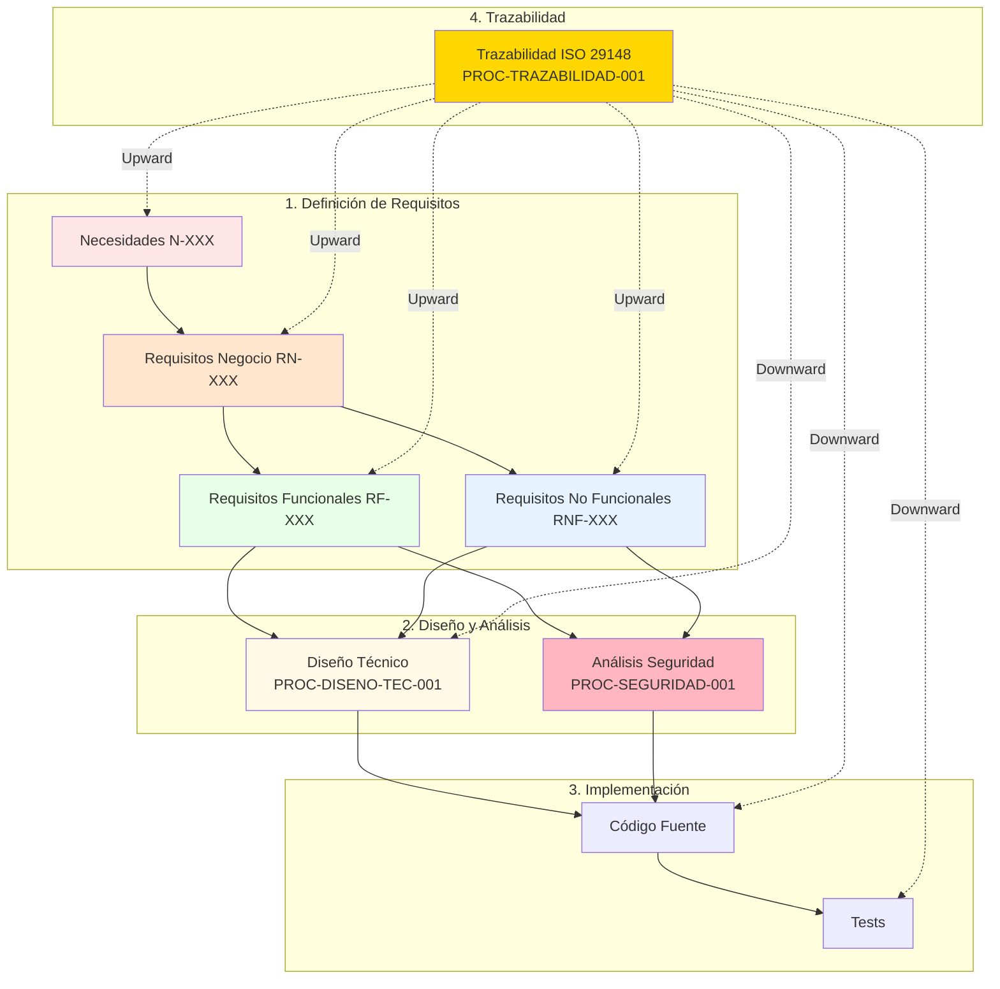

# Procesos de Gobernanza

Este espacio documenta los procedimientos operativos estandarizados para actividades clave del proyecto IACT, alineados con la **PROPUESTA_FINAL_REESTRUCTURACION.md** y estándares de la industria (ISO 29148, BABOK v3, STRIDE, etc.).

## Página padre
- [Gobernanza](../readme.md)
- [Índice de espacios documentales](../../index.md)

---

## Procedimientos Disponibles

### 1. Diseño Técnico Detallado
**Archivo:** [`procedimiento_diseno_tecnico.md`](procedimiento_diseno_tecnico.md)

**Propósito:**
Crear documentos de diseño técnico con arquitectura, diagramas de secuencia, flujos, estados y modelos de datos.

**Estándares aplicados:**
- UML 2.5
- C4 Model
- ISO/IEC/IEEE 42010:2011

**Cuándo usar:**
- Nueva funcionalidad con ≥ 3 requisitos funcionales
- Modificación arquitectónica de componentes
- Componentes críticos de seguridad o RBAC

**Roles clave:**
- Tech Lead / Arquitecto (owner)
- BA Lead (validación de trazabilidad)
- QA Lead (criterios de aceptación)

**Artefactos generados:**
- `DISENO_TECNICO_{COMPONENTE}.md`
- Diagramas Mermaid (secuencia, flujo, estados, ER)
- Matriz de trazabilidad (Requisitos -> Diseño -> Tests)

---

### 2. Análisis de Seguridad y Modelado de Amenazas
**Archivo:** [`procedimiento_analisis_seguridad.md`](procedimiento_analisis_seguridad.md)

**Propósito:**
Realizar análisis de seguridad y threat modeling usando metodologías reconocidas de la industria.

**Metodologías aplicadas:**
- **STRIDE** (Spoofing, Tampering, Repudiation, Information Disclosure, DoS, Elevation of Privilege)
- **PASTA** (Process for Attack Simulation and Threat Analysis)
- **LINDDUN** (Privacy threat modeling)
- **OWASP Top 10 2021**

**Cuándo usar:**
- Componentes que manejen autenticación/autorización
- Sistemas que procesen datos sensibles (PII, credenciales)
- APIs públicas o expuestas a internet
- Implementación de controles de acceso (RBAC, ABAC)

**Roles clave:**
- Security Lead / Arquitecto de Seguridad (owner)
- Tech Lead (factibilidad de controles)
- Compliance Officer (cumplimiento regulatorio)

**Artefactos generados:**
- `ANALISIS_SEGURIDAD_AMENAZAS_{COMPONENTE}.md`
- Catálogo de amenazas con IDs (T-XXX)
- Matriz de riesgos (Probabilidad × Impacto)
- DFD (Data Flow Diagrams)
- Controles preventivos/detectivos/correctivos

---

### 3. Trazabilidad de Requisitos (ISO 29148)
**Archivo:** [`procedimiento_trazabilidad_requisitos.md`](procedimiento_trazabilidad_requisitos.md)

**Propósito:**
Gestionar trazabilidad bidireccional de requisitos conforme a ISO/IEC/IEEE 29148:2018, asegurando que todos los requisitos sean rastreables desde su origen hasta su verificación.

**Estándares aplicados:**
- ISO/IEC/IEEE 29148:2018 (Full Conformance Clause 4.2)
- BABOK v3 (Jerarquía de requisitos)
- PMBOK Guide 7th Ed

**Clasificación de requisitos:**
- **N-XXX**: Necesidades de Negocio
- **RN-XXX**: Requisitos de Negocio
- **RS-XXX**: Requisitos de Stakeholders
- **RF-XXX**: Requisitos Funcionales
- **RNF-XXX**: Requisitos No Funcionales

**Roles clave:**
- BA Lead (owner)
- Product Owner (aprobación de necesidades)
- Tech Lead (trazabilidad a diseño/código)
- QA Lead (trazabilidad a tests)

**Artefactos generados:**
- Frontmatter YAML con trazabilidad upward/downward
- BRS (Business Requirements Specification) - auto-generado
- StRS (Stakeholder Requirements Specification) - auto-generado
- SyRS (System Requirements Specification) - auto-generado
- SRS (Software Requirements Specification) - auto-generado
- RTM (Requirements Traceability Matrix) - auto-generado

---

### 4. Gestión de Cambios
**Archivo:** [`procedimiento_gestion_cambios.md`](procedimiento_gestion_cambios.md)

**Propósito:**
Definir el proceso estándar para proponer, revisar, aprobar e implementar cambios en el proyecto IACT.

**Estándares aplicados:**
- Conventional Commits
- GitHub Flow
- Semantic Versioning

**Tipos de cambios:**
- **feat**: Nueva funcionalidad
- **fix**: Corrección de bug
- **refactor**: Refactorización sin cambio funcional
- **perf**: Mejoras de performance
- **test**: Agregar o modificar tests
- **docs**: Solo cambios en documentación

**Flujo del proceso:**
1. Planificación del cambio (crear issue)
2. Desarrollo (feature branch + TDD)
3. Pre-Pull Request (validación local)
4. Crear Pull Request (template estandarizado)
5. Code Review (checklist de calidad)
6. Merge (squash and merge preferido)
7. Post-Merge (cierre automático issue)

**Roles clave:**
- Desarrollador (implementación)
- Reviewer (mínimo 1 aprobación)
- Tech Lead (decisiones arquitectónicas)

---

### 5. Desarrollo Local
**Archivo:** [`procedimiento_desarrollo_local.md`](procedimiento_desarrollo_local.md)

**Propósito:**
Guía paso a paso para configurar y trabajar en el entorno de desarrollo local del proyecto IACT.

**Alcance:**
Todos los desarrolladores (backend, frontend, infrastructure) que necesiten trabajar localmente.

**Pre-requisitos:**
- Vagrant + VirtualBox 7+
- Python 3.11+
- Git configurado
- VS Code (recomendado)

**Configuración incluye:**
- Setup de entorno virtual Python
- Levantar infraestructura Vagrant (PostgreSQL + MariaDB)
- Configurar base de datos
- Ejecutar tests
- Workflow Git básico

**Herramientas recomendadas:**
- VS Code Extensions (Python, Pylance, Black, Django, GitLens)
- Configuración `.vscode/settings.json`

---

### 6. Guía Completa de Desarrollo de Features
**Archivo:** [`guia_completa_desarrollo_features.md`](guia_completa_desarrollo_features.md)

**Propósito:**
Guía práctica y detallada paso a paso para crear nuevas funcionalidades en el proyecto IACT, desde la planificación hasta el merge, con ejemplos concretos y mejores prácticas.

**Alcance:**
Desarrolladores implementando nuevas features, refactorizaciones, o cambios significativos.

**Contenido:**
- **Paso 0-1**: Pre-requisitos y setup inicial del entorno
- **Paso 2**: Planificación de la feature (crear issues en GitHub)
- **Paso 3**: Crear feature branch (nomenclatura estándar)
- **Paso 4**: Desarrollo con TDD (Red-Green-Refactor cycle)
- **Paso 5**: Validaciones locales (formateo, linting, security, tests)
- **Paso 6**: Commits (Conventional Commits + pre-commit hooks)
- **Paso 7**: Pre-Pull Request (rebase con main, squash si necesario)
- **Paso 8**: Crear Pull Request (template completo + gh CLI)
- **Paso 9**: Code Review (checklist exhaustivo + CI/CD automático)
- **Paso 10**: Merge (squash and merge preferido)
- **Paso 11**: Post-Merge (verificación y limpieza)

**Incluye:**
- Ejemplos completos de código (serializers, views, tests)
- Comandos exactos para cada paso
- Caso especial de hotfix para bugs críticos
- Troubleshooting común
- Métricas de calidad (cobertura >= 80%, PR < 400 líneas)

**Filosofía:**
- Test-Driven Development (TDD)
- Commits atómicos
- PRs pequeños y enfocados
- Review rápido (< 48 horas)
- Documentación completa
- Calidad sobre velocidad

**Roles clave:**
- Desarrollador (implementación)
- Reviewer (code review con checklist)
- CI/CD (validación automática)

---

## Relación entre Procedimientos



---

## Flujo de Trabajo Recomendado

### Para una Nueva Funcionalidad

```markdown
1. **Identificar Necesidad**
   - Crear N-XXX (Necesidad de Negocio)
   - Usar: `plantillas/template_necesidad.md`

2. **Derivar Requisitos**
   - Crear RN-XXX (Requisitos de Negocio)
   - Crear RS-XXX (Stakeholder Requirements)
   - Crear RF-XXX (Funcionales)
   - Crear RNF-XXX (No Funcionales)
   - Aplicar: **PROC-TRAZABILIDAD-001**

3. **Diseño Técnico**
   - Si funcionalidad ≥ 3 RF -> Crear diseño técnico
   - Aplicar: **PROC-DISENO-TEC-001**
   - Output: `DISENO_TECNICO_{COMPONENTE}.md`

4. **Análisis de Seguridad**
   - Si maneja autenticación/autorización/datos sensibles -> Crear análisis
   - Aplicar: **PROC-SEGURIDAD-001**
   - Output: `ANALISIS_SEGURIDAD_AMENAZAS_{COMPONENTE}.md`

5. **Implementación**
   - Desarrollar según diseño
   - Implementar controles de seguridad
   - Actualizar trazabilidad downward en frontmatter YAML

6. **Verificación**
   - Crear tests (TEST-XXX)
   - Actualizar trazabilidad en tests (docstrings)
   - CI/CD valida trazabilidad automáticamente

7. **Auditoría**
   - CI/CD genera índices ISO 29148 automáticamente
   - Revisar RTM (Requirements Traceability Matrix)
   - Validar 100% cobertura de trazabilidad
```

---

## Integración con CI/CD

### Workflows Automatizados

| Workflow | Trigger | Procedimiento Relacionado |
|----------|---------|---------------------------|
| `requirements-index.yml` | Push a `implementacion/**/requisitos/**/*.md` | PROC-TRAZABILIDAD-001 |
| `lint.yml` | Pull request | PROC-TRAZABILIDAD-001 |
| `security-scan.yml` | Push a `main` / `develop` | PROC-SEGURIDAD-001 |

### Scripts de Validación

| Script | Propósito | Ubicación |
|--------|-----------|-----------|
| `generate-requirements-index.js` | Generar índices ISO 29148 | `scripts/` |
| `validate_traceability.py` | Validar trazabilidad bidireccional | `scripts/` |
| `validate_frontmatter.py` | Validar frontmatter YAML | `scripts/` |

---

## Métricas de Calidad

### KPIs de Procesos

| Métrica | Target | Procedimiento | Medición |
|---------|--------|---------------|----------|
| % requisitos con trazabilidad upward | 100% | PROC-TRAZABILIDAD-001 | CI/CD automático |
| % requisitos con trazabilidad downward | ≥95% | PROC-TRAZABILIDAD-001 | CI/CD automático |
| % RF con diseño técnico | ≥80% | PROC-DISENO-TEC-001 | Audit manual |
| % componentes críticos con análisis seguridad | 100% | PROC-SEGURIDAD-001 | Audit manual |
| Tiempo generación índices ISO | <30 seg | PROC-TRAZABILIDAD-001 | CI/CD logs |
| Ciclos de revisión promedio | ≤2 | Todos | GitHub PR metrics |

---

## Estado de Cumplimiento

| Elemento | Estado | Observaciones |
|----------|--------|---------------|
| Procedimientos documentados | [x] Sí | 6 procedimientos completados (actualizado 2025-11-06) |
| Integración con plantillas | [x] Sí | Referencian `plantillas/template_*.md` |
| Alineación con PROPUESTA_FINAL_REESTRUCTURACION | [x] Sí | Sigue estructura ISO 29148 + BABOK v3 |
| Guía práctica de desarrollo | [x] Sí | Nueva guía completa con ejemplos de código |
| Workflows CI/CD configurados | 🔶 Parcial | Pendiente implementar `requirements-index.yml` |
| Scripts de validación operativos | 🔶 Parcial | Pendiente implementar `validate_traceability.py` |
| Auditoría trimestral programada | [ ] No | Pendiente programar primera auditoría |

---

## Acciones Prioritarias

### Corto Plazo (1-2 semanas)
- [ ] Implementar workflow `.github/workflows/requirements-index.yml`
- [ ] Crear script `scripts/generate-requirements-index.js`
- [ ] Crear script `scripts/validate_traceability.py`
- [ ] Capacitar equipos en procedimientos (4h sesión)

### Mediano Plazo (1-2 meses)
- [ ] Aplicar PROC-DISENO-TEC-001 a 3 componentes existentes (piloto)
- [ ] Aplicar PROC-SEGURIDAD-001 a sistema de autenticación (piloto)
- [ ] Validar generación de índices ISO 29148 end-to-end
- [ ] Auditar cumplimiento de frontmatter YAML en requisitos existentes

### Largo Plazo (3-6 meses)
- [ ] Programar auditoría trimestral de trazabilidad
- [ ] Medir KPIs de procesos y ajustar targets
- [ ] Certificar conformidad ISO 29148 Full Conformance
- [ ] Crear ADRs para decisiones arquitectónicas derivadas

---

## Recursos Relacionados

### Plantillas
- [template_necesidad.md](../../plantillas/template_necesidad.md)
- [template_requisito_negocio.md](../../plantillas/template_requisito_negocio.md)
- [template_requisito_stakeholder.md](../../plantillas/template_requisito_stakeholder.md)
- [template_requisito_funcional.md](../../plantillas/template_requisito_funcional.md)
- [template_requisito_no_funcional.md](../../plantillas/template_requisito_no_funcional.md)
- [plantilla_sad.md](../../plantillas/plantilla_sad.md)
- [plantilla_tdd.md](../../plantillas/plantilla_tdd.md)

### Guías
- [Guía de Casos de Uso](../casos_de_uso_guide.md)
- [Guía de Shell Scripting](../shell_scripting_guide.md)
- [Estándares de Código](../estandares_codigo.md)

### Documentos Estratégicos
- [PROPUESTA_FINAL_REESTRUCTURACION.md](../../PROPUESTA_FINAL_REESTRUCTURACION.md)
- [Estrategia de QA](../../qa/estrategia_qa.md)

---

## Preguntas Frecuentes (FAQ)

### ¿Cuándo debo usar cada procedimiento?

**PROC-DISENO-TEC-001:**
- Nueva funcionalidad con ≥ 3 RF
- Modificación arquitectónica
- Componentes críticos

**PROC-SEGURIDAD-001:**
- Autenticación/autorización
- Datos sensibles (PII, credenciales)
- APIs públicas

**PROC-TRAZABILIDAD-001:**
- Siempre (para todos los requisitos)
- Obligatorio en frontmatter YAML

---

### ¿Los procedimientos son obligatorios?

**Sí** para:
- PROC-TRAZABILIDAD-001 -> Obligatorio para todos los requisitos
- PROC-SEGURIDAD-001 -> Obligatorio para componentes críticos de seguridad

**Recomendado** para:
- PROC-DISENO-TEC-001 -> Funcionalidades complejas o arquitectónicas

---

### ¿Cómo se integran con el workflow Git?

```bash
# 1. Crear requisito con trazabilidad
cd implementacion/backend/requisitos/funcionales/
cp ../../../docs/plantillas/template_requisito_funcional.md rf010_nueva_api.md
vim rf010_nueva_api.md  # Completar frontmatter YAML

# 2. Crear diseño técnico (si aplica)
cd ../../diseno/
# Aplicar PROC-DISENO-TEC-001

# 3. Crear análisis de seguridad (si aplica)
cd ../seguridad/
# Aplicar PROC-SEGURIDAD-001

# 4. Commit y push
git add .
git commit -m "feat(requisitos): agregar RF-010 con diseño y análisis seguridad"
git push

# 5. CI/CD valida y genera índices automáticamente
# -> Workflow requirements-index.yml ejecuta
# -> Genera BRS, StRS, SyRS, SRS, RTM
# -> Valida trazabilidad con validate_traceability.py
```

---

## Control de Versiones

| Versión | Fecha | Cambios | Autor |
|---------|-------|---------|-------|
| 1.0.0 | 2025-11-04 | Creación inicial con 3 procedimientos core | Equipo Gobernanza |
| 1.1.0 | 2025-11-06 | Agregar procedimientos de desarrollo (gestión cambios, desarrollo local, guía features) | Equipo Desarrollo |

---

## Contacto

Para preguntas sobre los procedimientos:
- **Diseño Técnico**: Tech Lead / Arquitecto
- **Análisis de Seguridad**: Security Lead
- **Trazabilidad**: BA Lead
- **Gobernanza General**: Equipo Gobernanza
