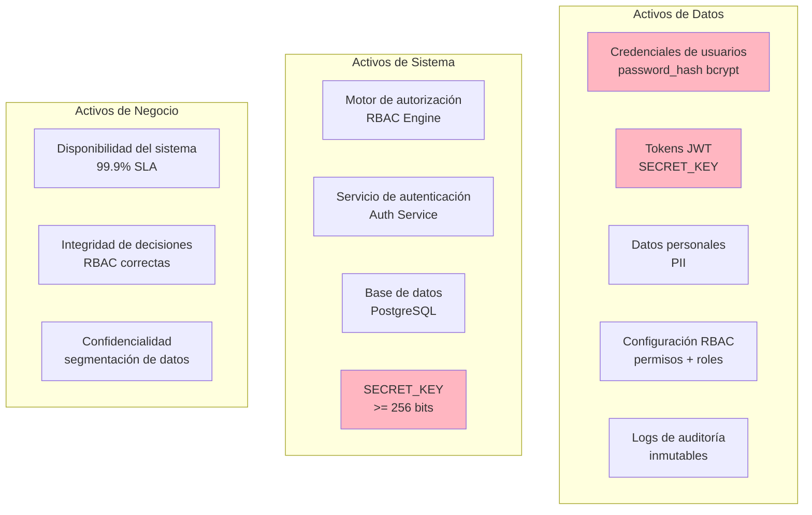
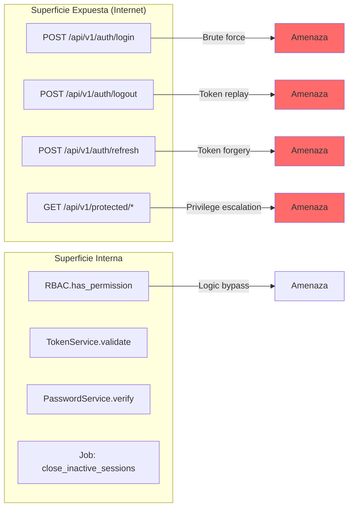
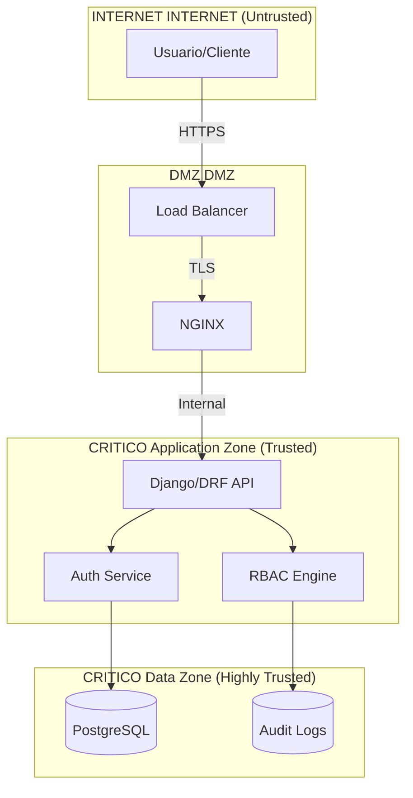
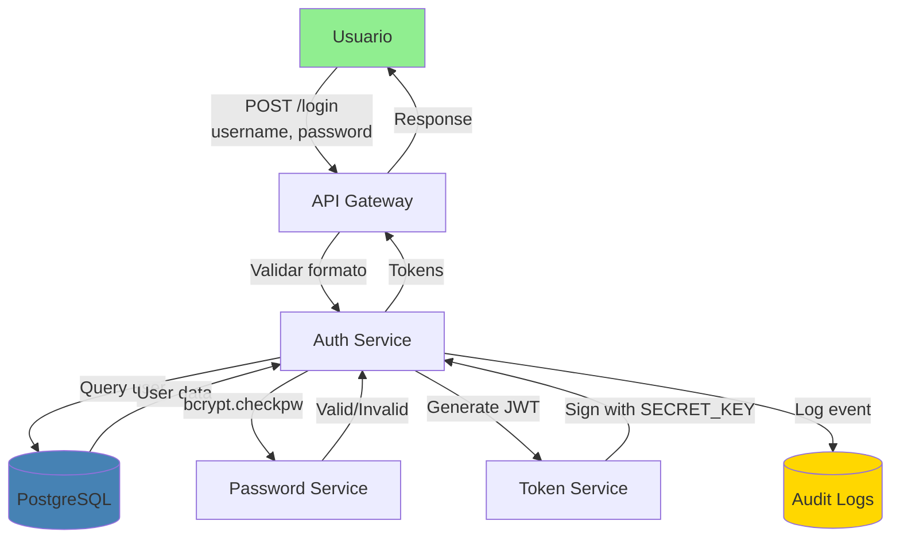

# Procedimiento: Análisis de Seguridad y Modelado de Amenazas

## Propósito

Establecer el proceso para realizar análisis de seguridad y threat modeling (modelado de amenazas) de componentes, funcionalidades o sistemas completos del proyecto IACT, utilizando metodologías reconocidas de la industria.

## Alcance

Aplica a:
- Componentes nuevos que manejen autenticación, autorización o datos sensibles
- Modificaciones arquitectónicas con impacto en seguridad
- Implementación de controles de acceso (RBAC, ABAC, etc.)
- Integraciones con sistemas externos
- APIs públicas o expuestas a internet

## Página padre
- [Procesos de Gobernanza](readme.md)
- [Gobernanza](../readme.md)

---

## Metodologías Aplicables

### Metodologías Obligatorias

| Metodología | Cuándo Usar | Output Esperado |
|-------------|-------------|-----------------|
| **STRIDE** | Análisis de amenazas de componentes | Catálogo de amenazas por categoría |
| **PASTA** (Process for Attack Simulation and Threat Analysis) | Análisis de riesgos end-to-end | Matriz de riesgos con probabilidad e impacto |
| **LINDDUN** | Análisis de privacidad y datos personales | Threat trees de privacidad |
| **OWASP Top 10** | Validación de controles web | Checklist de mitigaciones |

### Metodologías Complementarias

- **Attack Trees**: Modelado de vectores de ataque
- **DREAD**: Scoring de riesgos (Damage, Reproducibility, Exploitability, Affected users, Discoverability)
- **CVSS**: Scoring de vulnerabilidades (Common Vulnerability Scoring System)

---

## Roles y Responsabilidades

| Rol | Responsabilidad |
|-----|-----------------|
| **Security Lead / Arquitecto de Seguridad** | Liderar análisis STRIDE, aprobar controles |
| **Tech Lead** | Proveer contexto técnico, validar factibilidad de mitigaciones |
| **BA Lead** | Identificar activos de negocio críticos |
| **DevOps Lead** | Implementar controles de infraestructura |
| **QA Lead** | Diseñar tests de seguridad y penetration testing |
| **Compliance Officer** (si aplica) | Validar cumplimiento regulatorio (GDPR, HIPAA, etc.) |

---

## Proceso Paso a Paso

### FASE 1: Definición de Contexto y Alcance

#### 1.1 Identificar Activos Críticos

**Entrada:**
- Documento de diseño técnico (`DISENO_TECNICO_{COMPONENTE}.md`)
- Requisitos de seguridad (RNF-XXX tipo seguridad)
- Restricciones regulatorias

**Acción:**

Crear sección de activos críticos con clasificación:

```markdown
## 1. Contexto y Alcance

### 1.1 Activos Críticos


```

**Checklist:**
- [ ] Activos de Datos identificados (credenciales, tokens, PII)
- [ ] Activos de Sistema identificados (servicios críticos, secrets)
- [ ] Activos de Negocio identificados (SLAs, compliance)
- [ ] Clasificación por criticidad (colores: rojo = crítico, amarillo = importante, verde = bajo)

---

#### 1.2 Mapear Superficie de Ataque

**Descripción:**
Identificar todos los puntos de entrada al sistema (APIs, UIs, jobs, integraciones).

**Formato requerido:**

```markdown
## 2. Superficie de Ataque

### 2.1 Puntos de Entrada



### 2.2 Límites de Confianza (Trust Boundaries)


```

**Checklist:**
- [ ] Todos los endpoints HTTP/REST documentados
- [ ] Límites de confianza definidos (Untrusted, DMZ, Trusted, Highly Trusted)
- [ ] Protocolos de comunicación especificados (HTTPS, TLS, etc.)
- [ ] Jobs y procesos background incluidos

---

### FASE 2: Análisis STRIDE

#### 2.1 Aplicar Categorías STRIDE

**STRIDE** = **S**poofing, **T**ampering, **R**epudiation, **I**nformation Disclosure, **D**enial of Service, **E**levation of Privilege

**Formato requerido:**

```markdown
## 4. Análisis STRIDE

### 4.1 Spoofing (Suplantación de Identidad)

| Componente | Amenaza | Probabilidad | Impacto | Riesgo | Mitigación |
|------------|---------|--------------|---------|--------|------------|
| LoginView | Ataque de fuerza bruta en credenciales | Alta | Crítico | **CRÍTICO** | Rate limiting (5 intentos/min), bloqueo temporal 15 min |
| JWT Tokens | Falsificación de tokens | Media | Crítico | **ALTO** | Firma HMAC-SHA256, SECRET_KEY >= 256 bits, rotación periódica |
| User Model | Session hijacking | Media | Alto | **ALTO** | Tokens vinculados a IP/User-Agent, validación en cada request |

### 4.2 Tampering (Manipulación de Datos)

| Componente | Amenaza | Probabilidad | Impacto | Riesgo | Mitigación |
|------------|---------|--------------|---------|--------|------------|
| RBAC Permissions | Modificación de permisos en DB | Baja | Crítico | **MEDIO** | Audit logs inmutables, validación de integridad, restricciones DB |
| Password Hash | Rainbow table attacks | Media | Crítico | **ALTO** | bcrypt cost factor 12, salt único por usuario |
| Audit Logs | Eliminación de evidencia | Baja | Alto | **MEDIO** | Eliminación lógica, permisos restrictivos, backup continuo |

### 4.3 Repudiation (No Repudio)

| Componente | Amenaza | Probabilidad | Impacto | Riesgo | Mitigación |
|------------|---------|--------------|---------|--------|------------|
| Login/Logout | Usuario niega haber iniciado sesión | Media | Medio | **MEDIO** | Audit logs con IP, timestamp, User-Agent |
| RBAC Decisions | Negación de acceso a recurso | Baja | Alto | **MEDIO** | Log de cada decisión RBAC (grant/deny) |

### 4.4 Information Disclosure (Divulgación de Información)

| Componente | Amenaza | Probabilidad | Impacto | Riesgo | Mitigación |
|------------|---------|--------------|---------|--------|------------|
| API Errors | Stack traces expuestos | Baja | Alto | **MEDIO** | DEBUG=False, error handlers genéricos |
| Password Reset | Enumeración de usuarios | Media | Medio | **MEDIO** | Mensajes genéricos, rate limiting |
| Logs | Credenciales en logs | Media | Crítico | **ALTO** | Sanitización de logs, no loggear passwords/tokens |

### 4.5 Denial of Service (Denegación de Servicio)

| Componente | Amenaza | Probabilidad | Impacto | Riesgo | Mitigación |
|------------|---------|--------------|---------|--------|------------|
| Login Endpoint | Flood de requests | Alta | Alto | **ALTO** | Rate limiting, CAPTCHA tras N intentos, WAF |
| DB Queries | SQL query sin índices | Media | Alto | **MEDIO** | Índices optimizados, query timeout, connection pooling |
| Background Jobs | Job infinito sin timeout | Baja | Medio | **BAJO** | Timeout configurado, dead letter queue |

### 4.6 Elevation of Privilege (Escalada de Privilegios)

| Componente | Amenaza | Probabilidad | Impacto | Riesgo | Mitigación |
|------------|---------|--------------|---------|--------|------------|
| RBAC Engine | Bypass de validación de permisos | Baja | Crítico | **ALTO** | Short-circuit evaluation, tests exhaustivos, code review |
| Direct Object Reference | IDOR para acceder datos de otro usuario | Media | Alto | **ALTO** | Validación de ownership, filtros por segmento/rol |
| Admin Endpoints | Acceso no autorizado a /admin/ | Media | Crítico | **ALTO** | IP whitelist, MFA obligatorio para admins |
```

**Niveles de Riesgo:**
- **CRÍTICO**: Probabilidad Alta + Impacto Crítico
- **ALTO**: Probabilidad Media/Alta + Impacto Alto/Crítico
- **MEDIO**: Probabilidad Baja/Media + Impacto Medio/Alto
- **BAJO**: Probabilidad Baja + Impacto Bajo/Medio

**Checklist:**
- [ ] Las 6 categorías STRIDE completadas
- [ ] Cada amenaza tiene probabilidad, impacto, riesgo calculado
- [ ] Mitigaciones específicas y accionables
- [ ] Riesgos CRÍTICOS tienen mitigación inmediata

---

### FASE 3: Modelado de Amenazas con DFD

#### 3.1 Data Flow Diagrams (DFD)

**Descripción:**
Crear diagramas de flujo de datos para visualizar cómo se mueven los datos sensibles.

**Formato requerido:**

```markdown
## 3. Modelado de Amenazas - DFD

### 3.1 DFD Nivel 0 - Sistema Completo

```mermaid
flowchart LR
    U[Usuario] -->|1. Credenciales<br/>(HTTPS)| SYS[Sistema IACT]
    SYS -->|2. Tokens JWT<br/>(HTTPS)| U
    U -->|3. Request + Token<br/>(HTTPS)| SYS
    SYS -->|4. Decisión RBAC| U
    SYS -->|5. Audit Event| LOG[(Audit Logs)]

    style U fill:#90EE90
    style SYS fill:#4682B4
    style LOG fill:#FFD700
```

### 3.2 DFD Nivel 1 - Flujo de Autenticación


```

**Elementos de DFD:**
- **External Entity**: Rectángulo (Usuario, Sistema Externo)
- **Process**: Rectángulo redondeado (Auth Service, RBAC Engine)
- **Data Store**: Cilindro (PostgreSQL, Audit Logs)
- **Data Flow**: Flechas con etiquetas de datos

**Checklist:**
- [ ] DFD Nivel 0 (vista general del sistema)
- [ ] DFD Nivel 1 (descomposición de procesos críticos)
- [ ] Flujos de datos sensibles etiquetados
- [ ] Data stores claramente identificados

---

### FASE 4: Catálogo de Amenazas y Controles

#### 4.1 Catálogo de Amenazas

**Formato requerido:**

```markdown
## 5. Catálogo de Amenazas

### 5.1 Amenazas Identificadas

| ID | Categoría STRIDE | Amenaza | CWE | OWASP Top 10 |
|----|------------------|---------|-----|--------------|
| T-001 | Spoofing | Brute force en login | CWE-307 | A07:2021 – Identification and Authentication Failures |
| T-002 | Spoofing | JWT token forgery | CWE-347 | A02:2021 – Cryptographic Failures |
| T-003 | Tampering | SQL injection en queries dinámicas | CWE-89 | A03:2021 – Injection |
| T-004 | Tampering | Password hash cracking (bcrypt débil) | CWE-916 | A02:2021 – Cryptographic Failures |
| T-005 | Repudiation | Falta de audit logs | CWE-778 | A09:2021 – Security Logging Failures |
| T-006 | Info Disclosure | Stack trace expuesto | CWE-209 | A05:2021 – Security Misconfiguration |
| T-007 | Info Disclosure | User enumeration en login | CWE-204 | A07:2021 – Identification Failures |
| T-008 | DoS | Flood de requests sin rate limit | CWE-770 | A04:2021 – Insecure Design |
| T-009 | Elevation | RBAC bypass por lógica incorrecta | CWE-863 | A01:2021 – Broken Access Control |
| T-010 | Elevation | IDOR (Insecure Direct Object Reference) | CWE-639 | A01:2021 – Broken Access Control |
```

**Checklist:**
- [ ] Cada amenaza tiene ID único (T-XXX)
- [ ] Categoría STRIDE asignada
- [ ] CWE (Common Weakness Enumeration) referenciado
- [ ] Mapeado a OWASP Top 10 2021

---

#### 4.2 Controles y Mitigaciones

**Formato requerido:**

```markdown
## 8. Controles y Mitigaciones

### 8.1 Controles Preventivos

| Amenaza ID | Control | Tipo | Estado | Responsable | Verificación |
|------------|---------|------|--------|-------------|--------------|
| T-001 | Rate limiting (5 req/min por IP) | Técnico | OK Implementado | DevOps | `TEST-SEC-001` |
| T-001 | Bloqueo de cuenta (3 intentos, 15 min) | Técnico | OK Implementado | Backend | `TEST-SEC-002` |
| T-002 | SECRET_KEY >= 256 bits | Técnico | OK Implementado | DevOps | Audit config |
| T-002 | Firma HMAC-SHA256 en JWT | Técnico | OK Implementado | Backend | `TEST-SEC-003` |
| T-003 | Django ORM (sin queries raw) | Técnico | OK Implementado | Backend | Code review |
| T-004 | bcrypt cost factor 12 | Técnico | OK Implementado | Backend | `TEST-SEC-004` |
| T-009 | RBAC short-circuit evaluation | Lógico | OK Implementado | Backend | `TEST-SEC-010` |

### 8.2 Controles Detectivos

| Amenaza ID | Control | Tipo | Estado | Responsable | Verificación |
|------------|---------|------|--------|-------------|--------------|
| T-001 | Alertas por intentos fallidos masivos | Monitoreo | DMZ Planificado | DevOps | Dashboard |
| T-005 | Audit logs de autenticación | Auditoría | OK Implementado | Backend | `TEST-SEC-005` |
| T-006 | Logging de errores (sin stack trace) | Auditoría | OK Implementado | Backend | Validación manual |
| T-009 | Logging de decisiones RBAC | Auditoría | OK Implementado | Backend | `TEST-SEC-011` |

### 8.3 Controles Correctivos

| Amenaza ID | Control | Tipo | Estado | Responsable | Verificación |
|------------|---------|------|--------|-------------|--------------|
| T-001 | Desbloqueo manual por admin | Proceso | OK Implementado | Soporte | Runbook |
| T-008 | Auto-scaling en picos de tráfico | Infraestructura | DMZ Planificado | DevOps | Terraform |
```

**Estados:**
- OK Implementado
- DMZ Planificado
- NO No planificado (riesgo aceptado)

**Checklist:**
- [ ] Controles preventivos cubren amenazas CRÍTICAS/ALTAS
- [ ] Controles detectivos incluyen logging y monitoreo
- [ ] Controles correctivos tienen runbooks asociados
- [ ] Cada control tiene test de verificación (TEST-SEC-XXX)

---

### FASE 5: Matriz de Riesgos y Priorización

#### 5.1 Matriz de Riesgos

**Formato requerido:**

```markdown
## 6. Matriz de Riesgos

### 6.1 Matriz de Probabilidad vs Impacto

| Amenaza ID | Amenaza | Probabilidad | Impacto | Riesgo Inherente | Controles | Riesgo Residual | Prioridad |
|------------|---------|--------------|---------|------------------|-----------|-----------------|-----------|
| T-001 | Brute force login | Alta | Crítico | **CRÍTICO** | Rate limit + bloqueo | **BAJO** | P1 |
| T-002 | JWT forgery | Media | Crítico | **ALTO** | HMAC-SHA256 + SECRET_KEY | **BAJO** | P1 |
| T-009 | RBAC bypass | Baja | Crítico | **ALTO** | Short-circuit + tests | **MEDIO** | P2 |
| T-003 | SQL injection | Baja | Crítico | **MEDIO** | Django ORM | **BAJO** | P3 |
| T-007 | User enumeration | Media | Medio | **MEDIO** | Mensajes genéricos | **BAJO** | P3 |
| T-008 | DoS flood | Alta | Alto | **ALTO** | Rate limit + WAF | **MEDIO** | P2 |

### 6.2 Priorización de Remediación

**P1 - Crítico (Remediar inmediatamente):**
- T-001: Brute force login
- T-002: JWT forgery

**P2 - Alto (Remediar en 30 días):**
- T-009: RBAC bypass
- T-008: DoS flood

**P3 - Medio (Remediar en 90 días):**
- T-003: SQL injection
- T-007: User enumeration

**P4 - Bajo (Monitorear):**
- T-010: IDOR (mitigado por segmentación)
```

**Checklist:**
- [ ] Todas las amenazas tienen riesgo inherente calculado
- [ ] Controles reducen riesgo inherente -> riesgo residual
- [ ] Prioridades asignadas (P1-P4)
- [ ] Riesgos residuales ALTOS tienen plan de remediación

---

### FASE 6: Métricas y Auditoría

#### 6.1 Métricas de Seguridad

**Formato requerido:**

```markdown
## 10. Métricas de Seguridad

### 10.1 KPIs de Seguridad

| Métrica | Target | Medición | Responsable |
|---------|--------|----------|-------------|
| Intentos fallidos de login | < 5% de requests totales | Logs de auditoría | Security |
| Tiempo de bloqueo promedio | 15 min | UserSession.locked_until | Backend |
| Tokens JWT válidos sin expirar | > 95% | Token validation logs | Backend |
| Cobertura de tests de seguridad | 100% de controles | pytest + coverage | QA |
| Vulnerabilidades críticas abiertas | 0 | Dependabot + Snyk | DevOps |
| Tiempo de respuesta a incidentes | < 24 hrs | Incident tracking | Security |

### 10.2 Auditoría de Controles

**Frecuencia:** Trimestral

**Checklist de Auditoría:**
- [ ] bcrypt cost factor = 12 (validar en código)
- [ ] SECRET_KEY >= 256 bits (validar en config)
- [ ] Rate limiting activo en todos los endpoints públicos
- [ ] Audit logs sin gaps (validar integridad)
- [ ] Dependencias sin CVEs HIGH/CRITICAL
- [ ] Tests de seguridad pasando (TEST-SEC-XXX)
```

**Checklist:**
- [ ] KPIs definidos con targets medibles
- [ ] Responsables asignados
- [ ] Auditoría programada (trimestral/semestral)
- [ ] Checklist de validación completo

---

### FASE 7: Revisión y Aprobación

#### 7.1 Checklist de Completitud

Antes de solicitar revisión, validar:

**Análisis:**
- [ ] Activos críticos identificados y clasificados
- [ ] Superficie de ataque mapeada (puntos de entrada + límites de confianza)
- [ ] Análisis STRIDE completo (6 categorías)
- [ ] DFD Nivel 0 y Nivel 1 creados

**Amenazas:**
- [ ] Catálogo de amenazas con IDs únicos (T-XXX)
- [ ] Amenazas mapeadas a CWE y OWASP Top 10
- [ ] Matriz de riesgos con probabilidad e impacto

**Controles:**
- [ ] Controles preventivos, detectivos y correctivos definidos
- [ ] Cada control tiene responsable y estado
- [ ] Tests de verificación asignados (TEST-SEC-XXX)
- [ ] Riesgos residuales calculados

**Métricas:**
- [ ] KPIs de seguridad definidos
- [ ] Plan de auditoría trimestral/semestral

---

#### 7.2 Proceso de Revisión

**Revisor 1: Security Lead**
- Valida metodología STRIDE aplicada correctamente
- Revisa clasificación de riesgos
- Aprueba controles propuestos

**Revisor 2: Tech Lead**
- Valida factibilidad de controles técnicos
- Revisa impacto en rendimiento
- Aprueba implementación

**Revisor 3: Compliance Officer** (si aplica)
- Valida cumplimiento regulatorio (GDPR, HIPAA, SOC2)
- Confirma trazabilidad de controles a normativas
- Aprueba documentación de auditoría

**Aprobación final:** CISO o Security Committee

---

#### 7.3 Cambio de Estado

Una vez aprobado:

1. Actualizar estado en header:
```markdown
**Estado:** Aprobado
**Fecha de Aprobación:** {YYYY-MM-DD}
**Aprobadores:** {Security Lead, Tech Lead, Compliance Officer}
```

2. Crear issues de remediación en GitHub:
   - Prioridad P1: Label `security-critical`
   - Prioridad P2: Label `security-high`
   - Prioridad P3: Label `security-medium`

3. Programar auditoría trimestral en calendario

---

## Herramientas y Referencias

### Herramientas Obligatorias

| Herramienta | Uso |
|-------------|-----|
| **Mermaid** | Diagramas DFD, flujos de amenazas |
| **OWASP Threat Dragon** (opcional) | Modelado visual de amenazas |
| **Snyk / Dependabot** | Escaneo de vulnerabilidades en dependencias |
| **Bandit** (Python) | Análisis estático de seguridad |
| **pytest** | Tests de controles de seguridad |

### Referencias Externas

- **STRIDE**: [Microsoft Threat Modeling](https://www.microsoft.com/en-us/securityengineering/sdl/threatmodeling)
- **PASTA**: [Process for Attack Simulation and Threat Analysis](https://versprite.com/blog/what-is-pasta-threat-modeling/)
- **LINDDUN**: [Privacy Threat Modeling](https://linddun.org/)
- **OWASP Top 10 2021**: [owasp.org/Top10](https://owasp.org/Top10/)
- **CWE**: [Common Weakness Enumeration](https://cwe.mitre.org/)
- **CVSS**: [Common Vulnerability Scoring System](https://www.first.org/cvss/)

---

## Ejemplos del Proyecto

### Ejemplo Real: Sistema de Autenticación y RBAC

**Ubicación:** `docs/implementacion/backend/seguridad/ANALISIS_SEGURIDAD_AMENAZAS.md`

**Características destacadas:**
- Análisis STRIDE completo con 6 categorías
- Catálogo de 20+ amenazas con IDs únicos
- Matriz de riesgos con scoring DREAD
- Controles mapeados a OWASP Top 10 2021
- Métricas de seguridad con KPIs

**Usar como referencia para:**
- Estructura completa de análisis de seguridad
- Diagramas DFD de autenticación
- Matriz de riesgos con priorización

---

## Preguntas Frecuentes (FAQ)

### ¿Cuándo aplicar STRIDE vs PASTA?

**STRIDE**: Para análisis técnico de componentes individuales (autenticación, RBAC, APIs)

**PASTA**: Para análisis de riesgos end-to-end de sistemas completos o flujos de negocio críticos

Usar ambos cuando sea posible para cobertura completa.

---

### ¿Cómo calcular el riesgo?

**Fórmula:** Riesgo = Probabilidad × Impacto

**Escala de Probabilidad:**
- Alta: > 50% de ocurrir en 1 año
- Media: 10-50% de ocurrir en 1 año
- Baja: < 10% de ocurrir en 1 año

**Escala de Impacto:**
- Crítico: Pérdida de datos sensibles, violación regulatoria, downtime > 24h
- Alto: Compromiso de cuentas, pérdida de confianza, downtime 4-24h
- Medio: Degradación de servicio, downtime < 4h
- Bajo: Impacto mínimo en operación

---

### ¿Qué hacer con riesgos residuales ALTOS?

1. **Opción A:** Implementar controles adicionales hasta reducir a MEDIO
2. **Opción B:** Aceptar el riesgo con aprobación ejecutiva (Risk Acceptance Form)
3. **Opción C:** Transferir el riesgo (seguro, tercerización)
4. **Opción D:** Evitar el riesgo (no implementar la funcionalidad)

Documentar la decisión en un ADR.

---

### ¿Cómo integrar con el proceso de desarrollo?

**Shift-left security:**

1. **Diseño**: Crear análisis de seguridad (este procedimiento)
2. **Desarrollo**: Implementar controles preventivos
3. **Testing**: Ejecutar tests de seguridad (TEST-SEC-XXX)
4. **Deployment**: Validar controles en producción
5. **Monitoreo**: Medir KPIs de seguridad, auditar trimestralmente

---

## Control de Versiones

| Versión | Fecha | Cambios | Autor |
|---------|-------|---------|-------|
| 1.0.0 | 2025-11-04 | Creación inicial del procedimiento | Equipo Seguridad |

---

## Aprobaciones

| Rol | Nombre | Fecha | Firma |
|-----|--------|-------|-------|
| Security Lead | [Pendiente] | - | - |
| Tech Lead | [Pendiente] | - | - |
| Compliance Officer | [Pendiente] | - | - |
