# Procedimiento: Trazabilidad de Requisitos (ISO 29148)

## Propósito

Establecer el proceso para gestionar la trazabilidad bidireccional de requisitos conforme a **ISO/IEC/IEEE 29148:2018** (Systems and software engineering - Life cycle processes - Requirements engineering), asegurando que todos los requisitos sean rastreables desde su origen (necesidades de negocio) hasta su verificación (tests).

## Alcance

Aplica a todos los requisitos del proyecto IACT clasificados según jerarquía BABOK v3:
- **Necesidades de Negocio (N-XXX)**: Business Needs
- **Requisitos de Negocio (RN-XXX)**: Business Requirements
- **Requisitos de Stakeholders (RS-XXX)**: Stakeholder Requirements
- **Requisitos Funcionales (RF-XXX)**: Functional Requirements
- **Requisitos No Funcionales (RNF-XXX)**: Non-Functional Requirements

## Página padre
- [Procesos de Gobernanza](readme.md)
- [Gobernanza](../readme.md)

---

## Fundamentos ISO 29148

### Conformance Level

Este procedimiento implementa **Full Conformance** a ISO/IEC/IEEE 29148:2018 Clause 4.2, cumpliendo:

- OK **Clause 5.2.8**: Traceability requirements
- OK **Clause 6**: Process requirements (Stakeholder needs, System requirements)
- OK **Clause 7**: Information items (BRS, StRS, SyRS, SRS)
- OK **Clause 9**: Content outlines (9.3 BRS, 9.4 StRS, 9.5 SyRS, 9.6 SRS)

### Tipos de Trazabilidad (ISO 29148 - 5.2.8)

```mermaid
graph TB
    subgraph "Upward Traceability (origen)"
        N[N-001<br/>Necesidad]
        RN[RN-001<br/>Requisito Negocio]
        RS[RS-001<br/>Stakeholder Req]
        RF[RF-001<br/>Funcional]
        RNF[RNF-001<br/>No Funcional]
    end

    subgraph "Downward Traceability (verificación)"
        DESIGN[Diseño Técnico]
        CODE[Código Fuente]
        TEST[Tests]
    end

    N --> RN
    RN --> RS
    RS --> RF
    RS --> RNF
    RF --> DESIGN
    RNF --> DESIGN
    DESIGN --> CODE
    CODE --> TEST

    style N fill:#FFE6E6
    style RN fill:#FFE6CC
    style RS fill:#FFF9E6
    style RF fill:#E6FFE6
    style RNF fill:#E6F3FF
    style TEST fill:#FFD700
```



---

## Roles y Responsabilidades

| Rol | Responsabilidad |
|-----|-----------------|
| **BA Lead** | Mantener matriz de trazabilidad (RTM), validar upward traceability |
| **Product Owner** | Aprobar necesidades de negocio (N-XXX), priorizar requisitos |
| **Tech Lead** | Validar downward traceability (Requisitos -> Diseño -> Código) |
| **QA Lead** | Validar trazabilidad a tests (Requisitos -> Tests), verificar cobertura |
| **Desarrollador** | Actualizar frontmatter YAML con trazabilidad en cada commit |
| **CI/CD System** | Generar índices ISO 29148 automáticamente |

---

## Proceso Paso a Paso

### FASE 1: Clasificación y Frontmatter YAML

#### 1.1 Clasificar Requisito según BABOK v3

**Decisión Tree:**

```mermaid
flowchart TD
    Start{¿Qué estoy documentando?}

    Start -->|Problema/oportunidad de negocio| N[Necesidad N-XXX]
    Start -->|Capacidad requerida del sistema| RN[Requisito Negocio RN-XXX]
    Start -->|Expectativa de usuario específico| RS[Stakeholder Req RS-XXX]
    Start -->|Comportamiento del sistema| RF[Funcional RF-XXX]
    Start -->|Calidad/restricción técnica| RNF[No Funcional RNF-XXX]

    N --> Loc1[backend/requisitos/necesidades/]
    RN --> Loc2[{dominio}/requisitos/negocio/]
    RS --> Loc3[{dominio}/requisitos/stakeholders/]
    RF --> Loc4[{dominio}/requisitos/funcionales/]
    RNF --> Loc5[{dominio}/requisitos/no_funcionales/]

    style N fill:#FFE6E6
    style RN fill:#FFE6CC
    style RS fill:#FFF9E6
    style RF fill:#E6FFE6
    style RNF fill:#E6F3FF
```

**Ubicaciones según PROPUESTA_FINAL_REESTRUCTURACION.md:**

| Tipo | Ubicación Principal | Owner |
|------|---------------------|-------|
| Necesidades (N-XXX) | `implementacion/backend/requisitos/necesidades/` | BA Lead + PMO |
| Requisitos Negocio (RN-XXX) | `implementacion/{dominio}/requisitos/negocio/` | Equipo por dominio |
| Requisitos Stakeholders (RS-XXX) | `implementacion/{dominio}/requisitos/stakeholders/` | Equipo por dominio |
| Funcionales (RF-XXX) | `implementacion/{dominio}/requisitos/funcionales/` | Equipo por dominio |
| No Funcionales (RNF-XXX) | `implementacion/{dominio}/requisitos/no_funcionales/` | Equipo por dominio |

**Checklist:**
- [ ] Tipo de requisito identificado (N, RN, RS, RF, RNF)
- [ ] Dominio técnico asignado (backend, frontend, infrastructure)
- [ ] Ubicación de archivo validada según propuesta

---

#### 1.2 Crear Frontmatter YAML Completo

**Formato obligatorio** (conforme ISO 29148 - 5.2):

```yaml
---
# Identificación (ISO 29148 - 5.2.1)
id: RF-001
tipo: funcional
titulo: API para cálculo de stock mínimo
dominio: backend

# Gestión (ISO 29148 - 5.2.3)
owner: equipo-backend
prioridad: alta | media | baja
estado: borrador | revision | aprobado | implementado | obsoleto
fecha_creacion: 2025-11-04
fecha_aprobacion: 2025-11-10

# Trazabilidad Upward (ISO 29148 - 5.2.8)
trazabilidad_upward:
  - N-001  # Necesidad: Reducir roturas de stock
  - RN-001 # Requisito negocio: Sistema de alertas automáticas
  - RS-001 # Stakeholder: Alertas para gerente de compras

# Trazabilidad Downward (ISO 29148 - 5.2.8)
trazabilidad_downward:
  - DESIGN-001 # Diseño: docs/implementacion/backend/diseno/DISENO_TECNICO_STOCK.md
  - TEST-001   # Test: backend/tests/test_stock_calculation.py
  - TEST-002   # Test: backend/tests/test_stock_api.py

# Stakeholders (ISO 29148 - 6.3)
stakeholders:
  - gerente_compras
  - analista_inventario
  - auditor_interno

# Verificación (ISO 29148 - 6.5)
iso29148_clause: "9.6.4"  # Clause del estándar
verificacion_metodo: "test"  # test | inspection | demonstration | analysis
criterios_aceptacion:
  - "El endpoint responde en <200ms (P95)"
  - "El cálculo considera demanda histórica de últimos 90 días"
  - "El resultado incluye stock actual, mínimo, punto de reorden"

# Atributos adicionales (ISO 29148 - 5.2.5)
criticidad: alta | media | baja
estabilidad: estable | volatil
complejidad: baja | media | alta
---
```

**Campos obligatorios:**
- OK `id`: Identificador único (N-XXX, RN-XXX, RS-XXX, RF-XXX, RNF-XXX)
- OK `tipo`: Clasificación BABOK
- OK `titulo`: Descripción corta (<80 caracteres)
- OK `dominio`: backend | frontend | infrastructure
- OK `trazabilidad_upward`: Lista de requisitos origen
- OK `trazabilidad_downward`: Lista de artefactos derivados (diseños, tests)
- OK `estado`: Estado del ciclo de vida

**Campos recomendados:**
- 🔶 `iso29148_clause`: Mapeo a cláusula del estándar
- 🔶 `verificacion_metodo`: Cómo se verificará el requisito
- 🔶 `criterios_aceptacion`: Lista de criterios medibles

**Checklist:**
- [ ] Frontmatter YAML válido (sin errores de sintaxis)
- [ ] Todos los campos obligatorios completados
- [ ] IDs de trazabilidad upward existen (N-XXX, RN-XXX)
- [ ] IDs de trazabilidad downward son rutas válidas

---

### FASE 2: Trazabilidad Upward (Origen)

#### 2.1 Mapear Requisitos a Necesidades

**Regla de oro:**
> Toda derivación de requisitos debe seguir la jerarquía BABOK v3:
> **NECESIDAD (N) -> NEGOCIO (RN) -> STAKEHOLDERS (RS) -> SOLUCIÓN (RF/RNF)**

**Ejemplo completo:**

```markdown
# Jerarquía de Trazabilidad

## Necesidad de Negocio
**ID:** N-001
**Título:** Reducir roturas de stock en almacenes

## Requisito de Negocio
**ID:** RN-001
**Título:** Sistema de alertas automáticas de stock mínimo
**Trazabilidad Upward:** N-001

## Requisito de Stakeholder
**ID:** RS-001
**Título:** Gerente de compras recibe alertas de stock bajo
**Trazabilidad Upward:** N-001, RN-001

## Requisitos Funcionales
**ID:** RF-001
**Título:** API para cálculo de stock mínimo
**Trazabilidad Upward:** N-001, RN-001, RS-001

**ID:** RF-002
**Título:** Endpoint para consultar alertas activas
**Trazabilidad Upward:** N-001, RN-001, RS-001

## Requisitos No Funcionales
**ID:** RNF-001
**Título:** Tiempo de respuesta de cálculo < 200ms
**Trazabilidad Upward:** N-001, RN-001, RF-001

**ID:** RNF-002
**Título:** Disponibilidad del servicio 99.9%
**Trazabilidad Upward:** N-001, RN-001
```

**Checklist:**
- [ ] Toda N-XXX tiene ≥ 1 RN-XXX derivado
- [ ] Todo RN-XXX tiene ≥ 1 RS-XXX o RF-XXX derivado
- [ ] Todo RF-XXX/RNF-XXX traza a ≥ 1 RN-XXX
- [ ] Cadena de trazabilidad completa sin gaps

---

#### 2.2 Validar Trazabilidad con Matriz Forward

**Formato requerido:**

```markdown
## Matriz de Trazabilidad Forward (Upward)

| Necesidad | Requisito Negocio | Stakeholder Req | Funcional | No Funcional |
|-----------|-------------------|-----------------|-----------|--------------|
| N-001 | RN-001 | RS-001 | RF-001, RF-002 | RNF-001, RNF-002 |
| N-001 | RN-001 | RS-002 | RF-003 | - |
| N-002 | RN-002 | RS-003 | RF-004, RF-005 | RNF-003 |
```

**Validaciones automáticas (CI/CD):**
```bash
# Script de validación (ejecutado en GitHub Actions)
python scripts/validate_traceability.py

# Validaciones:
# 1. Todos los IDs en trazabilidad_upward existen
# 2. No hay ciclos (A -> B -> A)
# 3. No hay requisitos huérfanos (sin upward ni downward)
# 4. Cadena completa hasta N-XXX
```

**Checklist:**
- [ ] Matriz forward generada automáticamente
- [ ] Sin requisitos huérfanos
- [ ] Sin ciclos detectados
- [ ] 100% de RF-XXX trazan a RN-XXX o N-XXX

---

### FASE 3: Trazabilidad Downward (Verificación)

#### 3.1 Mapear Requisitos a Diseño

**Formato en frontmatter:**

```yaml
---
id: RF-001
# ...
trazabilidad_downward:
  - DESIGN-STOCK-001  # docs/implementacion/backend/diseno/DISENO_TECNICO_STOCK.md#2.1
  - CODE-001          # api/callcentersite/callcentersite/apps/inventory/services.py#calculate_min_stock
  - TEST-001          # api/callcentersite/backend/tests/test_stock_calculation.py::test_calculate_min_stock_happy_path
  - TEST-002          # api/callcentersite/backend/tests/test_stock_api.py::test_api_response_time
---
```

**Formato en Diseño Técnico:**

```markdown
# DISENO_TECNICO_STOCK.md

## 7. Trazabilidad a Requisitos

### 7.1 Matriz de Trazabilidad Backward

| Requisito | Sección Diseño | Diagrama | Componente Código |
|-----------|----------------|----------|-------------------|
| RF-001 | 2.1 Diagrama de Secuencia | Fig 2.1 | InventoryService.calculate_min_stock() |
| RF-002 | 2.2 Diagrama de Secuencia | Fig 2.2 | AlertView.list_active_alerts() |
| RNF-001 | 5.1 Modelo de Datos | Índices DB | Index on inventory.sku |
```

**Checklist:**
- [ ] Todos los RF-XXX tienen ≥ 1 sección de diseño
- [ ] Diagramas de secuencia mapeados a RF-XXX
- [ ] Componentes de código identificados
- [ ] Índices de BD documentados para RNF-XXX

---

#### 3.2 Mapear Requisitos a Tests

**Formato en Tests (Docstring):**

```python
# backend/tests/test_stock_calculation.py

def test_calculate_min_stock_happy_path():
    """
    Test ID: TEST-001
    Requisito: RF-001 - API para cálculo de stock mínimo
    Trazabilidad: N-001 -> RN-001 -> RS-001 -> RF-001
    Criterio de Aceptación: "El cálculo considera demanda histórica de últimos 90 días"
    Método de Verificación: test (ISO 29148 - 6.5.2.2.d)
    """
    # Given
    product = create_product(sku="ABC123")
    create_demand_history(product, days=90, avg_daily=100)

    # When
    result = InventoryService.calculate_min_stock(product.sku)

    # Then
    assert result['min_stock'] == 100 * 7  # 7 días de stock de seguridad
    assert result['current_stock'] >= 0
    assert result['reorder_point'] > result['min_stock']
```

**Checklist:**
- [ ] Docstring incluye Test ID (TEST-XXX)
- [ ] Requisito origen documentado (RF-XXX)
- [ ] Cadena de trazabilidad completa
- [ ] Criterio de aceptación específico citado
- [ ] Método de verificación ISO 29148

---

### FASE 4: Generación Automática de Índices ISO 29148

#### 4.1 Workflow CI/CD

**Archivo:** `.github/workflows/requirements-index.yml`

**Trigger:**
- Push a `implementacion/**/requisitos/**/*.md`
- Pull request modificando requisitos
- Manual dispatch

**Proceso:**

```yaml
name: Generate Requirements Indices (ISO 29148)

on:
  push:
    paths:
      - 'implementacion/**/requisitos/**/*.md'
  pull_request:
    paths:
      - 'implementacion/**/requisitos/**/*.md'
  workflow_dispatch:

jobs:
  generate-indices:
    runs-on: ubuntu-latest
    steps:
      - uses: actions/checkout@v3

      - name: Setup Node.js
        uses: actions/setup-node@v3
        with:
          node-version: '18'

      - name: Generate ISO 29148 Indices
        run: node scripts/generate-requirements-index.js

      - name: Validate Traceability
        run: python scripts/validate_traceability.py

      - name: Commit Generated Indices
        run: |
          git config user.name "GitHub Actions"
          git config user.email "actions@github.com"
          git add docs/requisitos/*.md
          git commit -m "chore(requisitos): regenerar índices ISO 29148 [skip ci]" || echo "No changes"
          git push
```

**Checklist:**
- [ ] Workflow configurado en `.github/workflows/`
- [ ] Script `generate-requirements-index.js` funcional
- [ ] Script `validate_traceability.py` funcional
- [ ] Commits automáticos con `[skip ci]`

---

#### 4.2 Índices Generados (ISO 29148 - Clause 9)

El workflow genera 5 documentos automáticamente:

| Documento | Cláusula ISO | Contenido | Ubicación |
|-----------|--------------|-----------|-----------|
| **BRS** | 9.3 | Business Requirements Specification | `docs/requisitos/brs_business_requirements.md` |
| **StRS** | 9.4 | Stakeholder Requirements Specification | `docs/requisitos/strs_stakeholder_requirements.md` |
| **SyRS** | 9.5 | System Requirements Specification | `docs/requisitos/syrs_system_requirements.md` |
| **SRS** | 9.6 | Software Requirements Specification | `docs/requisitos/srs_software_requirements.md` |
| **RTM** | 5.2.8 | Requirements Traceability Matrix | `docs/requisitos/matriz_trazabilidad_rtm.md` |

**Ejemplo de BRS generado:**

```markdown
# BRS - Business Requirements Specification

**Conforme a:** ISO/IEC/IEEE 29148:2018 - Clause 9.3
**Generado:** 2025-11-04 10:30:00 UTC
**Fuente:** Escaneo automático de `implementacion/**/requisitos/necesidades/*.md` y `**/negocio/*.md`

---

## 1. Introduction (ISO 9.3.1)

Este documento consolida todos los requisitos de negocio del proyecto IACT,
derivados de necesidades identificadas por stakeholders.

## 2. Business Needs (ISO 9.3.2)

### N-001: Reducir roturas de stock en almacenes

**Dominio:** backend
**Stakeholders:** Gerente de Operaciones, Gerente de Compras
**Justificación:** Pérdidas estimadas de $50K/mes por roturas de stock
**Prioridad:** Alta

**Requisitos de Negocio Derivados:**
- RN-001: Sistema de alertas automáticas de stock mínimo

## 3. Business Requirements (ISO 9.3.3)

### RN-001: Sistema de alertas automáticas de stock mínimo

**Origen:** N-001
**Dominio:** backend
**Owner:** equipo-backend
**Estado:** Aprobado

**Descripción:**
El sistema deberá generar alertas automáticas cuando el stock de un producto
alcance el punto de reorden, notificando al gerente de compras.

**Requisitos de Solución Derivados:**
- RF-001: API para cálculo de stock mínimo
- RF-002: Endpoint para consultar alertas activas
- RNF-001: Tiempo de respuesta < 200ms

## 4. Traceability Matrix (ISO 9.3.5)

| Necesidad | Requisito Negocio | Stakeholder Req | Solución Req | Tests |
|-----------|-------------------|-----------------|--------------|-------|
| N-001 | RN-001 | RS-001 | RF-001, RF-002 | TEST-001, TEST-002 |
```

**Checklist:**
- [ ] BRS generado cumple estructura ISO 9.3
- [ ] StRS generado cumple estructura ISO 9.4
- [ ] SyRS generado cumple estructura ISO 9.5
- [ ] SRS generado cumple estructura ISO 9.6
- [ ] RTM completo con trazabilidad bidireccional

---

### FASE 5: Validación y Auditoría

#### 5.1 Validaciones Automáticas

**Script:** `scripts/validate_traceability.py`

```python
#!/usr/bin/env python3
"""
Validador de Trazabilidad - ISO 29148
Ejecutado en CI/CD para garantizar integridad de trazabilidad.
"""

import sys
import yaml
from pathlib import Path

def validate_traceability():
    errors = []

    # 1. Validar que todos los IDs en upward existen
    for req_file in Path("implementacion").rglob("requisitos/**/*.md"):
        frontmatter = parse_frontmatter(req_file)
        for upward_id in frontmatter.get("trazabilidad_upward", []):
            if not requirement_exists(upward_id):
                errors.append(f"{req_file}: Upward ID '{upward_id}' no existe")

    # 2. Detectar requisitos huérfanos
    all_requirements = get_all_requirements()
    for req in all_requirements:
        if not req.trazabilidad_upward and not req.trazabilidad_downward:
            errors.append(f"Requisito huérfano: {req.id}")

    # 3. Detectar ciclos
    cycles = detect_cycles(all_requirements)
    if cycles:
        errors.append(f"Ciclos detectados: {cycles}")

    # 4. Validar que todos los RF tienen tests
    for req in filter(lambda r: r.tipo == "funcional", all_requirements):
        tests = [d for d in req.trazabilidad_downward if d.startswith("TEST-")]
        if not tests:
            errors.append(f"{req.id}: Requisito funcional sin tests")

    if errors:
        print("NO ERRORES DE TRAZABILIDAD:")
        for error in errors:
            print(f"  - {error}")
        sys.exit(1)
    else:
        print("OK Trazabilidad válida - 100% integridad")
        sys.exit(0)

if __name__ == "__main__":
    validate_traceability()
```

**Checklist:**
- [ ] Script de validación funcional
- [ ] Sin requisitos huérfanos
- [ ] Sin ciclos detectados
- [ ] 100% de RF tienen ≥ 1 test
- [ ] 100% de requisitos tienen upward o downward

---

#### 5.2 Auditoría Trimestral de Trazabilidad

**Checklist de Auditoría:**

**Integridad:**
- [ ] 100% de requisitos tienen ID único
- [ ] 100% de RF/RNF trazan a RN o N
- [ ] 100% de RF tienen ≥ 1 test
- [ ] Sin requisitos obsoletos sin marcar

**Conformidad ISO 29148:**
- [ ] BRS cumple estructura Clause 9.3
- [ ] StRS cumple estructura Clause 9.4
- [ ] SyRS cumple estructura Clause 9.5
- [ ] SRS cumple estructura Clause 9.6
- [ ] RTM bidireccional completa

**Métricas:**
- [ ] % de requisitos con trazabilidad upward: **Target 100%**
- [ ] % de requisitos con trazabilidad downward: **Target ≥95%**
- [ ] % de tests que trazan a requisitos: **Target ≥90%**
- [ ] Tiempo promedio de regeneración de índices: **Target <30 seg**

---

## Herramientas y Referencias

### Herramientas Obligatorias

| Herramienta | Uso |
|-------------|-----|
| **YAML** | Frontmatter de requisitos |
| **GitHub Actions** | CI/CD para generación de índices |
| **Node.js** | Script de generación de índices |
| **Python** | Script de validación de trazabilidad |
| **Markdown** | Formato de requisitos e índices |

### Plantillas Relacionadas

- `plantillas/template_necesidad.md` - Necesidades de negocio (N-XXX)
- `plantillas/template_requisito_negocio.md` - Requisitos de negocio (RN-XXX)
- `plantillas/template_requisito_stakeholder.md` - Requisitos de stakeholders (RS-XXX)
- `plantillas/template_requisito_funcional.md` - Requisitos funcionales (RF-XXX)
- `plantillas/template_requisito_no_funcional.md` - Requisitos no funcionales (RNF-XXX)

### Referencias Externas

- **ISO/IEC/IEEE 29148:2018**: [iso.org](https://www.iso.org/standard/72089.html)
- **BABOK v3**: [IIBA Body of Knowledge](https://www.iiba.org/standards-and-resources/babok/)
- **PMBOK Guide 7th Ed**: [PMI Knowledge](https://www.pmi.org/pmbok-guide-standards/foundational/pmbok)
- **Requirements Traceability**: [INCOSE Guide](https://www.incose.org/products-and-publications/se-handbook)

---

## Ejemplos del Proyecto

### Ejemplo 1: Trazabilidad de Autenticación

**Cadena completa:**

```
N-001: Sistema de autenticación seguro
  └─ RN-001: Login con credenciales locales
      ├─ RS-001: Usuario gerente necesita acceso 24/7
      │   └─ RF-005: Login con username/password
      │       ├─ DESIGN: DISENO_TECNICO_AUTENTICACION.md#2.1
      │       ├─ CODE: apps/authentication/views.py#LoginView
      │       └─ TEST: tests/test_auth_login.py::test_login_success
      │
      └─ RNF-001: Tiempo de autenticación < 500ms
          ├─ DESIGN: DISENO_TECNICO_AUTENTICACION.md#5.1 (Índices DB)
          └─ TEST: tests/test_auth_performance.py::test_login_response_time
```

**Ubicación:** `docs/implementacion/backend/requisitos/`

---

### Ejemplo 2: Matriz RTM Generada

**Ubicación:** `docs/requisitos/matriz_trazabilidad_rtm.md` (auto-generado)

```markdown
# RTM - Requirements Traceability Matrix

**Conforme a:** ISO/IEC/IEEE 29148:2018 - Clause 5.2.8
**Generado:** 2025-11-04 10:30:00 UTC

## Trazabilidad Forward (Upward)

| ID | Tipo | Título | Upward IDs | Downward IDs |
|----|------|--------|------------|--------------|
| N-001 | necesidad | Autenticación segura | - | RN-001 |
| RN-001 | negocio | Login local | N-001 | RS-001, RF-005, RF-006 |
| RS-001 | stakeholder | Acceso gerente 24/7 | N-001, RN-001 | RF-005 |
| RF-005 | funcional | Login username/password | N-001, RN-001, RS-001 | DESIGN-001, TEST-005 |
| RNF-001 | no_funcional | Tiempo auth < 500ms | N-001, RN-001 | DESIGN-001, TEST-006 |

## Estadísticas

- Total requisitos: 247
- Requisitos con upward: 247 (100%)
- Requisitos con downward: 235 (95.1%)
- Tests totales: 312
- Cobertura de trazabilidad: 95.1%
```

---

## Preguntas Frecuentes (FAQ)

### ¿Qué hacer si un requisito tiene múltiples orígenes (upward)?

**Respuesta:**
Listar todos en el frontmatter YAML:

```yaml
trazabilidad_upward:
  - N-001  # Necesidad principal
  - N-002  # Necesidad secundaria
  - RN-001 # Requisito de negocio derivado de N-001
  - RS-003 # Stakeholder req específico
```

Esto es válido y común en sistemas complejos donde un requisito satisface múltiples necesidades.

---

### ¿Cómo manejar requisitos obsoletos?

**Respuesta:**
1. Cambiar estado a `obsoleto` en frontmatter
2. Agregar campo `obsoleto_por`:

```yaml
estado: obsoleto
obsoleto_por: RF-025  # Nuevo requisito que reemplaza
fecha_obsolescencia: 2025-11-10
razon_obsolescencia: "Cambio de arquitectura a microservicios"
```

3. No eliminar el archivo (mantener trazabilidad histórica)
4. Excluir de índices generados (filtro por estado)

---

### ¿Qué hacer si el CI/CD detecta errores de trazabilidad?

**Respuesta:**
El workflow falla con mensaje específico:

```
NO ERRORES DE TRAZABILIDAD:
  - implementacion/backend/requisitos/funcionales/rf005.md: Upward ID 'RN-999' no existe
  - RF-010: Requisito funcional sin tests
```

**Acciones correctivas:**
1. Revisar el requisito indicado
2. Corregir frontmatter YAML
3. Agregar tests faltantes
4. Commit y push (CI/CD revalida automáticamente)

---

### ¿Cómo generar índices manualmente?

**Respuesta:**

```bash
# Opción 1: Ejecutar script local
node scripts/generate-requirements-index.js

# Opción 2: Disparar workflow manual
gh workflow run requirements-index.yml

# Opción 3: Commit dummy para trigger
git commit --allow-empty -m "chore: regenerar índices ISO 29148"
git push
```

---

## Control de Versiones

| Versión | Fecha | Cambios | Autor |
|---------|-------|---------|-------|
| 1.0.0 | 2025-11-04 | Creación inicial del procedimiento | Equipo BA |

---

## Aprobaciones

| Rol | Nombre | Fecha | Firma |
|-----|--------|-------|-------|
| BA Lead | [Pendiente] | - | - |
| Tech Lead | [Pendiente] | - | - |
| QA Lead | [Pendiente] | - | - |
| Product Owner | [Pendiente] | - | - |
