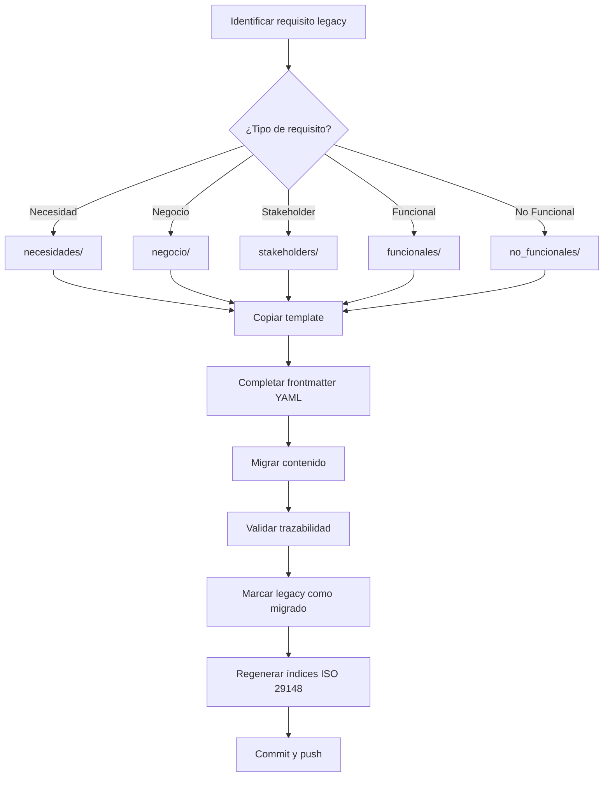

# 🔄 Guía de Migración de Requisitos Legacy

Esta guía documenta cómo migrar requisitos desde la estructura antigua a `docs/implementacion/`.

---

## 📊 Análisis de Situación Actual

### Archivos Legacy Encontrados

| Ubicación | Archivos | Tipo | Acción Recomendada |
|-----------|----------|------|-------------------|
| `docs/backend/requisitos/` | `rq_plantilla.md`, `trazabilidad.md` | Plantillas/Docs | ✅ MANTENER (no son requisitos) |
| `docs/frontend/requisitos/` | `readme.md` | README | ✅ MANTENER |
| `docs/infrastructure/requisitos/` | `readme.md` | README | ✅ MANTENER |
| `docs/requisitos/` | `rq_plantilla.md`, `trazabilidad.md` | Plantillas/Docs | ✅ MANTENER |
| `docs/solicitudes/sc00/` | Documentación evento | Docs proyecto | ✅ MANTENER (no es requisito) |
| `docs/solicitudes/sc01/` | Guía MkDocs | Doc operativa | ✅ MANTENER (no es requisito) |

### 🎯 Conclusión

**NO hay requisitos formales creados todavía** en el proyecto IACT.

Los archivos existentes son:
- ✅ Plantillas de documentación
- ✅ Documentación de guías
- ✅ Documentación de eventos/proyectos

**Por lo tanto**: La migración no es necesaria en este momento. Esta guía está preparada para cuando se creen requisitos formales.

---

## 🚀 Métodos de Migración

Hay 3 métodos disponibles dependiendo del volumen:

### **Método 1: Migración Automatizada** ⭐ (Recomendado para >5 requisitos)

Usar el script `scripts/migrate_requirements.py`:

```bash
# 1. Dry-run (preview sin modificar)
python scripts/migrate_requirements.py

# 2. Ejecutar migración real
python scripts/migrate_requirements.py --execute

# 3. Validar migración
python .github/workflows/scripts/generate_requirements_index.py

# 4. Revisar y ajustar
# Abrir archivos migrados y completar campos PENDIENTE
```

**El script automáticamente**:
- ✅ Detecta tipo de requisito (necesidad, negocio, stakeholder, funcional, no funcional)
- ✅ Detecta dominio (backend, frontend, infrastructure)
- ✅ Genera frontmatter YAML si no existe
- ✅ Mueve archivo a ubicación correcta en `docs/implementacion/`
- ✅ Marca campos que necesitan revisión manual

---

### **Método 2: Migración Manual** (Para 1-5 requisitos)

#### Paso 1: Identificar el requisito legacy

```bash
# Ejemplo: Tienes un archivo en
docs/backend/requisitos/calculo_stock.md
```

#### Paso 2: Determinar tipo y ubicación

¿Qué tipo de requisito es?
- **Necesidad de negocio** → `docs/implementacion/backend/requisitos/necesidades/`
- **Requisito de negocio** → `docs/implementacion/backend/requisitos/negocio/`
- **Requisito de stakeholder** → `docs/implementacion/backend/requisitos/stakeholders/`
- **Requisito funcional** → `docs/implementacion/backend/requisitos/funcionales/`
- **Requisito no funcional** → `docs/implementacion/backend/requisitos/no_funcionales/`

#### Paso 3: Copiar template correspondiente

```bash
cd docs/implementacion/backend/requisitos/funcionales/

# Copiar template
cp ../../../../plantillas/template_requisito_funcional.md rf001_calculo_stock.md
```

#### Paso 4: Migrar contenido

1. Abrir archivo legacy
2. Copiar contenido útil al nuevo archivo
3. Completar frontmatter YAML
4. Asegurar trazabilidad

#### Paso 5: Marcar legacy como migrado

Agregar al inicio del archivo legacy:

```markdown
---
MIGRADO: Este requisito fue migrado a docs/implementacion/backend/requisitos/funcionales/rf001_calculo_stock.md
FECHA_MIGRACION: 2025-11-03
---

# ⚠️ ARCHIVO MIGRADO

Este requisito fue movido a la nueva estructura.

**Nueva ubicación**: [rf001_calculo_stock.md](../../implementacion/backend/requisitos/funcionales/rf001_calculo_stock.md)
```

---

### **Método 3: Crear Desde Cero** (Para requisitos nuevos)

Si el requisito legacy está desactualizado o incompleto, mejor crear uno nuevo:

```bash
# 1. Elegir template
cd docs/implementacion/backend/requisitos/funcionales/

# 2. Copiar template
cp ../../../../plantillas/template_requisito_funcional.md rf001_nuevo_requisito.md

# 3. Completar desde cero usando información del legacy como referencia
vim rf001_nuevo_requisito.md
```

---

## 📋 Checklist de Migración

Para cada requisito migrado, verificar:

### Antes de Migrar
- [ ] Identificar tipo correcto de requisito
- [ ] Determinar dominio (backend/frontend/infrastructure)
- [ ] Verificar que es un requisito real (no plantilla/doc)

### Durante Migración
- [ ] Copiar template correspondiente
- [ ] Completar frontmatter YAML
- [ ] Migrar contenido del legacy
- [ ] Asignar ID único (N-XXX, RN-XXX, RS-XXX, RF-XXX, RNF-XXX)
- [ ] Documentar trazabilidad upward
- [ ] Documentar trazabilidad downward
- [ ] Identificar stakeholders
- [ ] Definir criterios de aceptación

### Después de Migrar
- [ ] Validar que archivo está en ubicación correcta
- [ ] Marcar archivo legacy como migrado
- [ ] Regenerar índices ISO 29148
- [ ] Validar enlaces en índices
- [ ] Commit y push

---

## 🔍 Detección Automática de Tipo

El script usa estas reglas para detectar tipo:

| Tipo | Keywords en Nombre | Keywords en Contenido |
|------|-------------------|----------------------|
| **Necesidad** | necesidad, need | necesidad, business need, problema, oportunidad |
| **Negocio** | negocio, business | requisito de negocio, business requirement, objetivo |
| **Stakeholder** | stakeholder, usuario, cliente | stakeholder, usuario necesita, cliente necesita |
| **Funcional** | funcional, functional, rf | el sistema deberá, functional requirement, API, endpoint |
| **No Funcional** | nofuncional, rnf, performance | performance, seguridad, disponibilidad, non-functional |

**Si no detecta**: Por defecto asigna a "funcionales" (revisar manualmente).

---

## 🎯 Ejemplos de Migración

### Ejemplo 1: Requisito Funcional

**Legacy**: `docs/backend/requisitos/calculo_stock.md`

```markdown
# Cálculo de Stock Mínimo

El sistema debe calcular el stock mínimo...
```

**Migrado a**: `docs/implementacion/backend/requisitos/funcionales/rf001_calculo_stock.md`

```yaml
---
id: RF-001
tipo: funcional
titulo: API para cálculo de stock mínimo
dominio: backend
owner: equipo-backend
prioridad: alta
estado: aprobado

trazabilidad_upward:
  - N-001  # Reducir roturas de stock
  - RN-001 # Sistema de alertas

trazabilidad_downward:
  - TEST-001
  - TEST-002

stakeholders:
  - gerente_compras
  - analista_inventario
---

# RF-001: API para cálculo de stock mínimo

El sistema **DEBERÁ** calcular el stock mínimo...
```

---

### Ejemplo 2: Necesidad de Negocio

**Legacy**: `docs/solicitudes/reducir_costos.md`

```markdown
# Reducir Costos Operativos

La empresa necesita reducir costos operativos en un 20%...
```

**Migrado a**: `docs/implementacion/backend/requisitos/necesidades/n001_reducir_costos.md`

```yaml
---
id: N-001
tipo: necesidad
titulo: Reducir costos operativos en 20%
dominio: backend
owner: equipo-ba
prioridad: critica
estado: aprobado
sponsor: cfo

stakeholders:
  - cfo
  - director_operaciones

babok_knowledge_area: "Business Analysis Planning and Monitoring"
iso29148_clause: "6.2"
---

# N-001: Reducir Costos Operativos

## Problema u Oportunidad
La empresa experimenta costos operativos elevados...
```

---

## 🔄 Flujo Completo de Migración



---

## ⚠️ Situaciones Especiales

### Si el legacy no tiene ID

**Solución**: Asignar ID nuevo basado en tipo:
- Necesidad → N-001, N-002, ...
- Req. Negocio → RN-001, RN-002, ...
- Req. Stakeholder → RS-001, RS-002, ...
- Req. Funcional → RF-001, RF-002, ...
- Req. No Funcional → RNF-001, RNF-002, ...

### Si el legacy no tiene trazabilidad

**Solución**: Marcar como PENDIENTE en frontmatter:

```yaml
trazabilidad_upward:
  - # PENDIENTE: Identificar requisito de nivel superior

trazabilidad_downward:
  - # PENDIENTE: Vincular con tests
```

### Si hay conflicto de IDs

**Solución**:
1. Verificar que no exista en `docs/implementacion/`
2. Si existe, usar siguiente número disponible
3. Actualizar referencias en otros requisitos

### Si el dominio no está claro

**Solución**:
- Cross-domain (afecta a todos) → poner en `backend/` y crear enlaces en otros dominios
- Específico → poner en el dominio correspondiente

---

## 📊 Post-Migración

### Validar Migración

```bash
# 1. Regenerar índices
python .github/workflows/scripts/generate_requirements_index.py

# 2. Revisar índices generados
cat docs/requisitos/brs_business_requirements.md
cat docs/requisitos/srs_software_requirements.md
cat docs/requisitos/matriz_trazabilidad_rtm.md

# 3. Buscar enlaces rotos
grep -r "PENDIENTE" docs/implementacion/

# 4. Contar requisitos migrados
find docs/implementacion -name "*.md" -type f ! -name "README.md" | wc -l
```

### Limpiar Legacy (Opcional)

**Opción A: Archivar**
```bash
mkdir docs/_legacy
mv docs/backend/requisitos docs/_legacy/backend_requisitos
```

**Opción B: Marcar como deprecated**
Agregar `_DEPRECATED.md` en cada carpeta legacy.

**Opción C: Mantener read-only**
Dejar legacy sin cambios por 3-6 meses, luego archivar.

---

## 🚀 Ejecutar Migración Ahora

### Dry-Run (Recomendado primero)

```bash
# Ver qué se haría SIN modificar archivos
python scripts/migrate_requirements.py
```

### Ejecución Real

```bash
# Ejecutar migración
python scripts/migrate_requirements.py --execute

# Revisar resultados
find docs/implementacion -name "*.md" -type f

# Completar campos PENDIENTE manualmente
vim docs/implementacion/backend/requisitos/funcionales/rf001_*.md

# Regenerar índices
python .github/workflows/scripts/generate_requirements_index.py

# Commit
git add docs/implementacion/
git commit -m "feat(req): migrar requisitos legacy a docs/implementacion/"
git push
```

---

## 📚 Referencias

- [Estructura de Implementación](README.md)
- [Plantillas ISO 29148](../plantillas/readme.md)
- [Glosario BABOK/PMBOK/ISO](../anexos/glosario_babok_pmbok_iso.md)
- [Script de Migración](../../scripts/migrate_requirements.py)

---

## 📝 Registro de Migraciones

Mantener registro de migraciones realizadas:

| Fecha | Requisitos Migrados | Responsable | Commit |
|-------|-------------------|-------------|--------|
| 2025-11-03 | 0 (sin requisitos legacy) | equipo-arquitectura | - |
| YYYY-MM-DD | X requisitos | [nombre] | [hash] |

---

**Última actualización**: 2025-11-03
**Responsable**: equipo-arquitectura
**Estado**: Listo para usar cuando existan requisitos legacy
