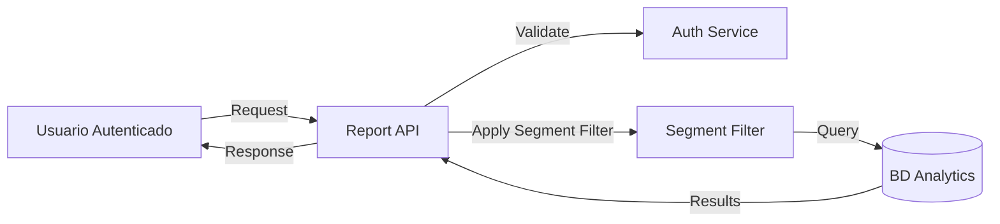

# Tareas Pendientes - Análisis de Amenazas de Módulos de Aplicación

**Fecha de creación:** 2025-11-04
**Estado:** Pendiente de iniciar
**Prioridad:** Alta
**Contexto:** Continuación del análisis de seguridad

---

## 📋 Resumen

Se requiere crear un documento complementario de análisis de amenazas que cubra los módulos de aplicación del sistema IACT. Actualmente existe `ANALISIS_SEGURIDAD_AMENAZAS.md` que cubre Autenticación y RBAC, pero falta el análisis para:

- Módulo de Reportes
- Módulo de Dashboard y Widgets
- Módulo de Alertas
- Módulo de Exportaciones (CSV, Excel, PDF)
- Módulo de ETL
- Módulo de Gestión de Usuarios
- Sistema de Mensajería Interno
- Integración con BD IVR (read-only)

---

## ✅ Completado

- [x] Análisis de estructura y módulos del sistema IACT
- [x] Identificación de componentes principales
- [x] Revisión de restricciones de seguridad (`restricciones_y_lineamientos.md`)

---

## 🔲 Tareas Pendientes

### 1. Crear Análisis de Amenazas para Módulos de Aplicación

**Objetivo:** Crear documento `ANALISIS_AMENAZAS_APLICACION.md` en `docs/implementacion/backend/seguridad/`

**Alcance:**
- Análisis de seguridad de componentes de aplicación (no autenticación/RBAC)
- Enfoque en módulos de negocio y datos

**Entregable:** Documento markdown estructurado con análisis STRIDE completo

---

### 2. Generar DFDs de Nivel de Aplicación

**Descripción:**
Crear Data Flow Diagrams (DFDs) que muestren:

- **DFD Nivel 0:** Vista general de la aplicación completa
  - Usuario autenticado → Sistema IACT → BD IVR (readonly) + BD Analytics

- **DFD Nivel 1 - Módulo de Reportes:**
  - Actor: Analista
  - Flujos: Request → ReportService → Query Engine → BD Analytics/IVR
  - Aplicación de filtros de segmento (RBAC)
  - Generación de resultados con paginación

- **DFD Nivel 1 - Módulo de Dashboard:**
  - Actor: Usuario con rol específico
  - Flujos: Dashboard View → Widget Service → Cache → BD Analytics
  - Personalización según permisos
  - Widgets configurables

- **DFD Nivel 1 - Módulo de Exportaciones:**
  - Actor: Usuario autorizado
  - Flujos: Export Request → Export Service → Limit Validation → File Generation
  - Límites por rol
  - Validación de volumen de datos

- **DFD Nivel 1 - Módulo de Alertas:**
  - Actor: Sistema (scheduler)
  - Flujos: Alert Evaluator → Threshold Check → InternalMessage → User Inbox
  - NO email (restricción crítica)
  - Gestión de severidades

- **DFD Nivel 1 - ETL:**
  - Actor: Scheduler (APScheduler)
  - Flujos: ETL Job → BD IVR (readonly) → Transform → BD Analytics
  - Transaccional (rollback completo)
  - Actualización de DataAvailability

**Formato:** Diagramas Mermaid embebidos en markdown

---

### 3. Aplicar STRIDE a Componentes de Aplicación

**Descripción:**
Analizar cada componente identificado usando la metodología STRIDE:

#### 3.1 Análisis STRIDE por Componente

**Componentes a analizar:**

1. **ReportService**
   - **S**poofing: ¿Puede un usuario suplantar identidad para acceder a reportes ajenos?
   - **T**ampering: ¿Pueden modificarse datos antes de generar el reporte?
   - **R**epudiation: ¿Puede un usuario negar que generó un reporte?
   - **I**nformation Disclosure: ¿Puede filtrarse info de otros segmentos?
   - **D**enial of Service: ¿Query muy grande puede tumbar el sistema?
   - **E**levation of Privilege: ¿Puede bypassear filtros de segmento?

2. **DashboardService**
   - Mismo análisis STRIDE

3. **ExportService**
   - Mismo análisis STRIDE
   - Énfasis en DoS (archivos masivos)
   - Information Disclosure (exportar datos prohibidos)

4. **AlertService**
   - Mismo análisis STRIDE
   - Énfasis en integridad (alertas falsas)

5. **ETLService**
   - Mismo análisis STRIDE
   - Énfasis en integridad de datos (fuente IVR)
   - DoS (ETL que no termina)

6. **InternalMessageService**
   - Mismo análisis STRIDE
   - Énfasis en confidencialidad (mensajes de otros usuarios)

#### 3.2 Análisis STRIDE por Interacción

**Interacciones críticas:**

| Interacción | S | T | R | I | D | E |
|-------------|---|---|---|---|---|---|
| Usuario → ReportService | ? | ? | ? | ? | ? | ? |
| ReportService → BD IVR | ? | ? | ? | ? | ? | ? |
| ExportService → File System | ? | ? | ? | ? | ? | ? |
| ETL → BD IVR (readonly) | ? | ? | ? | ? | ? | ? |
| ETL → BD Analytics (write) | ? | ? | ? | ? | ? | ? |
| AlertEvaluator → InternalMessage | ? | ? | ? | ? | ? | ? |
| DashboardService → Cache | ? | ? | ? | ? | ? | ? |

**Formato:** Tablas y descripciones detalladas por cada celda

---

### 4. Crear Catálogo de Amenazas Específico

**Descripción:**
Identificar amenazas concretas basadas en el análisis STRIDE.

**Estructura del catálogo:**

```markdown
### THR-APP-001: [Nombre de la amenaza]

**Descripción:**
[Descripción detallada de la amenaza]

**Componente afectado:**
[ReportService/ExportService/etc.]

**STRIDE:**
[Categoría: Spoofing/Tampering/etc.]

**Vector de ataque:**
1. [Paso 1 del ataque]
2. [Paso 2 del ataque]
3. [Impacto resultante]

**Probabilidad:**
[Alta (3) / Media (2) / Baja (1)]

**Impacto:**
[Crítico (3) / Alto (2) / Moderado (1)]

**Riesgo:**
[Probabilidad × Impacto = Score]

**Controles existentes:**
- [Control preventivo 1]
- [Control detectivo 2]

**Controles recomendados:**
- [Control adicional 1]
- [Control adicional 2]

**Dueño:**
[Equipo responsable]

**Fecha límite:**
[YYYY-MM-DD]

**Estado:**
[Identificada/En mitigación/Mitigada]
```

**Amenazas a identificar (mínimo 15):**

Ejemplos esperados:
- THR-APP-001: Query no optimizada causa DoS en reportes
- THR-APP-002: Exportación masiva de datos sin throttling
- THR-APP-003: Filtro de segmento bypasseable en reportes
- THR-APP-004: Alerta falsa por manipulación de umbrales
- THR-APP-005: ETL puede leer data no autorizada de IVR
- THR-APP-006: Dashboard expone métricas de otros segmentos
- THR-APP-007: Mensaje interno enviado a destinatario incorrecto
- THR-APP-008: Cache de dashboard contiene datos sensibles sin cifrar
- THR-APP-009: Log de exportación contiene PII en claro
- THR-APP-010: Usuario puede modificar criterios de alerta de otros
- ... (hasta THR-APP-015+)

---

### 5. Crear Matriz de Riesgos

**Descripción:**
Crear tabla de priorización de amenazas.

**Formato:**

| Amenaza | Probabilidad | Impacto | Riesgo | Prioridad | Due Date | Owner |
|---------|--------------|---------|--------|-----------|----------|-------|
| THR-APP-001 | 3 | 3 | 9 | CRÍTICA | 2025-12-15 | Backend |
| THR-APP-002 | 3 | 2 | 6 | ALTA | 2026-01-15 | Backend |
| THR-APP-003 | 2 | 3 | 6 | ALTA | 2025-12-31 | Security |
| ... | ... | ... | ... | ... | ... | ... |

**Clasificación de riesgos:**
- **9:** Crítico (máxima prioridad)
- **6:** Alto (prioridad alta)
- **4:** Medio (prioridad media)
- **3:** Bajo (prioridad baja)
- **1-2:** Trivial (monitorear)

---

### 6. Documentar Controles y Mitigaciones

**Descripción:**
Catálogo de controles de seguridad específicos para cada amenaza.

**Estructura:**

#### 6.1 Controles Preventivos

```markdown
| ID | Control | Amenazas Mitigadas | Implementación | Estado |
|----|---------|-------------------|----------------|--------|
| CTRL-APP-P01 | Validación de rango de fechas (max 2 años) | THR-APP-001 | ReportService | Implementado |
| CTRL-APP-P02 | Throttling de exportaciones por rol | THR-APP-002 | ExportService | Implementado |
| CTRL-APP-P03 | Aplicación automática de filtro de segmento | THR-APP-003 | SegmentFilter | Pendiente |
| ... | ... | ... | ... | ... |
```

#### 6.2 Controles Detectivos

```markdown
| ID | Control | Qué detecta | Implementación | Estado |
|----|---------|-------------|----------------|--------|
| CTRL-APP-D01 | Log de todas las exportaciones | Exportaciones anómalas | AuditLog | Implementado |
| CTRL-APP-D02 | Monitoreo de tiempo de queries | Queries lentas (>10s) | QueryMonitor | Pendiente |
| CTRL-APP-D03 | Alertas de acceso fuera de horario | Acceso sospechoso | AlertService | Pendiente |
| ... | ... | ... | ... | ... |
```

#### 6.3 Controles Correctivos

```markdown
| ID | Control | Qué corrige | Implementación | Estado |
|----|---------|-------------|----------------|--------|
| CTRL-APP-C01 | Rollback de ETL si falla validación | Datos inconsistentes | ETL @transaction.atomic | Implementado |
| CTRL-APP-C02 | Cancelación automática de queries >5min | DoS por query larga | Query timeout | Pendiente |
| CTRL-APP-C03 | Revocación automática de permisos expirados | Permisos vencidos | PermissionCleanup job | Pendiente |
| ... | ... | ... | ... | ... |
```

---

### 7. Agregar Métricas de Seguridad Específicas

**Descripción:**
Definir KPIs de seguridad para módulos de aplicación.

**Métricas a incluir:**

```markdown
### KPIs de Seguridad de Aplicación

| Métrica | Objetivo | Frecuencia | Alerta |
|---------|----------|------------|--------|
| **Exportaciones por usuario/día** | < límite por rol | Diaria | > 80% del límite |
| **Queries de reportes > 10s** | < 5% | Diaria | > 10% |
| **Fallos de ETL** | 0 | Por ejecución | > 0 |
| **Alertas no leídas > 7 días** | < 10 por usuario | Semanal | > 20 |
| **Cache hits en dashboard** | > 80% | Diaria | < 50% |
| **Violaciones de filtro de segmento** | 0 | Mensual | > 0 |
| **Mensajes internos no entregados** | < 1% | Diaria | > 2% |
| **Tiempo de respuesta dashboard** | < 3s | Continua | > 5s |
```

---

### 8. Commit del Documento

**Descripción:**
Una vez completadas las tareas anteriores, commitear el documento final.

**Comandos:**
```bash
git add docs/implementacion/backend/seguridad/ANALISIS_AMENAZAS_APLICACION.md
git commit -m "docs: agregar análisis de amenazas para módulos de aplicación

- DFDs de nivel 1 para reportes, dashboard, exportaciones, alertas y ETL
- Análisis STRIDE completo por componente e interacción
- Catálogo de 15+ amenazas específicas (THR-APP-001 a THR-APP-015+)
- Matriz de riesgos con priorización
- Controles preventivos, detectivos y correctivos
- KPIs de seguridad para módulos de aplicación
"
git push -u origin claude/add-api-tdd-tests-011CUnSQ9QwKuZXVsFgTJZcr
```

---

## 📚 Referencias y Contexto

### Documentos de Referencia

1. **ANALISIS_SEGURIDAD_AMENAZAS.md** (ya existe)
   - Ubicación: `docs/implementacion/backend/seguridad/ANALISIS_SEGURIDAD_AMENAZAS.md`
   - Contiene: Análisis de Autenticación y RBAC
   - Usar como plantilla de estructura y formato

2. **restricciones_y_lineamientos.md**
   - Ubicación: `docs/implementacion/backend/requisitos/restricciones_y_lineamientos.md`
   - Contiene: Restricciones críticas del sistema
   - **CRÍTICO:** Incorporar restricciones en el análisis:
     - ❌ NO EMAIL (solo buzón interno)
     - 🔒 BD IVR READONLY (solo SELECT)
     - 💾 SESIONES EN BD (no Redis)
     - 🔄 NO REAL-TIME (actualización por ETL 6-12h)
     - 📊 LÍMITES DE EXPORTACIÓN (CSV: 100k, Excel: 100k, PDF: 10k)
     - ⏱️ TIMEOUTS (Reportes: 5s, Exports: 60-120s)

3. **Requisitos Funcionales** (RF-001 a RF-010)
   - Ubicación: `docs/implementacion/backend/requisitos/funcionales/`
   - Contexto de negocio para entender flujos

### Metodologías Aplicables

- **STRIDE:** Spoofing, Tampering, Repudiation, Information Disclosure, Denial of Service, Elevation of Privilege
- **PASTA:** Process for Attack Simulation and Threat Analysis
- **LINDDUN:** Privacy threat modeling (aplicar a PII en reportes/exports)
- **OWASP Top 10:** Para APIs web

### Herramientas de Diagramación

- **Mermaid:** Para todos los DFDs (ya usado en documento existente)
- Formato de ejemplo:


### Componentes del Sistema

**Backend (Django/DRF):**
- `callcentersite/apps/users/` - Usuarios y permisos
- `callcentersite/apps/authentication/` - Autenticación (ya analizado)
- `callcentersite/apps/reports/` - Reportes (PENDIENTE ANALIZAR)
- `callcentersite/apps/dashboard/` - Dashboard y widgets (PENDIENTE)
- `callcentersite/apps/alerts/` - Sistema de alertas (PENDIENTE)
- `callcentersite/apps/exports/` - Exportaciones (PENDIENTE)
- `callcentersite/apps/etl/` - ETL de IVR a Analytics (PENDIENTE)
- `callcentersite/apps/messages/` - Mensajería interna (PENDIENTE)

**Bases de Datos:**
- BD Analytics (PostgreSQL) - Read/Write
- BD IVR (MySQL Legacy) - Read-only

---

## 🎯 Criterios de Aceptación

El documento `ANALISIS_AMENAZAS_APLICACION.md` estará completo cuando:

- [ ] Contiene DFDs de Nivel 0 y Nivel 1 para todos los módulos
- [ ] Incluye análisis STRIDE completo (tablas por componente e interacción)
- [ ] Define al menos 15 amenazas específicas con formato completo
- [ ] Contiene matriz de riesgos con priorización
- [ ] Lista al menos 20 controles (preventivos, detectivos, correctivos)
- [ ] Define 8+ KPIs de seguridad para aplicación
- [ ] Incorpora todas las restricciones críticas del sistema
- [ ] Usa formato Mermaid para diagramas
- [ ] Sigue la estructura del documento existente `ANALISIS_SEGURIDAD_AMENAZAS.md`
- [ ] Está commiteado y pusheado al repositorio

---

## 💡 Notas Adicionales

### Prioridades de Análisis

1. **CRÍTICO:** Módulo de Reportes y Exportaciones (alto riesgo de information disclosure)
2. **ALTO:** ETL (integridad de datos, DoS)
3. **ALTO:** Sistema de Alertas (disponibilidad, integridad)
4. **MEDIO:** Dashboard (confidencialidad, DoS)
5. **MEDIO:** Mensajería interna (confidencialidad)

### Restricciones Críticas a Destacar en Análisis

- **NO EMAIL:** Todas las notificaciones van por buzón interno → analizar amenazas de suplantación de mensajes
- **BD IVR READONLY:** Usuario con solo SELECT → analizar si hay riesgo de escalación a WRITE
- **SESIONES EN BD:** No Redis → analizar rendimiento como DoS potencial
- **NO REAL-TIME:** ETL cada 6-12h → analizar integridad de datos obsoletos
- **LÍMITES DE EXPORTACIÓN:** Controlados por rol → analizar bypass de límites

### Formato de Entrega

- Documento markdown autocontenido
- Diagramas Mermaid embebidos
- Tablas para catálogos y matrices
- Secciones numeradas para fácil navegación
- Índice al inicio con links internos
- Frontmatter YAML con metadatos

---

**Documento creado por:** Claude (Sesión: claude/add-api-tdd-tests-011CUnSQ9QwKuZXVsFgTJZcr)
**Para retomar:** En nueva sesión, leer este documento y ejecutar tareas pendientes 1-8
