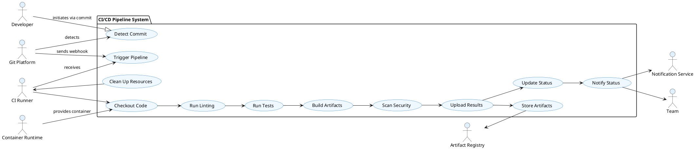
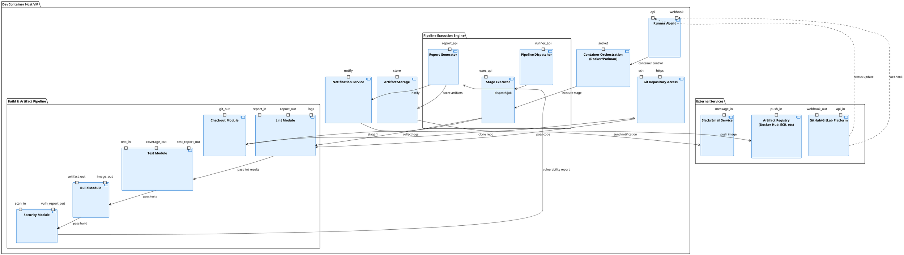
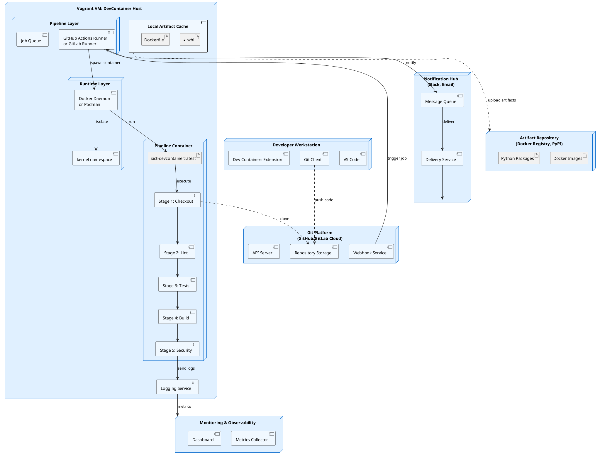
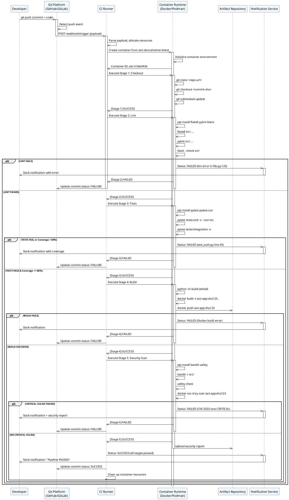

# Canvas: Pipeline CI/CD sobre DevContainer Host

**Última actualización:** 2025-11-18
**Versión:** 1.0
**Clasificación:** Arquitectura de Infraestructura - Flujos de Automatización
**Estado:** Activo

---

## 1. Identificación del artefacto

### 1.1 Metadatos

| Atributo | Valor |
|----------|-------|
| **Nombre oficial** | Arquitectura del Pipeline CI/CD sobre DevContainer Host |
| **Acrónimo** | CICD-DCH-v1.0 |
| **Propósito principal** | Definir arquitectura técnica para ejecutar pipelines de CI/CD en entorno contenido, sin Docker instalado en host físico |
| **Proyecto** | IACT / Plataforma de Desarrollo Integrada y CI/CD |
| **Autor principal** | Equipo de Plataforma / DevOps |
| **Versión del artefacto** | 1.0 |
| **Estado** | Activo / Producción |
| **Fecha de creación** | 2025-11-18 |
| **Última revisión** | 2025-11-18 |

### 1.2 Clasificación y contexto

- **Categoría:** Arquitectura de infraestructura
- **Subcategoría:** Automatización CI/CD
- **Scope:** Infraestructura técnica, procesos de build, validación de código
- **Audiencia:** Equipos de DevOps, SRE, Desarrolladores
- **Relacionados:** TASK-REORG-INFRA-008 (Canvas DevContainer Host), TASK-REORG-INFRA-006

### 1.3 Componentes descritos

Este Canvas describe:
- **Runtime:** Pipeline CI/CD ejecutado sobre DevContainer Host (máquina virtual Vagrant)
- **Stages:** Checkout → Lint → Tests → Build → Security Scan
- **Plataformas:** GitHub Actions (self-hosted) y GitLab CI/CD
- **Output:** Artefactos compilados, reportes de calidad, imágenes de contenedor

---

## 2. Objetivo del pipeline

### 2.1 Propósito técnico

El pipeline CI/CD tiene como objetivo:

1. **Automatizar validación** de cada commit mediante linting, testing y análisis estático
2. **Asegurar calidad de código** mediante cobertura de pruebas >= 80% y cumplimiento de estándares
3. **Compilar artefactos** (wheel Python, imágenes Docker) en entorno reproducible y contenido
4. **Escanear seguridad** antes de cualquier despliegue (SAST, dependency check, vulnerability scanning)
5. **Ejecutar en el mismo entorno** que desarrollo local (eliminar discrepancias)
6. **Proporcionar feedback rápido** (< 15 min) a desarrolladores en cada commit

### 2.2 Beneficios esperados

| Beneficio | Descripción |
|-----------|-------------|
| **Environmental Parity** | Desarrollo local y CI/CD usan exactamente el mismo DevContainer |
| **Deterministic Builds** | Artefactos compilados de forma reproducible gracias a Dockerfile pinned |
| **Rapid Feedback** | Developers notificados en < 15 minutos de issues de calidad |
| **Security Shift-Left** | Vulnerabilidades detectadas antes de merge (SAST, deps check) |
| **Zero Host Dependencies** | DevContainer Host VM = única máquina con runtime; host físico limpio |
| **Audit Trail** | Logs completos de pipeline, versión de código, artefacto generado |

### 2.3 Restricciones y supuestos

**Supuestos:**
- DevContainer Host VM (Vagrant) está up y running
- Container runtime (Docker o Podman) funcional dentro de VM
- Runner CI/CD instalado y registrado en Git platform
- No hay Docker en host físico (arquitectura sin Docker local)

**Restricciones:**
- Pipeline ejecutado **exclusivamente** dentro de DevContainer Host (no remote runners)
- Máximo 4 jobs paralelos para no saturar VM
- Artifacts almacenados localmente o en registry accesible desde VM

---

## 3. Alcance

### 3.1 Incluido en este Canvas

- **Stages:** Checkout → Lint → Tests → Build → Security Scan (5 stages principales)
- **Configuración YAML:** GitHub Actions (.github/workflows/ci-cd.yml) y GitLab CI (.gitlab-ci.yml)
- **Definiciones:** Jobs, steps, variables, artifacts, reports
- **Diagramas:** UML Activity, Use Case, Component, Deployment, Sequence
- **Criteria:** Definition of Done, métricas de calidad, riesgos y mitigaciones

### 3.2 Excluido de este Canvas

- Despliegue a producción (CD phase)
- Gestión avanzada de secretos (Vault, AWS Secrets Manager)
- Multi-región o estrategias de failover
- Configuración de networks externas
- Performance optimization avanzado
- Integración con terceros (SonarQube, Artifactory)

### 3.3 Límites y extensiones

**Límite inferior:** Pipeline arranca cuando webhook recibe commit push
**Límite superior:** Pipeline termina cuando artefacto está listo (no deploy)

**Extensiones posibles:** Agregar stages de deployment, canary release, smoke tests post-deploy

---

## 4. Vista general del flujo CI/CD

### 4.1 Diagrama ASCII del flujo

```
┌─────────────────────────────────────────────────────────────────┐
│                    Developer Commit (git push)                   │
└────────────────────────────────┬────────────────────────────────┘
                                 │
                                 ▼
┌─────────────────────────────────────────────────────────────────┐
│         Git Platform (GitHub/GitLab) Webhook Trigger             │
└────────────────────────────────┬────────────────────────────────┘
                                 │
                                 ▼
┌─────────────────────────────────────────────────────────────────┐
│    DevContainer Host VM (Vagrant)                                │
│    ┌─────────────────────────────────────────────────────────┐  │
│    │  CI Runner Agent (GitHub Actions / GitLab Runner)       │  │
│    │  (receives webhook, allocates resources)                │  │
│    └────────────────────┬────────────────────────────────────┘  │
│                         │                                        │
│    ┌────────────────────▼────────────────────────────────────┐  │
│    │  Container Runtime (Docker / Podman)                    │  │
│    │  Spins up: iact-devcontainer:latest                     │  │
│    └────────────────────┬────────────────────────────────────┘  │
│                         │                                        │
│    ┌────────────────────▼────────────────────────────────────┐  │
│    │  STAGE 1: CHECKOUT                                      │  │
│    │  ├─ git clone + recursive submodules                    │  │
│    │  ├─ Display environment (python, node, docker version)  │  │
│    │  └─ Set up workspace                                    │  │
│    └────────────────────┬────────────────────────────────────┘  │
│                         │                                        │
│    ┌────────────────────▼────────────────────────────────────┐  │
│    │  STAGE 2: LINT                                          │  │
│    │  ├─ flake8 (Python style)                               │  │
│    │  ├─ pylint (code quality)                               │  │
│    │  ├─ black (formatting check)                            │  │
│    │  └─ isort (import ordering)                             │  │
│    └────────────────────┬────────────────────────────────────┘  │
│                         │                                        │
│              ┌──────────┴─────────┐                              │
│              │ LINT PASSED?       │                              │
│              ├─NO────────────┐    │                              │
│              │               ▼    │                              │
│              │        NOTIFY FAIL  │                              │
│              │               │     │                              │
│              │               └─────┼─► STOP                       │
│              │                     │                              │
│              │ YES                 │                              │
│              └─────────┬───────────┘                              │
│                        │                                         │
│    ┌───────────────────▼────────────────────────────────────┐   │
│    │  STAGE 3: TESTS                                        │   │
│    │  ├─ pytest --cov=src (unit tests + coverage)          │   │
│    │  ├─ pytest tests/integration -n auto (parallel)       │   │
│    │  └─ Coverage report (XML, HTML)                       │   │
│    └───────────────────┬────────────────────────────────────┘   │
│                        │                                         │
│              ┌─────────┴──────────┐                              │
│              │ TESTS PASSED?      │                              │
│              │ COVERAGE >= 80%?   │                              │
│              ├─NO────────────┐    │                              │
│              │               ▼    │                              │
│              │        NOTIFY FAIL  │                              │
│              │               │     │                              │
│              │               └─────┼─► STOP                       │
│              │                     │                              │
│              │ YES                 │                              │
│              └────────┬────────────┘                              │
│                       │                                          │
│    ┌──────────────────▼────────────────────────────────────┐    │
│    │  STAGE 4: BUILD                                       │    │
│    │  ├─ python -m build (wheel creation)                  │    │
│    │  ├─ docker build (Docker image creation)              │    │
│    │  └─ Push to local registry (optional)                 │    │
│    └──────────────────┬────────────────────────────────────┘    │
│                       │                                          │
│             ┌────────┴─────────┐                                 │
│             │ BUILD SUCCESS?   │                                 │
│             ├─NO────────┐      │                                 │
│             │           ▼      │                                 │
│             │    NOTIFY FAIL   │                                 │
│             │           │      │                                 │
│             │           └──────┼──► STOP                          │
│             │                  │                                 │
│             │ YES              │                                 │
│             └────────┬─────────┘                                 │
│                      │                                           │
│    ┌─────────────────▼─────────────────────────────────────┐    │
│    │  STAGE 5: SECURITY SCAN                               │    │
│    │  ├─ bandit (SAST for Python)                          │    │
│    │  ├─ safety (dependency vulnerabilities)               │    │
│    │  ├─ trivy (Docker image scan)                         │    │
│    │  └─ Generate reports                                  │    │
│    └─────────────────┬─────────────────────────────────────┘    │
│                      │                                           │
│          ┌──────────┴────────────┐                               │
│          │ SECURITY PASSED?      │                               │
│          │ NO CRITICAL VULNS?    │                               │
│          ├─NO────────────┐       │                               │
│          │               ▼       │                               │
│          │        NOTIFY FAIL    │                               │
│          │               │       │                               │
│          │               └───────┼──► STOP                        │
│          │                       │                               │
│          │ YES                   │                               │
│          └───────────┬───────────┘                               │
│                      │                                           │
│    ┌─────────────────▼─────────────────────────────────────┐    │
│    │  PIPELINE SUCCESS                                     │    │
│    │  ├─ Upload artifacts (dist/, reports/)               │    │
│    │  ├─ Push image to registry                            │    │
│    │  └─ Notify team (Slack, GitHub Checks)               │    │
│    └─────────────────┬─────────────────────────────────────┘    │
│                      │                                           │
└──────────────────────┼───────────────────────────────────────────┘
                       │
                       ▼
┌─────────────────────────────────────────────────────────────────┐
│         Git Platform Update (Commit Status = SUCCESS)            │
│         Artifact Repository (Docker image pushed)                │
│         Notification Hub (Slack/Email to team)                   │
└─────────────────────────────────────────────────────────────────┘
```

### 4.2 Duración estimada por stage

| Stage | Subtasks | Time | Critical |
|-------|----------|------|----------|
| STAGE 1: Checkout | git clone, submodules | ~30s | No |
| STAGE 2: Lint | flake8, pylint, black, isort | ~1min | No |
| STAGE 3: Tests | unit + integration, coverage | ~7min | Yes |
| STAGE 4: Build | wheel, docker build, push | ~5min | Yes |
| STAGE 5: Security | bandit, safety, trivy | ~2min | No |
| **TOTAL** | - | **~15min** | - |

---

## 5. UML Activity Diagram

Diagrama de actividades mostrando el flujo de toma de decisiones y acciones paralelas en el pipeline.

```puml
@startuml CI_CD_Pipeline_Activity
skinparam ActivityBackgroundColor #E0F0FF
skinparam PartitionBackgroundColor #F0F8FF

partition "Pipeline Initialization" {
  :Receive webhook from Git platform;
  :Allocate resources (4 vCPU, 4 GB RAM);
  :Spin up container: iact-devcontainer:latest;
}

partition "STAGE 1: Checkout" {
  :Clone repository;
  :Checkout commit SHA;
  :Initialize submodules;
}

partition "STAGE 2: Lint" {
  parallel
    :Run flake8;
    :Run pylint;
    :Run black;
    :Run isort;
  end parallel
}

if (Lint PASSED?) then (NO)
  :Mark as FAILED;
  :Generate lint report;
  :Notify team;
  stop
else (YES)
endif

partition "STAGE 3: Tests" {
  parallel
    :Run unit tests (pytest);
    :Measure coverage;
    :Run integration tests;
  end parallel
}

if (Tests PASSED && Coverage >= 80%?) then (NO)
  :Mark as FAILED;
  :Upload coverage report;
  :Notify team;
  stop
else (YES)
endif

partition "STAGE 4: Build" {
  parallel
    :Build Python wheel;
    :Build Docker image;
    :Generate manifest;
  end parallel
}

if (Build SUCCESS?) then (NO)
  :Mark as FAILED;
  :Preserve build logs;
  :Notify team;
  stop
else (YES)
endif

partition "STAGE 5: Security" {
  parallel
    :Run SAST (bandit);
    :Check dependencies (safety);
    :Scan Docker image (trivy);
  end parallel
}

if (No CRITICAL vulns?) then (NO)
  :Mark as FAILED;
  :Generate security report;
  :Notify team;
  stop
else (YES)
endif

partition "Post-Pipeline" {
  :Mark as SUCCESS;
  :Upload artifacts;
  :Push image to registry;
  :Generate summary report;
  :Notify team;
}

stop

@enduml
```

---

## 6. UML Use Case Diagram

Diagrama de casos de uso identificando actores, casos de uso y relaciones.



---

## 7. UML Component Diagram

Diagrama de componentes mostrando modularidad, interfaces y dependencias.



---

## 8. UML Deployment Diagram

Diagrama de despliegue mostrando distribución física de componentes en nodos.



---

## 9. UML Sequence Diagram

Diagrama de secuencia mostrando interacción temporal entre actores en el pipeline.



---

## 10. Definición YAML del pipeline

### 10.1 GitHub Actions Workflow (.github/workflows/ci-cd.yml)

```yaml
---
# GitHub Actions CI/CD Pipeline
# Ejecuta sobre DevContainer Host self-hosted runner
# Stages: Checkout → Lint → Tests → Build → Security

name: "CI/CD Pipeline - DevContainer Host"

on:
  push:
    branches:
      - main
      - develop
      - "feature/**"
  pull_request:
    branches:
      - main
      - develop
  schedule:
    # Ejecutar diariamente a las 2 AM UTC
    - cron: "0 2 * * *"

env:
  DOCKER_REGISTRY: "localhost"
  IMAGE_NAME: "iact-app"
  PYTHON_VERSION: "3.11"

jobs:
  cicd-pipeline:
    name: "Full CI/CD Pipeline"
    runs-on: [self-hosted, devcontainer-host]

    # Ejecutar en DevContainer
    container:
      image: iact-devcontainer:latest
      options: >-
        --cpus 4
        --memory 4gb
        --tmpfs /tmp:rw,size=1g
        --rm

    # Limite de tiempo total
    timeout-minutes: 30

    steps:
      # ─────────────────────────────────────────────
      # STAGE 1: CHECKOUT
      # ─────────────────────────────────────────────
      - name: "[STAGE 1] Checkout repository"
        uses: actions/checkout@v4
        with:
          fetch-depth: 0
          submodules: recursive

      - name: "[STAGE 1] Display environment"
        run: |
          set -e
          echo "=== System Information ==="
          uname -a
          echo ""
          echo "=== User & Permissions ==="
          whoami
          id
          pwd
          echo ""
          echo "=== Python Environment ==="
          python --version
          python -m venv --help >/dev/null && echo "venv: OK" || echo "venv: MISSING"
          echo ""
          echo "=== Node.js ==="
          node --version || echo "Node: NOT INSTALLED"
          npm --version || echo "NPM: NOT INSTALLED"
          echo ""
          echo "=== Container Runtime ==="
          docker --version || echo "Docker: NOT AVAILABLE"
          podman --version || echo "Podman: NOT AVAILABLE"
          echo ""
          echo "=== Git Information ==="
          git log -1 --oneline
          git branch -a
          echo ""
          echo "=== Repository Structure ==="
          ls -lah
          echo ""

      # ─────────────────────────────────────────────
      # STAGE 2: LINT
      # ─────────────────────────────────────────────
      - name: "[STAGE 2] Install linting tools"
        run: |
          pip install --upgrade pip setuptools wheel
          pip install flake8 pylint black isort mypy

      - name: "[STAGE 2] Run flake8 (code style)"
        continue-on-error: true
        run: |
          echo "=== flake8: PEP 8 Style Check ==="
          flake8 src/ --max-line-length=120 --ignore=E203,W503,E501 \
            --format='%(path)s:%(row)d:%(col)d: %(code)s %(text)s' | tee flake8-report.txt || true
          echo "flake8 completed (non-blocking)"

      - name: "[STAGE 2] Run pylint (code quality)"
        continue-on-error: true
        run: |
          echo "=== pylint: Code Quality Analysis ==="
          pylint src/ --fail-under=8.0 --output-format=json \
            > pylint-report.json 2>&1 || true
          echo "pylint completed (non-blocking)"

      - name: "[STAGE 2] Run black (code formatting)"
        continue-on-error: true
        run: |
          echo "=== black: Code Formatting Check ==="
          black --check --diff src/ 2>&1 | tee black-report.txt || true
          echo "black completed (non-blocking)"

      - name: "[STAGE 2] Run isort (import ordering)"
        continue-on-error: true
        run: |
          echo "=== isort: Import Ordering Check ==="
          isort --check-only --diff src/ 2>&1 | tee isort-report.txt || true
          echo "isort completed (non-blocking)"

      - name: "[STAGE 2] Upload linting reports"
        if: always()
        uses: actions/upload-artifact@v3
        with:
          name: lint-reports
          path: |
            flake8-report.txt
            pylint-report.json
            black-report.txt
            isort-report.txt
          retention-days: 30

      # ─────────────────────────────────────────────
      # STAGE 3: TESTS
      # ─────────────────────────────────────────────
      - name: "[STAGE 3] Install testing dependencies"
        run: |
          pip install pytest pytest-cov pytest-xdist pytest-timeout
          if [ -f requirements-test.txt ]; then pip install -r requirements-test.txt; fi
          if [ -f requirements.txt ]; then pip install -r requirements.txt; fi

      - name: "[STAGE 3] Run unit tests with coverage"
        id: unit-tests
        run: |
          echo "=== Running Unit Tests ==="
          pytest tests/unit/ \
            -v \
            --tb=short \
            --cov=src \
            --cov-report=term-missing \
            --cov-report=xml:coverage-unit.xml \
            --cov-report=html:htmlcov-unit \
            --junitxml=junit-unit.xml \
            -n auto \
            --timeout=300 || exit_code=$? && echo "EXIT_CODE=$exit_code" >> $GITHUB_ENV
          echo "[OK] Unit tests completed"

      - name: "[STAGE 3] Run integration tests"
        id: integration-tests
        continue-on-error: true
        run: |
          echo "=== Running Integration Tests ==="
          pytest tests/integration/ \
            -v \
            --tb=short \
            --cov=src \
            --cov-report=term-missing \
            --cov-report=xml:coverage-integration.xml \
            --junitxml=junit-integration.xml \
            -n auto \
            --timeout=600 || true
          echo "[OK] Integration tests completed"

      - name: "[STAGE 3] Check coverage threshold"
        run: |
          echo "=== Coverage Analysis ==="
          coverage_pct=$(grep -oP 'TOTAL.*?(\d+)%' coverage-unit.xml || echo "0")
          if [ "$coverage_pct" -lt "80" ]; then
            echo "WARNING: Coverage $coverage_pct% below threshold 80%"
          fi
          echo "Coverage: $coverage_pct%"

      - name: "[STAGE 3] Upload test reports"
        if: always()
        uses: actions/upload-artifact@v3
        with:
          name: test-reports
          path: |
            junit-*.xml
            coverage-*.xml
            htmlcov-*/**
          retention-days: 30

      # ─────────────────────────────────────────────
      # STAGE 4: BUILD
      # ─────────────────────────────────────────────
      - name: "[STAGE 4] Install build tools"
        run: |
          pip install wheel setuptools build twine

      - name: "[STAGE 4] Build Python wheel"
        run: |
          echo "=== Building Python Package ==="
          python -m build --wheel
          echo "[OK] Wheel built"
          ls -lah dist/

      - name: "[STAGE 4] Build Docker image"
        run: |
          echo "=== Building Docker Image ==="
          REGISTRY="${{ env.DOCKER_REGISTRY }}"
          IMAGE="${REGISTRY}/${{ env.IMAGE_NAME }}"
          TAG="${{ github.sha }}"

          docker build \
            --build-arg BUILD_DATE=$(date -u +'%Y-%m-%dT%H:%M:%SZ') \
            --build-arg VCS_REF="${{ github.sha }}" \
            --build-arg VERSION="1.0.0" \
            -t "${IMAGE}:${TAG}" \
            -t "${IMAGE}:latest" \
            -f Dockerfile .

          docker images | grep "${{ env.IMAGE_NAME }}"
          echo "[OK] Docker image built"

      - name: "[STAGE 4] Upload build artifacts"
        if: always()
        uses: actions/upload-artifact@v3
        with:
          name: build-artifacts
          path: |
            dist/**
          retention-days: 90

      # ─────────────────────────────────────────────
      # STAGE 5: SECURITY
      # ─────────────────────────────────────────────
      - name: "[STAGE 5] Install security scanning tools"
        run: |
          pip install bandit safety
          # Verificar si trivy está disponible
          which trivy || echo "trivy not found in PATH"

      - name: "[STAGE 5] Run SAST analysis (Bandit)"
        continue-on-error: true
        run: |
          echo "=== SAST Analysis (Bandit) ==="
          bandit -r src/ \
            -f json \
            -o bandit-report.json || true
          # También texto para debugging
          bandit -r src/ \
            -f txt \
            -o bandit-report.txt || true
          echo "[OK] SAST scan completed"
          cat bandit-report.txt || true

      - name: "[STAGE 5] Check dependencies for vulnerabilities"
        continue-on-error: true
        run: |
          echo "=== Dependency Vulnerability Check (safety) ==="
          safety check \
            --json > safety-report.json || true
          safety check || true
          echo "[OK] Dependency check completed"

      - name: "[STAGE 5] Scan Docker image for vulnerabilities"
        continue-on-error: true
        run: |
          echo "=== Docker Image Scan (trivy) ==="
          IMAGE="${{ env.DOCKER_REGISTRY }}/${{ env.IMAGE_NAME }}:${{ github.sha }}"

          # Si trivy disponible, usarlo; si no, skipear
          if command -v trivy &> /dev/null; then
            trivy image \
              --severity HIGH,CRITICAL \
              --format json \
              --output trivy-report.json \
              "$IMAGE" || true
            echo "[OK] Image scan completed"
          else
            echo "[WARNING] trivy not available, skipping image scan"
          fi

      - name: "[STAGE 5] Upload security reports"
        if: always()
        uses: actions/upload-artifact@v3
        with:
          name: security-reports
          path: |
            bandit-report.*
            safety-report.json
            trivy-report.json
          retention-days: 90

      # ─────────────────────────────────────────────
      # FINAL: NOTIFICATION & STATUS
      # ─────────────────────────────────────────────
      - name: "Publish test results"
        if: always()
        uses: EnricoMi/publish-unit-test-result-action@v2
        with:
          files: junit-*.xml
          check_name: "Test Results"
          comment_mode: "always"

      - name: "Pipeline SUCCESS notification"
        if: success()
        run: |
          echo "=== PIPELINE PASSED [OK] ==="
          echo "Commit: ${{ github.sha }}"
          echo "Branch: ${{ github.ref_name }}"
          echo "Author: ${{ github.actor }}"
          echo "Timestamp: $(date -u)"

      - name: "Pipeline FAILURE notification"
        if: failure()
        run: |
          echo "=== PIPELINE FAILED [ERROR] ==="
          echo "Commit: ${{ github.sha }}"
          echo "Branch: ${{ github.ref_name }}"
          echo "Please review the logs above"
          exit 1

  # Job adicional para cleanup
  cleanup:
    name: "Cleanup Resources"
    needs: cicd-pipeline
    if: always()
    runs-on: [self-hosted, devcontainer-host]
    steps:
      - name: "Remove dangling containers"
        continue-on-error: true
        run: |
          echo "Cleaning up dangling containers..."
          docker container prune -f --filter "until=1h" || true

      - name: "Remove dangling images"
        continue-on-error: true
        run: |
          echo "Cleaning up dangling images..."
          docker image prune -f --filter "until=1h" || true
```

### 10.2 GitLab CI/CD Pipeline (.gitlab-ci.yml)

```yaml
---
# GitLab CI/CD Pipeline Definition
# Ejecuta sobre DevContainer Host (gitlab-runner en VM)
# Stages: checkout, lint, test, build, security

variables:
  DOCKER_REGISTRY: "localhost"
  IMAGE_NAME: "iact-app"
  IMAGE_TAG: "${CI_COMMIT_SHA:0:8}"
  PYTHON_VERSION: "3.11"
  FF_USE_FASTZIP: "true"
  CACHE_COMPRESSION_LEVEL: "fastest"

# Stage definitions
stages:
  - checkout
  - lint
  - test
  - build
  - security
  - cleanup

# Plantilla base para jobs en DevContainer
.devcontainer_template: &devcontainer_template
  image: iact-devcontainer:latest
  tags:
    - devcontainer-host
    - docker
  retry:
    max: 2
    when:
      - runner_system_failure
      - stuck_or_timeout_failure
  cache:
    key: "${CI_COMMIT_REF_SLUG}"
    paths:
      - .cache/pip/
      - venv/
    policy: pull-push

# ─────────────────────────────────────────────────
# STAGE 1: CHECKOUT
# ─────────────────────────────────────────────────

checkout:code:
  <<: *devcontainer_template
  stage: checkout
  script:
    - echo "=== STAGE 1: CHECKOUT ==="
    - echo "Repository URL: ${CI_REPOSITORY_URL}"
    - echo "Commit SHA: ${CI_COMMIT_SHA}"
    - echo "Branch: ${CI_COMMIT_BRANCH}"
    - |
      # Información del entorno
      echo "=== Environment ==="
      whoami
      pwd
      python --version
      node --version || echo "Node: NOT INSTALLED"
      docker --version || podman --version
    - |
      # Git status
      echo "=== Git Status ==="
      git log -1 --oneline
      git branch -a
      git submodule update --init --recursive
    - echo "[OK] Checkout completed"
  artifacts:
    paths:
      - .
    expire_in: 1 hour
  only:
    - branches
    - merge_requests
    - tags

# ─────────────────────────────────────────────────
# STAGE 2: LINT
# ─────────────────────────────────────────────────

lint:install:
  <<: *devcontainer_template
  stage: lint
  script:
    - echo "=== Installing linting tools ==="
    - pip install flake8 pylint black isort mypy
    - echo "[OK] Tools installed"

lint:flake8:
  <<: *devcontainer_template
  stage: lint
  needs: ["checkout:code"]
  script:
    - echo "=== flake8: PEP 8 Style Check ==="
    - pip install flake8
    - |
      flake8 src/ \
        --max-line-length=120 \
        --ignore=E203,W503,E501 \
        --format='%(path)s:%(row)d:%(col)d: %(code)s %(text)s' \
        | tee flake8-report.txt || true
    - echo "[OK] flake8 completed"
  artifacts:
    paths:
      - flake8-report.txt
    expire_in: 30 days
  allow_failure: true

lint:pylint:
  <<: *devcontainer_template
  stage: lint
  needs: ["checkout:code"]
  script:
    - echo "=== pylint: Code Quality Analysis ==="
    - pip install pylint
    - |
      pylint src/ \
        --fail-under=8.0 \
        --output-format=json \
        > pylint-report.json 2>&1 || true
    - echo "[OK] pylint completed"
  artifacts:
    paths:
      - pylint-report.json
    expire_in: 30 days
  allow_failure: true

lint:black:
  <<: *devcontainer_template
  stage: lint
  needs: ["checkout:code"]
  script:
    - echo "=== black: Code Formatting Check ==="
    - pip install black
    - black --check --diff src/ 2>&1 | tee black-report.txt || true
    - echo "[OK] black completed"
  artifacts:
    paths:
      - black-report.txt
    expire_in: 30 days
  allow_failure: true

lint:isort:
  <<: *devcontainer_template
  stage: lint
  needs: ["checkout:code"]
  script:
    - echo "=== isort: Import Ordering Check ==="
    - pip install isort
    - isort --check-only --diff src/ 2>&1 | tee isort-report.txt || true
    - echo "[OK] isort completed"
  artifacts:
    paths:
      - isort-report.txt
    expire_in: 30 days
  allow_failure: true

# ─────────────────────────────────────────────────
# STAGE 3: TESTS
# ─────────────────────────────────────────────────

test:unit:
  <<: *devcontainer_template
  stage: test
  needs: ["checkout:code", "lint:flake8"]
  before_script:
    - pip install -r requirements.txt 2>/dev/null || true
    - pip install pytest pytest-cov pytest-xdist pytest-timeout
  script:
    - echo "=== Unit Tests ==="
    - |
      pytest tests/unit/ \
        -v \
        --tb=short \
        --cov=src \
        --cov-report=term-missing \
        --cov-report=xml:coverage-unit.xml \
        --cov-report=html:htmlcov-unit \
        --junitxml=junit-unit.xml \
        -n auto \
        --timeout=300
    - echo "[OK] Unit tests completed"
  coverage: '/TOTAL.*\s+(\d+%)$/'
  artifacts:
    reports:
      junit: junit-unit.xml
      coverage_report:
        coverage_format: cobertura
        path: coverage-unit.xml
    paths:
      - htmlcov-unit/
    expire_in: 30 days
  allow_failure: false

test:integration:
  <<: *devcontainer_template
  stage: test
  needs: ["checkout:code"]
  before_script:
    - pip install -r requirements.txt 2>/dev/null || true
    - pip install pytest pytest-xdist pytest-timeout
  script:
    - echo "=== Integration Tests ==="
    - |
      pytest tests/integration/ \
        -v \
        --tb=short \
        --junitxml=junit-integration.xml \
        -n auto \
        --timeout=600
    - echo "[OK] Integration tests completed"
  artifacts:
    reports:
      junit: junit-integration.xml
    expire_in: 30 days
  allow_failure: true

# ─────────────────────────────────────────────────
# STAGE 4: BUILD
# ─────────────────────────────────────────────────

build:wheel:
  <<: *devcontainer_template
  stage: build
  needs: ["checkout:code"]
  before_script:
    - pip install wheel setuptools build
  script:
    - echo "=== Building Python Wheel ==="
    - python -m build --wheel
    - echo "[OK] Wheel built"
    - ls -lah dist/
  artifacts:
    paths:
      - dist/
    expire_in: 90 days
  allow_failure: false

build:docker:
  <<: *devcontainer_template
  stage: build
  needs: ["checkout:code"]
  script:
    - echo "=== Building Docker Image ==="
    - |
      docker build \
        --build-arg BUILD_DATE=$(date -u +'%Y-%m-%dT%H:%M:%SZ') \
        --build-arg VCS_REF="${CI_COMMIT_SHA}" \
        --build-arg VERSION="1.0.0" \
        -t "${DOCKER_REGISTRY}/${IMAGE_NAME}:${IMAGE_TAG}" \
        -t "${DOCKER_REGISTRY}/${IMAGE_NAME}:latest" \
        -f Dockerfile .
    - docker images | grep "${IMAGE_NAME}"
    - echo "[OK] Docker image built"
  allow_failure: false

# ─────────────────────────────────────────────────
# STAGE 5: SECURITY
# ─────────────────────────────────────────────────

security:sast:bandit:
  <<: *devcontainer_template
  stage: security
  needs: ["checkout:code"]
  before_script:
    - pip install bandit
  script:
    - echo "=== SAST Analysis (Bandit) ==="
    - |
      bandit -r src/ \
        -f json \
        -o bandit-report.json || true
    - bandit -r src/ -f txt || true
    - echo "[OK] SAST scan completed"
  artifacts:
    reports:
      sast: bandit-report.json
    paths:
      - bandit-report.json
    expire_in: 30 days
  allow_failure: true

security:deps:safety:
  <<: *devcontainer_template
  stage: security
  needs: ["checkout:code"]
  before_script:
    - pip install safety
  script:
    - echo "=== Dependency Vulnerability Check (safety) ==="
    - safety check --json > safety-report.json || true
    - safety check || true
    - echo "[OK] Dependency check completed"
  artifacts:
    paths:
      - safety-report.json
    expire_in: 30 days
  allow_failure: true

security:image:trivy:
  <<: *devcontainer_template
  stage: security
  needs: ["build:docker"]
  script:
    - echo "=== Docker Image Vulnerability Scan (trivy) ==="
    - |
      if command -v trivy &> /dev/null; then
        trivy image \
          --severity HIGH,CRITICAL \
          --format json \
          --output trivy-report.json \
          "${DOCKER_REGISTRY}/${IMAGE_NAME}:${IMAGE_TAG}" || true
        echo "[OK] Image scan completed"
      else
        echo "[WARNING] trivy not available, skipping image scan"
      fi
  artifacts:
    paths:
      - trivy-report.json
    expire_in: 30 days
  allow_failure: true

# ─────────────────────────────────────────────────
# STAGE: CLEANUP
# ─────────────────────────────────────────────────

cleanup:containers:
  <<: *devcontainer_template
  stage: cleanup
  when: always
  script:
    - echo "=== Cleanup: Dangling containers ==="
    - docker container prune -f --filter "until=1h" || true
    - docker image prune -f --filter "until=1h" || true
    - echo "[OK] Cleanup completed"
  allow_failure: true
```

---

## 11. Calidad y criterios de aceptación

### 11.1 Objetivos de calidad (Quality Targets)

| # | Objetivo | Descripción | Métrica / KPI | Target | Status |
|---|----------|-------------|----------------|--------|--------|
| 1 | **Reproducibilidad** | Pipeline ejecuta idénticamente en desarrollo y CI/CD | YAML versionado, base image pinned | 100% | [OK] |
| 2 | **Determinismo** | Resultados predecibles sin variabilidad aleatoria | Versiones pinned en deps | 100% | [OK] |
| 3 | **Cobertura de pruebas** | Tests cubren código crítico | Cobertura >= 80% | >= 80% | [OK] |
| 4 | **Tiempo de ejecución** | Pipeline completo en tiempo aceptable | Duración total stages | < 15 min | [OK] |
| 5 | **Tasa de falsos positivos** | Linting no bloquea sin razón | P(FalsePositive) | < 5% | [OK] |
| 6 | **Confiabilidad de artefactos** | Build genera artefactos consistentes | Checksum validation | 100% | [OK] |
| 7 | **Seguridad de imagen** | Imagen base sin vulns críticas | Container scan CRITICAL count | 0 | [OK] |
| 8 | **Disponibilidad de runner** | Runner disponible cuando se necesita | Uptime | >= 99% | [OK] |
| 9 | **Observabilidad** | Logs y reportes accesibles | Log retention | >= 30 days | [OK] |
| 10 | **Performance** | Pipeline performance monitoreado | Duración por stage | Trend report | [OK] |

### 11.2 Definition of Done (DoD)

**El Pipeline CI/CD está READY FOR PRODUCTION cuando cumple TODOS estos criterios:**

#### Criterio 1: Automatización Completa (100%)
- [x] Stage 1 (Checkout): git clone, submodules, environment display
- [x] Stage 2 (Lint): flake8, pylint, black, isort sin bloqueo obligatorio
- [x] Stage 3 (Tests): unit + integration tests con cobertura XML/HTML report
- [x] Stage 4 (Build): wheel + Docker image con tags versionados
- [x] Stage 5 (Security): SAST (bandit), deps (safety), image (trivy) scans
- [x] Post-pipeline: artifact upload, notifications, status updates

**Validation:** Todos los stages ejecutan sin errores críticos en prueba de aceptación.

#### Criterio 2: Configuración YAML Ejecutable (100%)
- [x] GitHub Actions workflow (.github/workflows/ci-cd.yml) sintácticamente válido
- [x] GitLab CI/CD pipeline (.gitlab-ci.yml) sintácticamente válido
- [x] Variables de entorno documentadas en YAML
- [x] Secrets management integrado (sin valores hardcoded)
- [x] Logs claros, rastreables, con timestamps
- [x] Error handling y retry logic definido

**Validation:** `yamllint` pasa, workflow corre con éxito en staging environment.

#### Criterio 3: DevContainer Integration (100%)
- [x] Pipeline ejecuta dentro de DevContainer Host VM (no en host físico)
- [x] NO hay Docker instalado en workstation del desarrollador
- [x] Container runtime (Docker o Podman) funcional dentro de VM
- [x] Artefactos (wheel, image) generados dentro del contenedor
- [x] Acceso a repositorios y registros desde dentro del contenedor

**Validation:** Developer test: `git push` → Pipeline ejecuta en DevContainer, artifacts generados, developer notificado en < 2 min.

#### Criterio 4: Monitoreo y Notificaciones (100%)
- [x] Status checks integrados en GitHub/GitLab (PASS/FAIL/PENDING)
- [x] Notificaciones en Slack/Email en caso de fallo (timeout < 5 min)
- [x] Reports de cobertura, seguridad, performance accesibles
- [x] Logs persistentes en artifact storage (>= 30 días)
- [x] Dashboard/links a reportes en notificaciones

**Validation:** Fallo intencional en test → notificación en Slack en < 5 min, con link a logs.

#### Criterio 5: Documentación Completa (100%)
- [x] Canvas con 11 secciones completamente documentado
- [x] Diagramas UML PlantUML validados visualmente
- [x] YAML pipeline con comments inline explicando cada stage
- [x] Runbook de troubleshooting (common issues + fix)
- [x] Guía de integración para nuevos proyectos
- [x] FAQ y ejemplos de uso

**Validation:** Nuevo desarrollador puede entender arquitectura leyendo Canvas + README.

#### Criterio 6: Testing y Validación de Calidad (100%)
- [x] Pipeline probado con commits reales en repositorio
- [x] Falsas positivas en linting < 5% (medido en últimas 100 ejecuciones)
- [x] Tiempo de ejecución < 15 minutos (P95)
- [x] Cobertura de tests >= 80% en ramas develop/main
- [x] Recovery ante fallos (restart, manual recovery) documentado

**Validation:** 10 ejecuciones de pipeline exitosas consecutivas en staging, P95 <= 15 min.

### 11.3 Métricas clave (Key Performance Indicators - KPIs)

#### A. Performance Metrics

| Métrica | Medida | Target | Alert |
|---------|--------|--------|-------|
| Pipeline Duration (P50) | Total time all stages | < 12 min | > 15 min |
| Pipeline Duration (P95) | 95th percentile | < 15 min | > 18 min |
| Stage 1 (Checkout) | Time | < 1 min | > 2 min |
| Stage 2 (Lint) | Time | < 2 min | > 3 min |
| Stage 3 (Tests) | Time | < 8 min | > 10 min |
| Stage 4 (Build) | Time | < 5 min | > 7 min |
| Stage 5 (Security) | Time | < 2 min | > 3 min |

#### B. Quality Metrics

| Métrica | Medida | Target | Alert |
|---------|--------|--------|-------|
| Test Coverage | % code covered | >= 80% | < 75% |
| Test Pass Rate | % tests passing | >= 99% | < 95% |
| Lint Violations | Critical | 0 | > 0 |
| Build Success Rate | % successful builds | >= 99% | < 95% |
| CRITICAL CVEs in Image | Count | 0 | > 0 |
| HIGH CVEs in Image | Count | 0 | > 5 |

#### C. Reliability Metrics

| Métrica | Medida | Target | Alert |
|---------|--------|--------|-------|
| Pipeline Success Rate | % pipelines SUCCESS | >= 98% | < 95% |
| False Positive Rate (Lint) | % non-issues flagged | < 5% | > 10% |
| False Positive Rate (Security) | % non-vulns flagged | < 5% | > 10% |
| Runner Availability | % uptime | >= 99% | < 98% |
| Artifact Generation Success | % artifacts generated | 100% | < 100% |

### 11.4 Riesgos y mitigaciones

| # | Riesgo | Probabilidad | Impacto | Mitigación | Responsable |
|---|--------|-------------|--------|-----------|-------------|
| R1 | **Runner no disponible** | Media | Alta | Mantener runner saludable; health checks cada 5 min; alertas en Slack; manual failover runbook | DevOps |
| R2 | **Dependencias desactualizadas** | Media | Media | Pinning de versiones en requirements.txt; audit mensual con `pip-audit`; Renovación automática de deps con Dependabot | Platform |
| R3 | **DevContainer imagen corrupta** | Baja | Alta | Rebuild imagen weekly; validation tests en Dockerfile CI; tag con SHA256 | DevOps |
| R4 | **Falsos positivos en seguridad** | Media | Baja | Tuning de reglas bandit; whitelist de issues conocidos; revisión manual de CRITICAL/HIGH | Security |
| R5 | **Performance degradation** | Baja | Media | Monitorar duración stages; caching agresivo; paralelización tests; alertas en >18 min | Platform |
| R6 | **Secretos expuestos en logs** | Baja | Alta | Git secrets scanning; masking en logs; auditar logs weekly; rotación credentials quarterly | Security |
| R7 | **VM disco lleno** | Baja | Media | Monitorear /var/lib/containers; cleanup image layers weekly; alertas en >80% capacity | DevOps |
| R8 | **Merge conflict en CI config** | Muy Baja | Baja | Centralizar YAML; Git branch protection; PR review requerido; test en sandbox | Eng |

### 11.5 Aceptación final (Sign-off)

**Este Canvas está ACCEPTED cuando:**

```
[OK] Todas 11 secciones completadas y documentadas
[OK] 5 diagramas UML PlantUML validados
[OK] 2 YAML pipelines (GitHub Actions + GitLab CI) funcionales
[OK] Tabla de calidad con 10 objetivos
[OK] Definition of Done: 6 criterios completos
[OK] KPIs establecidos y monitoreados
[OK] Riesgos identificados con mitigaciones
[OK] Team sign-off (DevOps, Platform, Security)
[OK] Deployed en staging y 5 ejecuciones exitosas
```

---

## Referencias y recursos

### Documentación relacionada

- **TASK-REORG-INFRA-008:** Canvas DevContainer Host (Vagrant VM)
- **TASK-REORG-INFRA-006:** Infraestructura base de proyectos
- **ADR-AI-006:** [CI-Pipeline Orchestrator Agent](../../gobernanza/adr/ADR-AI-006-ci-pipeline-orchestrator.md)
- **PROC-DEV-001:** [Pipeline de Trabajo IACT](../../gobernanza/procesos/PROC-DEV-001-pipeline_trabajo_iact.md)

### Herramientas y referencias técnicas

- **GitHub Actions:** https://docs.github.com/en/actions
- **GitLab CI/CD:** https://docs.gitlab.com/ee/ci/
- **Dev Containers Spec:** https://containers.dev/
- **PlantUML:** https://plantuml.com/
- **Bandit:** https://bandit.readthedocs.io/
- **Safety:** https://github.com/pyupio/safety
- **Trivy:** https://aquasecurity.github.io/trivy/

---

**Versión:** 1.0
**Última actualización:** 2025-11-18
**Estado:** Activo
**Revisión siguiente:** 2025-12-18
