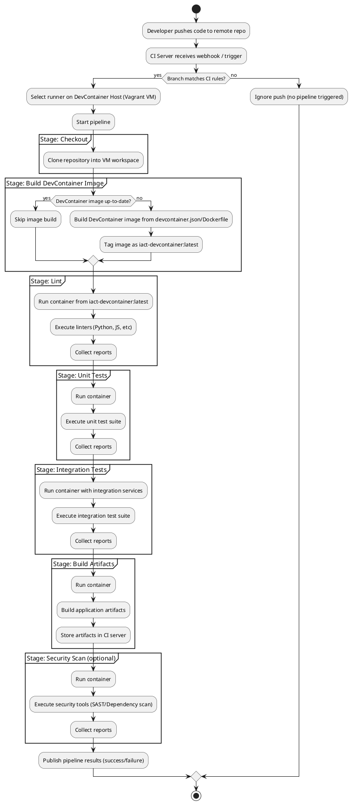
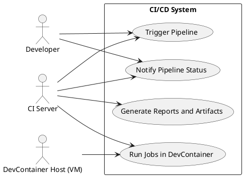
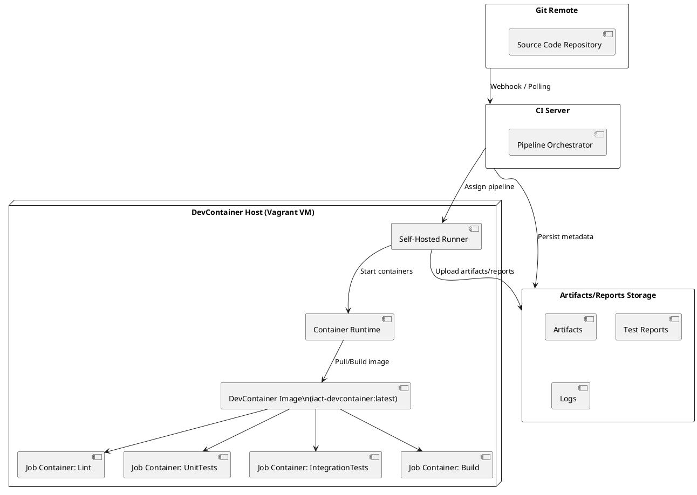
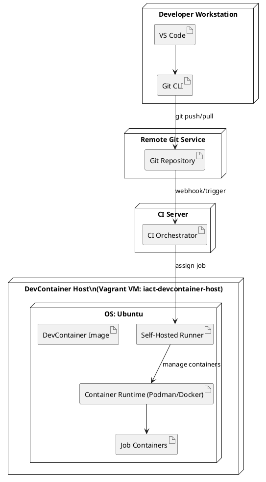
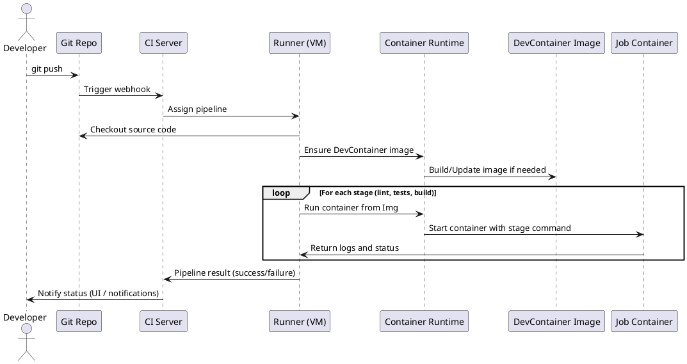

# Canvas de Arquitectura — Pipeline CI/CD sobre DevContainer Host con Vagrant (sin Docker en el host físico)

Diseño de pipeline CI/CD que reutiliza la imagen de DevContainer sobre una VM gestionada por Vagrant, sin instalar Docker en la workstation. El objetivo es asegurar consistencia ambiental entre desarrollo y CI/CD usando un runner self-hosted dentro de la misma VM.

## 1. Identificación del artefacto
- **Nombre:** Arquitectura de Pipeline CI/CD sobre DevContainer Host con Vagrant
- **Proyecto:** IACT
- **Versión:** 1.0
- **Tipo:** Diseño de Arquitectura CI/CD
- **Responsable:** Equipo de Plataforma / DevOps
- **Estado:** Propuesta técnica

## 2. Objetivo del pipeline
El pipeline debe:
1. Ejecutar lint, pruebas y builds en contenedores basados en la misma imagen del DevContainer usado en desarrollo.
2. Usar la VM creada por Vagrant como DevContainer Host y nodo de ejecución del runner CI/CD.
3. Mantener **environmental consistency**, **operational equivalence** y **deterministic execution** entre desarrollo (DevContainer en VS Code) y CI/CD (jobs en contenedores dentro de la VM).
4. Evitar instalar Docker en el host físico del desarrollador.

## 3. Alcance
Incluye:
- Diseño conceptual y lógico del pipeline CI/CD.
- Etapas: checkout, static analysis (lint/format), unit tests, integration tests, build artifacts y security scan opcional.
- Diagramas UML: Use Case, Activity, Component, Deployment y Sequence.

Excluye configuraciones específicas de herramientas, reglas de linters o detalles de credenciales/secrets.

## 4. Flujo CI/CD
### 4.1 Descripción
1. `git push` a rama principal o feature en el repositorio remoto (GitHub/GitLab).
2. El servidor CI/CD dispara el pipeline usando un runner self-hosted en la VM `iact-devcontainer-host`.
3. El runner, dentro de la VM, ejecuta:
   - `checkout` del código
   - `build_devcontainer_image` (si cambia la definición)
   - Jobs en contenedores basados en la imagen DevContainer: `lint`, `unit_tests`, `integration_tests`, `build_artifacts`, `security_scan` (opcional)
4. Los resultados se reportan al servidor CI/CD y se almacenan como artefactos/reportes.

## 5. UML — Activity Diagram del pipeline


## 6. UML — Use Case Diagram
### 6.1 Actores
- Developer
- CI Server (GitHub Actions / GitLab CI)
- DevContainer Host (VM Vagrant con runner)



## 7. UML — Component Diagram
### 7.1 Componentes principales
- Git Repository (Remote)
- CI Server
- Runner self-hosted en la VM
- Runtime de contenedores (Podman / Docker en VM)
- DevContainer image
- Job containers (lint, tests, build)
- Artifact/Report storage



## 8. UML — Deployment Diagram
### 8.1 Nodos de despliegue
- Developer Workstation
- CI Server (SaaS u on-prem)
- DevContainer Host (VM Vagrant)



## 9. UML — Sequence Diagram (push → pipeline → DevContainer)


## 10. Definición conceptual del pipeline (YAML genérico)
Plantilla conceptual para orquestadores CI/CD (no específica de proveedor).

```yaml
pipeline:
  name: iact-devcontainer-ci
  trigger:
    branches:
      include:
        - main
        - feature/*
  agent:
    type: self-hosted
    label: iact-devcontainer-host

  variables:
    DEVCONTAINER_IMAGE: iact-devcontainer:latest

  stages:
    - checkout
    - build_devcontainer_image
    - lint
    - unit_tests
    - integration_tests
    - build_artifacts
    - security_scan

  jobs:
    checkout:
      stage: checkout
      script:
        - git clone <repo-url> .
        - git checkout $CI_COMMIT_SHA

    build_devcontainer_image:
      stage: build_devcontainer_image
      script:
        - if image_outdated; then
        -   podman build -t $DEVCONTAINER_IMAGE -f .devcontainer/Dockerfile .
        - fi

    lint:
      stage: lint
      script:
        - podman run --rm -v $PWD:/workspace $DEVCONTAINER_IMAGE ./scripts/run_lint.sh

    unit_tests:
      stage: unit_tests
      script:
        - podman run --rm -v $PWD:/workspace $DEVCONTAINER_IMAGE ./scripts/run_unit_tests.sh

    integration_tests:
      stage: integration_tests
      script:
        - podman run --rm --network=host -v $PWD:/workspace \
            $DEVCONTAINER_IMAGE ./scripts/run_integration_tests.sh

    build_artifacts:
      stage: build_artifacts
      script:
        - podman run --rm -v $PWD:/workspace $DEVCONTAINER_IMAGE ./scripts/build_artifacts.sh
      artifacts:
        paths:
          - dist/
          - build/

    security_scan:
      stage: security_scan
      script:
        - podman run --rm -v $PWD:/workspace $DEVCONTAINER_IMAGE ./scripts/run_security_scan.sh
      when: manual
```

## 11. Calidad y criterios de aceptación
- Todos los jobs se ejecutan en contenedores basados en la misma imagen del DevContainer.
- El runner corre únicamente dentro de la VM `iact-devcontainer-host`.
- No hay dependencia de Docker en el host físico.
- Pipeline determinista: mismo commit → mismo resultado, salvo cambios explícitos en dependencias externas.
- Los diagramas UML reflejan flujo funcional, componentes, despliegue e interacción entre actores.

## 12. Riesgos y mitigaciones
- **Recursos insuficientes en la VM:** dimensionar RAM/CPU; escalar a múltiples DevContainer Hosts si se requiere.
- **Desincronización entre DevContainer de desarrollo y CI/CD:** la definición vive en `.devcontainer/`; el pipeline siempre construye y usa esa imagen.
- **Latencia entre CI Server y DevContainer Host:** ubicar el host en la misma red/región que el CI Server cuando sea posible.

## 13. Checklist de implementación
- [ ] Registrar un runner self-hosted en la VM `iact-devcontainer-host`.
- [ ] Parametrizar la imagen de DevContainer (`DEVCONTAINER_IMAGE`) en el orquestador.
- [ ] Construir/actualizar la imagen en la etapa `build_devcontainer_image`.
- [ ] Estandarizar scripts de etapa (`run_lint.sh`, `run_unit_tests.sh`, etc.) dentro del repositorio.
- [ ] Publicar artefactos y reportes en el servidor CI/CD.
- [ ] Documentar troubleshooting y flujos de actualización de imagen.
