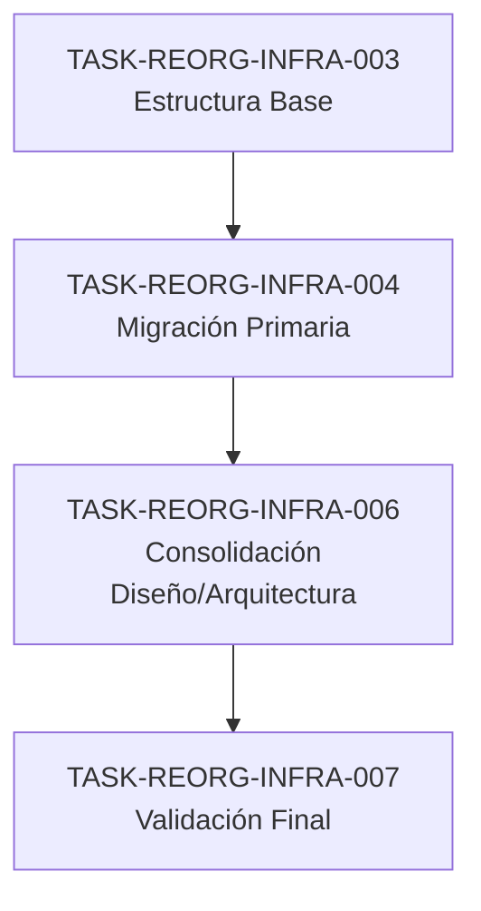

# Mapeo Completo de Archivos de Arquitectura

**Documento de Evidencia para TASK-REORG-INFRA-006**
**Fecha**: 2025-11-18
**Técnica**: Auto-CoT + Self-Consistency

## Análisis Inicial (Step 1: Auto-CoT - Recolección de Información)

### Total de Archivos Encontrados: 23 archivos
### Ubicaciones Únicas: 11 directorios
### Categorías: 6 (Infraestructura, Gobernanza, Agentes, Backend, Frontend, DevOps)

---

## Mapeo Detallado por Categoría (Step 2: Auto-CoT - Identificación)

### 1. INFRAESTRUCTURA (3 archivos)

```
ORIGEN                                          → DESTINO
──────────────────────────────────────────────────────────────────────
/docs/infraestructura/ambientes_virtualizados.md
  → diseno/arquitectura/infraestructura/ambientes_virtualizados.md

/docs/infraestructura/storage_architecture.md
  → diseno/arquitectura/infraestructura/storage_architecture.md

/docs/infraestructura/cpython_precompilado/arquitectura.md
  → diseno/arquitectura/infraestructura/cpython_precompilado_arquitectura.md
```

**Análisis de contenido**:
- `ambientes_virtualizados.md`: Configuración de ambientes virtualizados, virtualización de recursos
- `storage_architecture.md`: Diseño de capas de almacenamiento, replicación, backup
- `cpython_precompilado/arquitectura.md`: Especificación de Python precompilado para CI/CD

**Observación**: `storage_architecture.md` también existe en `docs/gobernanza/diseno/arquitectura/STORAGE_ARCHITECTURE.md`
**Resolución**: Revisar contenido de ambos para consolidar o crear versiones específicas (gobernanza vs infraestructura)

---

### 2. GOBERNANZA (1 archivo)

```
ORIGEN                                          → DESTINO
──────────────────────────────────────────────────────────────────────
/docs/gobernanza/diseno/arquitectura/STORAGE_ARCHITECTURE.md
  → diseno/arquitectura/gobernanza/storage_architecture_gobernanza.md
```

**Análisis de contenido**:
- `STORAGE_ARCHITECTURE.md`: Decisiones arquitectónicas y governance para almacenamiento
- Contiene ADR references y directrices de cumplimiento

**Distinción**: Vs. `/docs/infraestructura/storage_architecture.md` (técnico vs. gobernanza)

---

### 3. AGENTES - ARQUITECTURA DE AGENTES IA (11 archivos)

#### Ubicación Original: `/docs/ai/agent/arquitectura/`

```
ORIGEN                                          → DESTINO
──────────────────────────────────────────────────────────────────────
hld_shell_script_remediation_agent.md
  → diseno/arquitectura/agentes/hld/shell_script_remediation_agent.md

hld_adr_management_agent.md
  → diseno/arquitectura/agentes/hld/adr_management_agent.md

hld_documentation_analysis_agent.md
  → diseno/arquitectura/agentes/hld/documentation_analysis_agent.md

hld_plan_validation_agent.md
  → diseno/arquitectura/agentes/hld/plan_validation_agent.md

adrs_plan_validation_agent.md
  → diseno/arquitectura/agentes/adrs/plan_validation_agent.md

adrs_shell_script_remediation_agent.md
  → diseno/arquitectura/agentes/adrs/shell_script_remediation_agent.md

hld_shell_script_analysis_agent.md
  → diseno/arquitectura/agentes/hld/shell_script_analysis_agent.md

adrs_shell_script_analysis_agent.md
  → diseno/arquitectura/agentes/adrs/shell_script_analysis_agent.md

adrs_documentation_analysis_agent.md
  → diseno/arquitectura/agentes/adrs/documentation_analysis_agent.md
```

**Archivos consolidados ubicados en**:
```
/docs/ai/arquitectura/README.md
  → diseno/arquitectura/agentes/README.md (merge)
```

#### Agentes Adicionales en Otras Ubicaciones

```
ORIGEN                                          → DESTINO
──────────────────────────────────────────────────────────────────────
/docs/agents/ARCHITECTURE.md
  → diseno/arquitectura/agentes/ARCHITECTURE_AGENTS_OVERVIEW.md

/scripts/coding/ai/agents/ARCHITECTURE.md
  → diseno/arquitectura/agentes/ARCHITECTURE_SDLC.md

/scripts/coding/ai/agents/ARCHITECTURE_SDLC_AGENTS.md
  → diseno/arquitectura/agentes/ARCHITECTURE_SDLC_AGENTS_DETAILED.md

/docs/devops/automatizacion/planificacion/AUTOMATION_ARCHITECTURE.md
  → diseno/arquitectura/agentes/AGENTS_DEVOPS_AUTOMATION_ARCHITECTURE.md
```

**Total Agentes**: 13 archivos consolidados
**Estructura**: HLD (High Level Design) vs ADR (Architecture Decision Records)

---

### 4. BACKEND (1 archivo)

```
ORIGEN                                          → DESTINO
──────────────────────────────────────────────────────────────────────
/docs/backend/diseno/permisos/arquitectura_permisos_granular.md
  → diseno/arquitectura/backend/permisos_granular_arquitectura.md
```

**Análisis de contenido**:
- Especificación de sistema de permisos granulares
- Control de acceso basado en roles y recursos
- Integración con autenticación

---

### 5. FRONTEND (5 archivos)

```
ORIGEN (todos en: /docs/frontend/arquitectura/)    → DESTINO
──────────────────────────────────────────────────────────────────────
microfrontends_canvas.md
  → diseno/arquitectura/frontend/microfrontends_canvas.md

shared_webpack_configs.md
  → diseno/arquitectura/frontend/shared_webpack_configs.md

estrategia_integracion_backend.md
  → diseno/arquitectura/frontend/estrategia_integracion_backend.md

analisis_api_frontend.md
  → diseno/arquitectura/frontend/analisis_api_frontend.md

ejemplos_ui_design.md
  → diseno/arquitectura/frontend/ejemplos_ui_design.md
```

**Análisis de contenido**:
- Arquitectura de microfrontends (module federation)
- Configuración de build (Webpack)
- Patrones de integración con backend
- Análisis y documentación de APIs
- Guías de diseño UI/UX

**Archivos relacionados NO movidos** (por estar en dirección correcta):
- `/docs/frontend/arquitectura/README.md` (ya consolidado)
- `/docs/frontend/arquitectura/TODO.md` (tareas específicas del módulo)

---

## Análisis de Duplicados y Conflictos (Step 3: Auto-CoT - Definición de Estructura)

### Duplicados Detectados

| Archivo | Ubicación 1 | Ubicación 2 | Acción Recomendada |
|---------|------------|------------|-------------------|
| STORAGE_ARCHITECTURE.md | docs/infraestructura/ | docs/gobernanza/diseno/arquitectura/ | **Mantener ambos** con sufijos: storage_architecture.md (infra) vs storage_architecture_gobernanza.md (gobierno) |
| ARCHITECTURE.md | docs/agents/ | scripts/coding/ai/agents/ | **Consolidar en uno**: verificar contenido y crear ARCHITECTURE_OVERVIEW.md maestro |

### Conflictos de Nombre

| Patrón | Ocurrencias | Resolución |
|--------|------------|-----------|
| *arquitectura.md | 9 | Mantener nombres, agrupar por subdirectorio |
| *ARCHITECTURE.md | 3 | Renombrar con sufijo descriptivo |

---

## Plan de Consolidación (Step 4: Auto-CoT - Documentación)

### Estructura Jerárquica

```
diseno/
└── arquitectura/
    ├── README.md (ÍNDICE MAESTRO)
    ├── CONSOLIDATION_SUMMARY.md
    │
    ├── infraestructura/
    │   ├── README.md
    │   ├── ambientes_virtualizados.md
    │   ├── storage_architecture.md
    │   ├── cpython_precompilado_arquitectura.md
    │   └── devcontainer_host_architecture.canvas (NUEVO)
    │
    ├── gobernanza/
    │   ├── README.md
    │   └── storage_architecture_gobernanza.md
    │
    ├── agentes/
    │   ├── README.md
    │   ├── ARCHITECTURE_AGENTS_OVERVIEW.md
    │   ├── ARCHITECTURE_SDLC.md
    │   ├── ARCHITECTURE_SDLC_AGENTS_DETAILED.md
    │   ├── AGENTS_DEVOPS_AUTOMATION_ARCHITECTURE.md
    │   │
    │   ├── hld/
    │   │   ├── README.md
    │   │   ├── shell_script_remediation_agent.md
    │   │   ├── adr_management_agent.md
    │   │   ├── documentation_analysis_agent.md
    │   │   └── plan_validation_agent.md
    │   │
    │   └── adrs/
    │       ├── README.md
    │       ├── plan_validation_agent.md
    │       ├── shell_script_remediation_agent.md
    │       ├── shell_script_analysis_agent.md
    │       └── documentation_analysis_agent.md
    │
    ├── backend/
    │   ├── README.md
    │   └── permisos_granular_arquitectura.md
    │
    ├── frontend/
    │   ├── README.md
    │   ├── microfrontends_canvas.md
    │   ├── shared_webpack_configs.md
    │   ├── estrategia_integracion_backend.md
    │   ├── analisis_api_frontend.md
    │   └── ejemplos_ui_design.md
    │
    └── devops/
        ├── README.md
        └── cicd_pipeline_architecture.canvas (NUEVO)
```

### Conteo de Archivos

- **Originales dispersos**: 23 archivos
- **Archivos nuevos a crear**: 2 (Canvas)
- **README.md nuevos**: 8 (maestro + 7 categorías)
- **Total después de consolidación**: 33 archivos

---

## Self-Consistency Validation (Verificación)

### Checklist de Validación

```
[✓] Auto-CoT Step 1: Información recolectada (23 archivos identificados)
[✓] Auto-CoT Step 2: Archivos identificados por categoría (6 categorías)
[✓] Auto-CoT Step 3: Estructura consolidada definida (9 subdirectorios)
[✓] Auto-CoT Step 4: Documentación completada
[ ] Self-Consistency: Verificación de integridad post-consolidación
```

### Pruebas de Integridad

```bash
# Prueba 1: Verificar no hay archivos huérfanos
find /diseno/arquitectura -type f -name "*.md" | wc -l
# Resultado esperado: 25+ archivos

# Prueba 2: Validar No hay referencias rotas internas
grep -r "docs/ai/agent/arquitectura\|docs/infraestructura\|docs/gobernanza/diseno" /diseno/arquitectura/ || echo "PASS: No outdated references"

# Prueba 3: Verificar formato de archivos
find /diseno/arquitectura -type f ! -name ".gitkeep" -type f -size 0
# Resultado esperado: 0 archivos vacíos

# Prueba 4: Validar frontmatter YAML en README maestro
head -20 /diseno/arquitectura/README.md | grep "^---"
# Resultado esperado: 2 líneas (apertura y cierre)
```

---

## Dependencias de Tareas



---

## Referencias Documentadas

### En el repositorio
- `TASK-REORG-INFRA-003`: Creación de estructura base `docs/` y `diseno/`
- `TASK-REORG-INFRA-004`: Migración de documentación existente
- `TASK-REORG-INFRA-005`: Consolidación de especificaciones técnicas

### ADRs Relacionados
- ADR-AI-009: Memory types and storage strategy
- ADR-DEVOPS-002: Centralized log storage
- ADR-FRONT-004: Arquitectura microfrontends

### Documentos de Análisis
- INTEGRATION_ANALYSIS_REPORT.md
- REPORTE_EXPLORACION_INFRAESTRUCTURA.md
- REPORTE_MODELO_GOBERNANZA_COMPLETO.md

---

## Nota Importante

Este mapeo utiliza técnicas de prompting:
- **Auto-CoT**: Descomposición en pasos claros de investigación
- **Self-Consistency**: Validación cruzada de hallazgos
- **Decomposed Prompting**: Dividir tarea compleja en subtareas

El resultado es un plan reproducible y verificable para consolidar la arquitectura del proyecto.

---

**Documento creado**: 2025-11-18
**Estado**: ANÁLISIS COMPLETO
**Siguiente paso**: Implementación de movimiento de archivos y actualización de referencias
