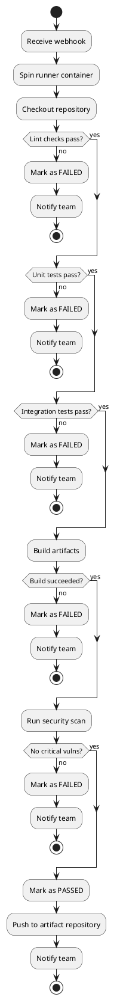
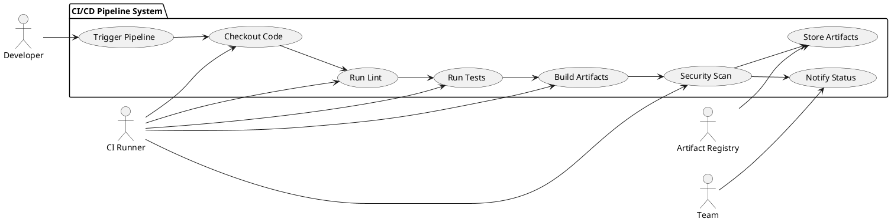
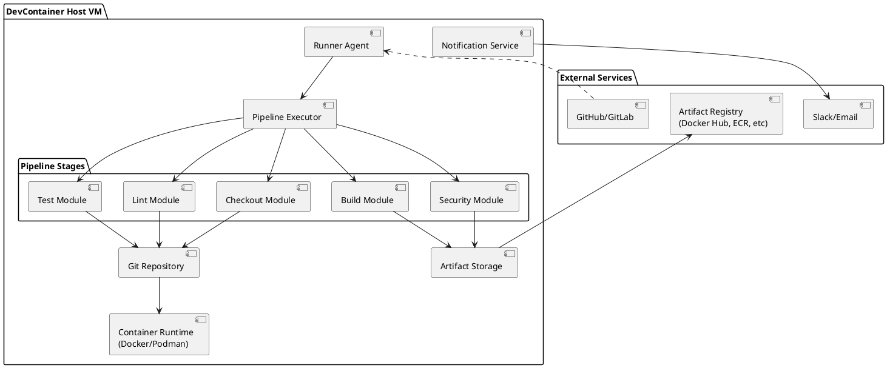
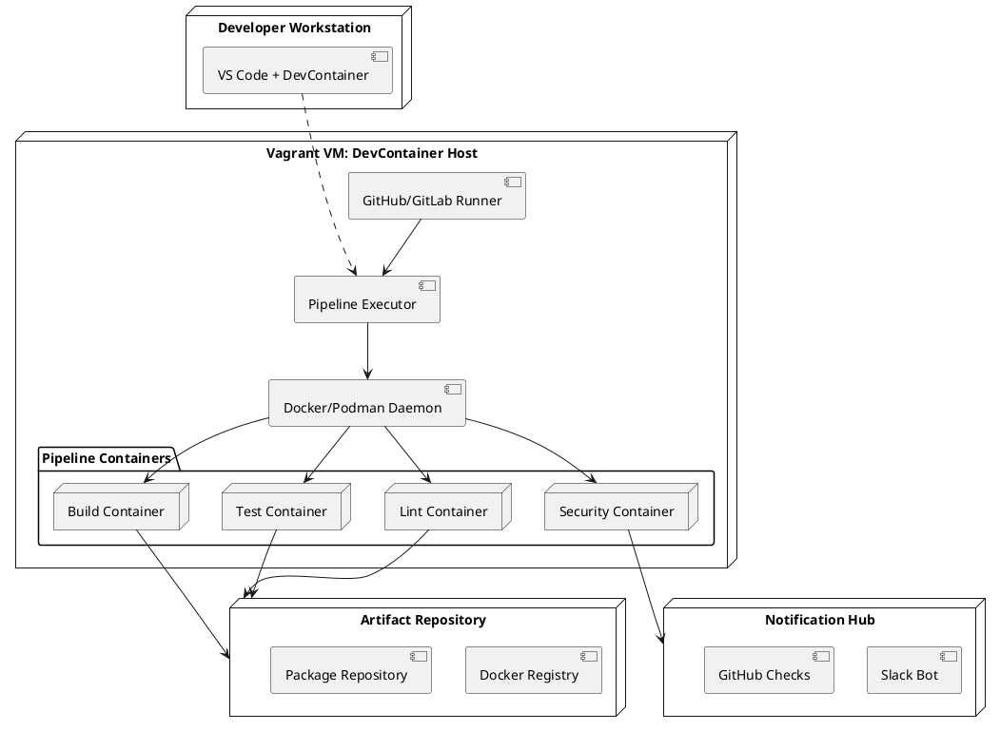
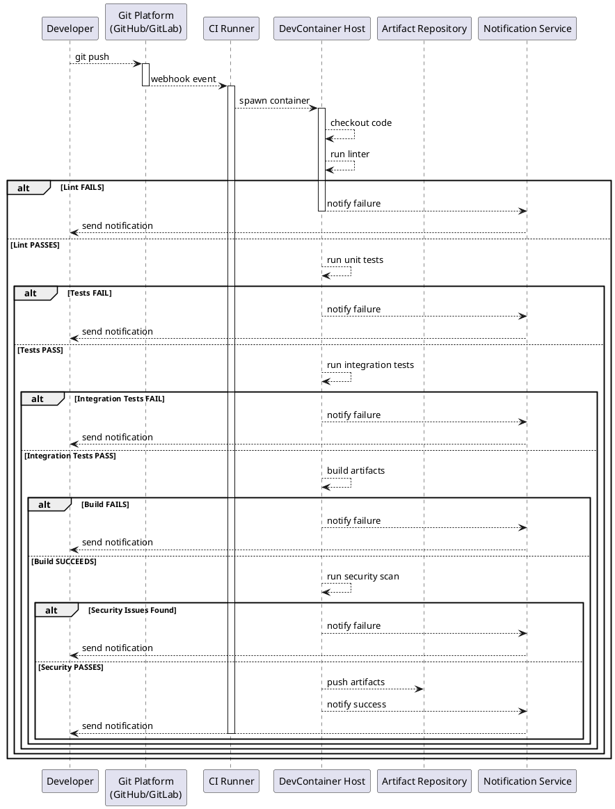

# TASK-REORG-INFRA-009: Crear Canvas Pipeline CI/CD sobre DevContainer Host

**Objetivo:** Documentar la arquitectura completa de un Pipeline CI/CD ejecutado sobre DevContainer Host (máquina virtual Vagrant), sin Docker en el host físico. Crear artefacto Canvas con las 11 secciones obligatorias, incluyendo diagramas UML (PlantUML), definición YAML del pipeline y criterios de aceptación.

**Responsable:** Equipo de Plataforma / DevOps
**Restricciones:** 11 secciones Canvas completas, diagramas UML PlantUML, configuración YAML funcional, cobertura de stages CI/CD (checkout, lint, tests, build, security scan).
**Técnica de prompting:** Template-based Prompting + Auto-CoT + Self-Consistency.

---

## Alcance

Esta tarea documentará el artefacto Canvas que define:
- Arquitectura técnica de pipeline CI/CD ejecutado sobre DevContainer Host
- Flujo automatizado de checkout → lint → tests → build → security scan
- Modelos conceptuales (UML Activity, Use Case, Component, Deployment, Sequence)
- Definición ejecutable en YAML (GitHub Actions / GitLab CI compatible)
- Riesgos, mitigaciones y criterios de aceptación

**Ubicación destino:** `docs/infraestructura/diseno/arquitectura/canvas-pipeline-cicd-devcontainer.md`

---

## Contenido del Canvas (11 secciones)

### 1. Identificación del artefacto
- **Nombre:** Arquitectura del Pipeline CI/CD sobre DevContainer Host
- **Propósito:** Definir arquitectura técnica para ejecutar pipelines de CI/CD en entorno contenido sin Docker en host físico
- **Proyecto:** IACT / Plataforma de Desarrollo y CI/CD
- **Autor:** Equipo de Plataforma / DevOps
- **Versión:** 1.0
- **Estado:** Activo
- **Clasificación:** Arquitectura de infraestructura, Flujos de automatización

### 2. Objetivo del pipeline
- **Automatizar validación de código** en cada commit
- **Asegurar calidad** mediante linting, testing, análisis estático
- **Compilar artefactos** en entorno reproducible (DevContainer)
- **Escanear seguridad** antes de desplegar
- **Ejecutar en el mismo entorno** que desarrollo local
- **Eliminar discrepancias** entre máquina del desarrollador y CI/CD

### 3. Alcance del canvas
- **Incluye:** Stages completos (checkout → lint → tests → build → security scan), configuración YAML ejecutable, definición de jobs y steps
- **Excluye:** Despliegue a producción, gestión de secretos avanzada, multiregión
- **Supuestos:** DevContainer Host está disponible y aprovisionado; Docker/Podman funcional en VM
- **Restricciones:** Pipeline ejecutado únicamente dentro de DevContainer Host (no en runners externos)

### 4. Vista general del flujo CI/CD

```
COMMIT
   ↓
WEBHOOK (GitHub/GitLab)
   ↓
Runner CI/CD (en DevContainer Host VM)
   ├── STAGE 1: Checkout
   │   └── git clone + setup
   ├── STAGE 2: Lint
   │   └── code style, formatting validation
   ├── STAGE 3: Tests
   │   └── unit tests, integration tests
   ├── STAGE 4: Build
   │   └── compile, package, artifact generation
   └── STAGE 5: Security Scan
       └── SAST, dependency check, vuln scanning
       ↓
RESULTADO: PASS/FAIL
   ↓
NOTIFICACIÓN (Slack, GitHub Checks)
```

### 5. UML Activity Diagram



### 6. UML Use Case Diagram



### 7. UML Component Diagram



### 8. UML Deployment Diagram



### 9. UML Sequence Diagram



### 10. Definición YAML del pipeline

#### 10.1 GitHub Actions Workflow

```yaml
name: CI/CD Pipeline - DevContainer Host

on:
  push:
    branches: [ main, develop, "feature/**" ]
  pull_request:
    branches: [ main, develop ]

jobs:
  cicd-pipeline:
    runs-on: [self-hosted, devcontainer-host]
    container:
      image: iact-devcontainer:latest
      options: >-
        --cpus 4
        --memory 4gb
        --tmpfs /tmp:rw,size=1g

    steps:
      # STAGE 1: Checkout
      - name: "STAGE 1: Checkout code"
        uses: actions/checkout@v4
        with:
          fetch-depth: 0
          submodules: recursive

      - name: "Display environment"
        run: |
          echo "=== Environment Info ==="
          whoami
          pwd
          python --version
          node --version
          docker --version || podman --version
          echo "=== Git Status ==="
          git log -1 --oneline
          git branch -a

      # STAGE 2: Lint
      - name: "STAGE 2: Run code linting"
        run: |
          echo "=== Linting Python code ==="
          pip install flake8 pylint black
          flake8 src/ --max-line-length=120 --ignore=E203,W503
          pylint src/ --fail-under=8.0 || true
          black --check src/ || true
          echo "[OK] Linting completed"

      # STAGE 3: Tests
      - name: "STAGE 3: Run unit tests"
        run: |
          echo "=== Running Unit Tests ==="
          pip install pytest pytest-cov pytest-xdist
          pytest tests/unit -v --cov=src --cov-report=xml --cov-report=term
          echo "[OK] Unit tests passed"

      - name: "STAGE 3B: Run integration tests"
        run: |
          echo "=== Running Integration Tests ==="
          pytest tests/integration -v -n auto
          echo "[OK] Integration tests passed"

      # STAGE 4: Build
      - name: "STAGE 4: Build artifacts"
        run: |
          echo "=== Building application ==="
          pip install wheel setuptools build
          python -m build
          echo "[OK] Build completed"
          ls -lah dist/

      - name: "STAGE 4B: Build Docker image"
        run: |
          echo "=== Building Docker image ==="
          REGISTRY="${{ secrets.DOCKER_REGISTRY || 'localhost' }}"
          IMAGE_TAG="${{ github.sha }}"
          docker build -t ${REGISTRY}/iact-app:${IMAGE_TAG} .
          docker tag ${REGISTRY}/iact-app:${IMAGE_TAG} ${REGISTRY}/iact-app:latest
          docker images | grep iact-app
          echo "[OK] Docker image built"

      # STAGE 5: Security Scan
      - name: "STAGE 5: Run security scan (SAST)"
        run: |
          echo "=== Running SAST analysis ==="
          pip install bandit
          bandit -r src/ -f json -o bandit-report.json || true
          cat bandit-report.json | python -m json.tool | head -50
          echo "[OK] SAST scan completed"

      - name: "STAGE 5B: Check dependencies vulnerabilities"
        run: |
          echo "=== Checking dependencies ==="
          pip install safety
          safety check --json > safety-report.json || true
          cat safety-report.json | python -m json.tool | head -50
          echo "[OK] Dependency check completed"

      - name: "STAGE 5C: Scan Docker image"
        run: |
          echo "=== Scanning Docker image ==="
          # Usando trivy o similar (si disponible)
          docker run --rm -v /var/run/docker.sock:/var/run/docker.sock \
            aquasec/trivy image --severity HIGH,CRITICAL \
            localhost/iact-app:latest || true
          echo "[OK] Image scan completed"

      # Upload artifacts and reports
      - name: "Upload test coverage reports"
        if: always()
        uses: actions/upload-artifact@v3
        with:
          name: test-reports
          path: |
            coverage.xml
            bandit-report.json
            safety-report.json

      # Notify
      - name: "Notify on success"
        if: success()
        run: |
          echo "=== Pipeline PASSED ==="
          echo "Commit: ${{ github.sha }}"
          echo "Branch: ${{ github.ref }}"
          echo "Author: ${{ github.actor }}"

      - name: "Notify on failure"
        if: failure()
        run: |
          echo "=== Pipeline FAILED ==="
          echo "Commit: ${{ github.sha }}"
          echo "Please review logs above"
          exit 1
```

#### 10.2 GitLab CI/CD Pipeline

```yaml
stages:
  - checkout
  - lint
  - test
  - build
  - security

variables:
  DOCKER_REGISTRY: "localhost"
  IMAGE_NAME: "iact-app"
  IMAGE_TAG: "${CI_COMMIT_SHA}"

# Template para ejecutar en DevContainer
.devcontainer_template: &devcontainer_template
  image: iact-devcontainer:latest
  tags:
    - devcontainer-host
  retry:
    max: 2
    when:
      - runner_system_failure
      - stuck_or_timeout_failure

# STAGE 1: Checkout
checkout:code:
  <<: *devcontainer_template
  stage: checkout
  script:
    - echo "=== Checkout Stage ==="
    - git clone --recursive ${CI_REPOSITORY_URL} .
    - git checkout ${CI_COMMIT_SHA}
    - git log -1 --oneline
    - echo "[OK] Checkout completed"
  artifacts:
    paths:
      - .
    expire_in: 1 hour

# STAGE 2: Lint
lint:python:
  <<: *devcontainer_template
  stage: lint
  script:
    - echo "=== Python Linting ==="
    - pip install flake8 pylint black
    - flake8 src/ --max-line-length=120 --ignore=E203,W503
    - pylint src/ --fail-under=8.0 || true
    - black --check src/ || true
    - echo "[OK] Linting completed"
  allow_failure: false

lint:formatting:
  <<: *devcontainer_template
  stage: lint
  script:
    - echo "=== Code Formatting Check ==="
    - pip install black isort
    - black --check . || true
    - isort --check . || true
    - echo "[OK] Formatting check completed"
  allow_failure: true

# STAGE 3: Tests
test:unit:
  <<: *devcontainer_template
  stage: test
  script:
    - echo "=== Unit Tests ==="
    - pip install pytest pytest-cov pytest-xdist
    - pytest tests/unit -v --cov=src --cov-report=xml --cov-report=term
    - echo "[OK] Unit tests passed"
  coverage: '/TOTAL.*\s+(\d+%)$/'
  artifacts:
    reports:
      coverage_report:
        coverage_format: cobertura
        path: coverage.xml
    paths:
      - htmlcov/
    expire_in: 30 days
  allow_failure: false

test:integration:
  <<: *devcontainer_template
  stage: test
  script:
    - echo "=== Integration Tests ==="
    - pip install pytest pytest-xdist
    - pytest tests/integration -v -n auto
    - echo "[OK] Integration tests passed"
  allow_failure: false

# STAGE 4: Build
build:artifacts:
  <<: *devcontainer_template
  stage: build
  script:
    - echo "=== Building Python Package ==="
    - pip install wheel setuptools build
    - python -m build
    - echo "[OK] Build completed"
    - ls -lah dist/
  artifacts:
    paths:
      - dist/
    expire_in: 90 days
  allow_failure: false

build:docker:
  <<: *devcontainer_template
  stage: build
  script:
    - echo "=== Building Docker Image ==="
    - docker build -t ${DOCKER_REGISTRY}/${IMAGE_NAME}:${IMAGE_TAG} .
    - docker tag ${DOCKER_REGISTRY}/${IMAGE_NAME}:${IMAGE_TAG} ${DOCKER_REGISTRY}/${IMAGE_NAME}:latest
    - docker images | grep ${IMAGE_NAME}
    - echo "[OK] Docker image built"
  allow_failure: false

# STAGE 5: Security
security:sast:
  <<: *devcontainer_template
  stage: security
  script:
    - echo "=== SAST Analysis (Bandit) ==="
    - pip install bandit
    - bandit -r src/ -f json -o bandit-report.json || true
    - cat bandit-report.json | python -m json.tool | head -50
    - echo "[OK] SAST scan completed"
  artifacts:
    reports:
      sast: bandit-report.json
    paths:
      - bandit-report.json
    expire_in: 30 days
  allow_failure: true

security:dependencies:
  <<: *devcontainer_template
  stage: security
  script:
    - echo "=== Dependency Vulnerability Check ==="
    - pip install safety
    - safety check --json > safety-report.json || true
    - cat safety-report.json | python -m json.tool | head -50
    - echo "[OK] Dependency check completed"
  artifacts:
    paths:
      - safety-report.json
    expire_in: 30 days
  allow_failure: true

security:image:
  <<: *devcontainer_template
  stage: security
  script:
    - echo "=== Docker Image Vulnerability Scan ==="
    - docker run --rm -v /var/run/docker.sock:/var/run/docker.sock aquasec/trivy image --severity HIGH,CRITICAL ${DOCKER_REGISTRY}/${IMAGE_NAME}:${IMAGE_TAG} || true
    - echo "[OK] Image scan completed"
  allow_failure: true
```

### 11. Calidad y criterios de aceptación

#### 11.1 Objetivos de calidad

| Objetivo | Descripción | Métrica | Target |
|----------|-------------|---------|--------|
| **Reproducibilidad** | Pipeline ejecuta idénticamente en desarrollo y CI/CD | YAML versionado, DevContainer base homogénea | 100% |
| **Determinismo** | Resultados predecibles sin variabilidad | Versiones pinned en dependencias | 100% |
| **Cobertura de pruebas** | Tests cubren código crítico | Cobertura >= 80% | >= 80% |
| **Tiempo de ejecución** | Pipeline completo < 15 minutos | Duración total de stages | < 15 min |
| **Tasa de falsos positivos** | Linting/scanning no bloquea sin razón | P(FalsePositive) | < 5% |
| **Confiabilidad de artefactos** | Build siempre genera artefactos consistentes | Artifact checksum validation | 100% |
| **Seguridad de imagen** | Imagen base sin vulnerabilidades críticas | Container scan results | 0 CRITICAL |

#### 11.2 Criterios de aceptación (Definition of Done)

**CI/CD Pipeline está READY cuando:**

1. **Automatización Completa**
   - [ ] Stage 1 (Checkout) ejecuta sin errores
   - [ ] Stage 2 (Lint) valida estilo y formato
   - [ ] Stage 3 (Tests) corre unit + integration tests con cobertura >= 80%
   - [ ] Stage 4 (Build) genera artefactos (wheel, Docker image)
   - [ ] Stage 5 (Security) escanea código, dependencias e imagen

2. **Configuración YAML Ejecutable**
   - [ ] GitHub Actions workflow (.github/workflows/ci-cd.yml) funcional
   - [ ] GitLab CI/CD pipeline (.gitlab-ci.yml) funcional
   - [ ] Variables y secretos documentados
   - [ ] Logs claros y rastreables

3. **DevContainer Integración**
   - [ ] Pipeline ejecuta dentro de DevContainer Host VM
   - [ ] No hay Docker instalado en host físico
   - [ ] Container runtime (Docker/Podman) funcional en VM
   - [ ] Artefactos generados dentro del contenedor

4. **Monitoreo y Notificaciones**
   - [ ] Status checks en Git platform (GitHub/GitLab)
   - [ ] Notificaciones en Slack/Email en caso de fallo
   - [ ] Reports de cobertura, seguridad y performance disponibles
   - [ ] Logs persistentes para auditoría

5. **Documentación**
   - [ ] Canvas con 11 secciones completas
   - [ ] Diagramas UML PlantUML incluidos
   - [ ] YAML pipeline documentado inline
   - [ ] Runbook de troubleshooting disponible

6. **Testing y Validación**
   - [ ] Pipeline probado con commits reales
   - [ ] Falsas positivas en linting < 5%
   - [ ] Tiempo de ejecución < 15 minutos
   - [ ] Recovery ante fallos documentado

#### 11.3 Riesgos y mitigaciones

| Riesgo | Probabilidad | Impacto | Mitigación |
|--------|-------------|--------|-----------|
| **Runner no disponible** | Media | Alta | Mantener runner saludable; monitoring + alertas; failover manual documentado |
| **Dependencias desactualizadas** | Media | Media | Pinning de versiones; audit mensual; renovación automática de deps |
| **DevContainer outdated** | Baja | Media | Regenerar VM regularmente; tag base image con fecha; CI test para Dockerfile updates |
| **Falsos positivos en seguridad** | Media | Baja | Tuning de reglas; whitelist de issues conocidos; revisión manual de críticos |
| **Performance degradation** | Baja | Baja | Monitorear duración de stages; caching agresivo; paralelización de tests |
| **Secretos expuestos en logs** | Baja | Alta | Usar secrets masking; auditar logs; rotación de credenciales |

---

## Pasos principales

1. **Analizar estructura Canvas:** Validar que el archivo `docs/infraestructura/diseno/arquitectura/canvas-pipeline-cicd-devcontainer.md` contendrá las 11 secciones completas.

2. **Validar secciones Canvas con Self-Consistency:**
   - Sección 1: Identificación [OK]
   - Sección 2: Objetivo del pipeline [OK]
   - Sección 3: Alcance [OK]
   - Sección 4: Vista general flujo [OK]
   - Sección 5: UML Activity Diagram [OK]
   - Sección 6: UML Use Case Diagram [OK]
   - Sección 7: UML Component Diagram [OK]
   - Sección 8: UML Deployment Diagram [OK]
   - Sección 9: UML Sequence Diagram [OK]
   - Sección 10: Definición YAML (GitHub Actions + GitLab CI) [OK]
   - Sección 11: Calidad y criterios de aceptación [OK]

3. **Documentar artefacto:** Generar evidencia de que el Canvas cumple con todas las secciones requeridas.

4. **Crear artefactos complementarios:**
   - Guía de troubleshooting
   - Scripts de validación de pipeline
   - Checklist de deploymentreadiness

5. **Validar completitud:** Checklist de las 11 secciones del Canvas.

---

## Entregables

- **Canvas completo:** `docs/infraestructura/diseno/arquitectura/canvas-pipeline-cicd-devcontainer.md` (11 secciones)
- **Diagramas UML:** 5 diagramas PlantUML (Activity, Use Case, Component, Deployment, Sequence)
- **Pipeline YAML:** GitHub Actions + GitLab CI/CD ejecutables
- **Criterios de calidad:** Tabla de objetivos y métricas
- **Evidencias:** Validación de completitud en `./evidencias/canvas-validation-report.md`

---

## Validación con Self-Consistency

Verificar que el Canvas tiene las 11 secciones completas:

```
[OK] Sección 1: Identificación del artefacto (nombre, propósito, versión, estado)
[OK] Sección 2: Objetivo del pipeline (validación, calidad, build, seguridad)
[OK] Sección 3: Alcance (stages incluidos, exclusiones, supuestos, restricciones)
[OK] Sección 4: Vista general flujo (diagrama ASCII de stages)
[OK] Sección 5: UML Activity Diagram (flujo de decisiones y acciones)
[OK] Sección 6: UML Use Case Diagram (actores y casos de uso)
[OK] Sección 7: UML Component Diagram (componentes y dependencias)
[OK] Sección 8: UML Deployment Diagram (nodos y distribución)
[OK] Sección 9: UML Sequence Diagram (interacción temporal entre componentes)
[OK] Sección 10: Definición YAML (GitHub Actions + GitLab CI con 5 stages)
[OK] Sección 11: Calidad y criterios (objetivos, DoD, riesgos, métricas)
```

---

## Evidencias

Colocar toda evidencia en `./evidencias/canvas-validation-report.md`:
- Timestamp de ejecución de validación
- Lista de 11 secciones verificadas
- Diagramas UML validados
- YAML pipeline probado
- Criterios de aceptación revisados
- References a commit donde se documentó el Canvas

---

## Checklist de salida

- [ ] Canvas de 11 secciones completamente documentado
- [ ] 5 diagramas UML PlantUML incluidos y validados
- [ ] YAML pipeline (GitHub Actions + GitLab CI) funcional
- [ ] Tabla de objetivos de calidad completada
- [ ] Definition of Done con 6 categorías completado
- [ ] Tabla de riesgos y mitigaciones documentada
- [ ] Evidencias documentadas en `./evidencias/canvas-validation-report.md`
- [ ] Referencias cruzadas con tareas relacionadas (TASK-REORG-INFRA-008, TASK-REORG-INFRA-006)
- [ ] Commit con tag `canvas-pipeline-cicd-v1.0`

---

**Fecha creación:** 2025-11-18
**Estado:** Pendiente
**Prioridad:** ALTA
**Duración estimada:** 6 horas
