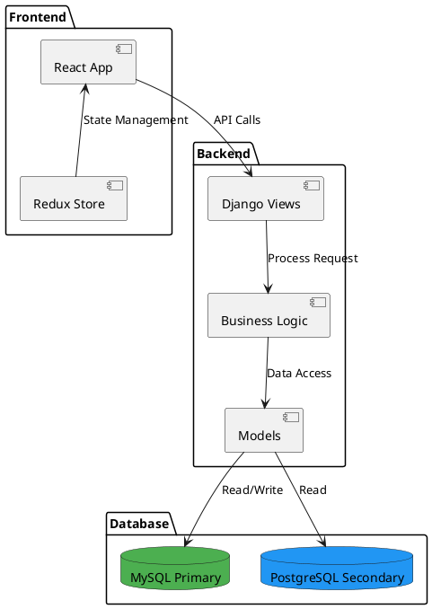
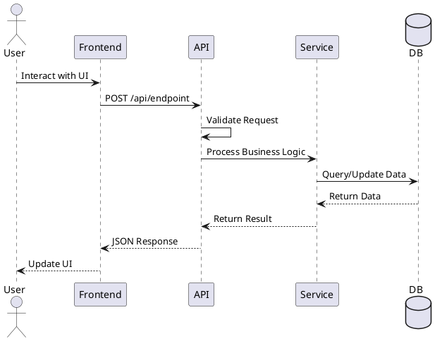
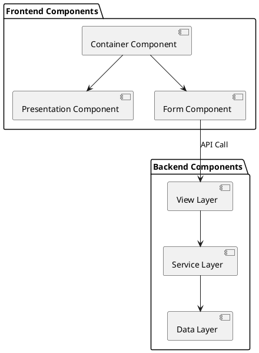
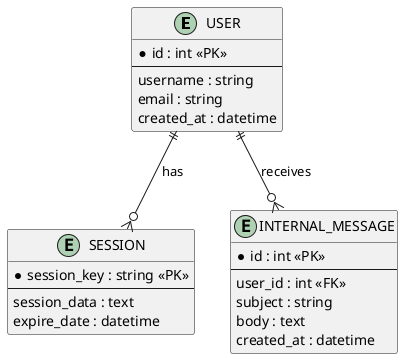

# System Diagrams

**Date**: 2025-11-12 04:15:48
**Generated by**: SDLCDesignAgent

---

## Architecture Diagram

---

## Sequence Diagram

---

## Component Diagram

---

## Database ER Diagram

---

*Generated by SDLCDesignAgent*
*Date: 2025-11-12 04:15:48*
