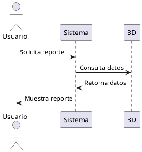

# Solicitud SC01 · Preparación de entorno MkDocs

Esta solicitud documenta los pasos necesarios para instalar MkDocs en los equipos de trabajo de IACT. Sigue el procedimiento
estándar para garantizar compatibilidad con la base documental y las herramientas de automatización del equipo de
Documentación y DevOps.

## Requisitos previos
- Python 3.8 o superior instalado y disponible en la variable de entorno `PATH`.
- Conectividad a Internet para descargar dependencias desde PyPI.
- Permisos para instalar paquetes en el entorno de trabajo (virtualenv recomendado).

## Pasos de instalación

### Opción 1: Instalación completa con requirements.txt (RECOMENDADO)

```bash
# Desde el directorio raíz del proyecto
cd docs
pip install -r requirements.txt
```

Esto instalará:
- MkDocs 1.5.3+
- Plugin Kroki (para PlantUML, Mermaid, C4)
- PyMdown Extensions (bloques de código avanzados)
- Plugins adicionales de navegación y fechas

### Opción 2: Instalación básica

1. Instala MkDocs mediante `pip`.
   ```bash
   pip install mkdocs>=1.5.3
   ```

2. Instala plugins esenciales para PlantUML:
   ```bash
   pip install mkdocs-kroki-plugin>=0.6.0
   pip install pymdown-extensions>=10.3
   ```

3. Verifica la instalación comprobando la versión.
   ```bash
   mkdocs --version
   ```
   El resultado esperado es similar a:
   ```
   mkdocs, version 1.5.3 from /usr/local/lib/python3.11/site-packages/mkdocs (Python 3.11)
   ```

## Notas adicionales
- **Manpages opcionales:** Si se requieren páginas de manual, instala `click-man` y genera la documentación correspondiente.
  ```bash
  pip install click-man
  click-man --target path/to/man/pages mkdocs
  ```
- **Consideraciones en Windows:** Algunos comandos pueden requerir el prefijo `python -m`.
  ```bash
  python -m pip install mkdocs
  python -m mkdocs
  ```
  Para una solución permanente, agrega el directorio `Scripts` de la instalación de Python a la variable `PATH`. Los instaladores
  recientes incluyen el script `win_add2path.py` en `Tools/Scripts/` para automatizar este paso.

---

## Renderizado de Diagramas PlantUML

El proyecto IACT utiliza diagramas PlantUML almacenados en `docs/anexos/diagramas/`. MkDocs puede renderizarlos automáticamente mediante el plugin Kroki.

### Cómo funciona

**Plugin Kroki**:
- Servicio online: https://kroki.io
- Convierte código PlantUML a SVG/PNG automáticamente
- No requiere instalación local de PlantUML
- Funciona con: PlantUML, Mermaid, C4, GraphViz, etc.

### Uso en documentos Markdown

#### Opción 1: Bloque de código inline

```markdown


El diagrama se renderizará automáticamente al ejecutar `mkdocs serve` o `mkdocs build`.

#### Opción 2: Referencia a archivo .puml existente

```markdown


[Fuente PlantUML](../anexos/diagramas/casos_de_uso/UC-001_generar_reporte_metricas.puml)
```

Para generar SVG desde archivos .puml:

```bash
# Instalar PlantUML localmente (opcional)
brew install plantuml  # macOS
apt-get install plantuml  # Ubuntu

# Generar SVG
cd docs/anexos/diagramas
plantuml -tsvg casos_de_uso/*.puml
plantuml -tsvg secuencia/*.puml
plantuml -tsvg actividad/*.puml
```

### Verificar configuración

1. Verifica que `docs/mkdocs.yml` incluya:
   ```yaml
   plugins:
     - search
     - kroki:
         ServerURL: https://kroki.io
         FileTypes:
           - plantuml
           - mermaid
         DownloadImages: true

   markdown_extensions:
     - pymdownx.superfences:
         custom_fences:
           - name: plantuml
             class: plantuml
             format: !!python/name:mkdocs_kroki_plugin.fences.fence_kroki
   ```

2. Ejecuta servidor de desarrollo:
   ```bash
   cd docs
   mkdocs serve
   ```

3. Abre http://127.0.0.1:8000 y navega a cualquier página con diagramas PlantUML.

### Ejemplo completo

Ver ejemplos funcionales en:
- [Guía de Casos de Uso](../../gobernanza/casos_de_uso_guide.md) - Sección 3
- [Diagramas UML](../../anexos/diagramas/readme.md) - Catálogo completo

### Troubleshooting

**Error: "Failed to render diagram"**
- Verifica conexión a internet (Kroki requiere acceso a https://kroki.io)
- Valida sintaxis PlantUML: http://www.plantuml.com/plantuml/uml/

**Diagramas no se muestran**
- Verifica que `mkdocs-kroki-plugin` esté instalado: `pip list | grep kroki`
- Revisa configuración en `mkdocs.yml` sección `plugins` y `markdown_extensions`

**Preferir renderizado local**
- Alternativa: Usar `plantuml-markdown` plugin
- Requiere: PlantUML instalado localmente
- Configuración diferente en `mkdocs.yml`

---

## Comandos útiles de MkDocs

```bash
# Servidor de desarrollo (auto-reload)
mkdocs serve

# Servidor en puerto específico
mkdocs serve -a 127.0.0.1:8080

# Construcción de sitio estático
mkdocs build

# Limpiar build anterior
mkdocs build --clean

# Desplegar a GitHub Pages
mkdocs gh-deploy

# Verificar configuración
mkdocs --version
mkdocs get-deps
```

---

## Checklist de finalización

- [ ] MkDocs instalado y accesible desde la terminal
- [ ] Versión 1.5.3+ verificada
- [ ] Plugin Kroki instalado (`pip list | grep kroki`)
- [ ] PyMdown Extensions instalado
- [ ] `mkdocs serve` ejecuta sin errores
- [ ] Diagramas PlantUML se renderizan correctamente
- [ ] Navegación a secciones principales funciona
- [ ] Manpages generadas (si aplica)
- [ ] Actualización de `PATH` confirmada en equipos Windows (si corresponde)

---

## Referencias

- [MkDocs Documentation](https://www.mkdocs.org/)
- [Kroki Plugin](https://github.com/AVATEAM-IT-SYSTEMHAUS/mkdocs-kroki-plugin)
- [PyMdown Extensions](https://facelessuser.github.io/pymdown-extensions/)
- [PlantUML Documentation](https://plantuml.com/)
- [Diagramas del Proyecto](../../anexos/diagramas/readme.md)
