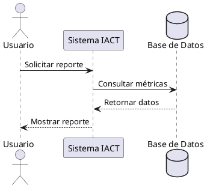
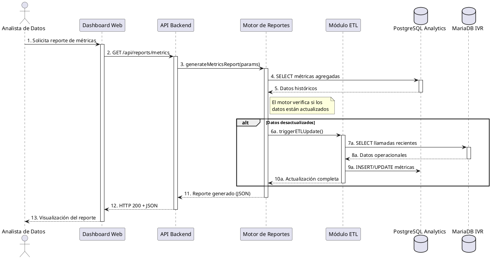
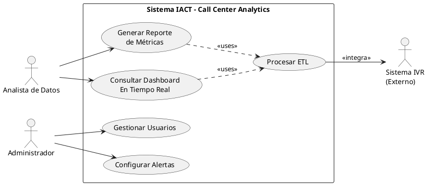
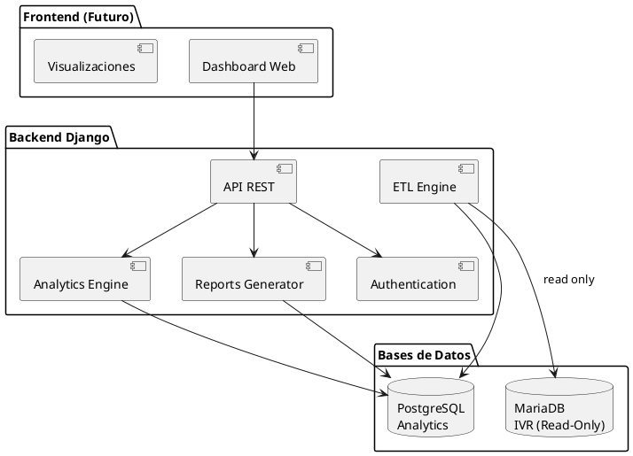
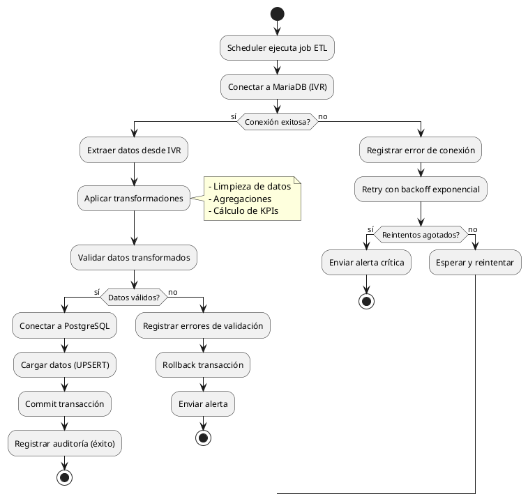

# Prueba de renderizado de diagramas PlantUML

Esta página prueba si el plugin Kroki renderiza correctamente diagramas PlantUML.

## Test 1: Diagrama inline simple



## Test 2: Diagrama de secuencia del proyecto

Diagrama real del proyecto UC-001:



## Test 3: Diagrama de casos de uso



## Test 4: Diagrama de componentes



## Test 5: Diagrama de actividad



## Resultado esperado

Si el plugin Kroki está configurado correctamente, deberías ver:
- OK 5 diagramas renderizados como imágenes SVG
- OK Los diagramas deberían ser interactivos y escalables
- OK No deberían aparecer bloques de código PlantUML sin renderizar

## Verificación

Para verificar que funciona:
1. Ejecutar: `mkdocs serve -f docs/mkdocs.yml`
2. Abrir: http://127.0.0.1:8000
3. Navegar a esta página
4. Verificar que los diagramas se rendericen correctamente

## Troubleshooting

Si los diagramas NO se renderizan:
- NO Verificar que `mkdocs-kroki-plugin` esté instalado
- NO Verificar conexión a internet (Kroki usa https://kroki.io)
- NO Revisar configuración en `mkdocs.yml`:
  ```yaml
  plugins:
    - kroki:
        ServerURL: https://kroki.io
  ```
- NO Verificar que `pymdownx.superfences` esté en `markdown_extensions`
