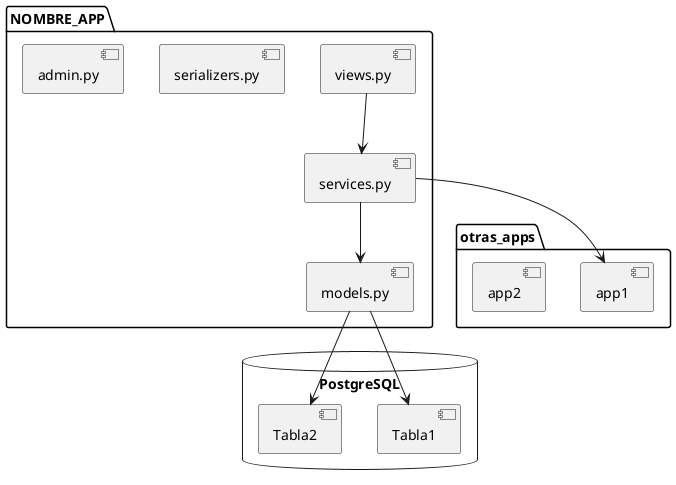
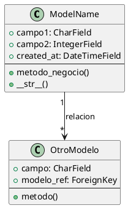
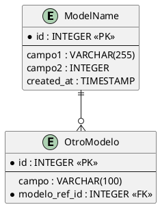
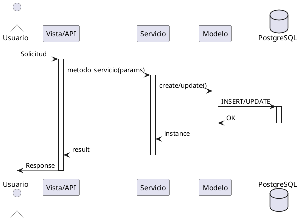

# Plantilla: Documentación de Aplicación Django

> **Instrucciones de uso**:
> 1. Copiar esta plantilla a la ubicación deseada (ej: `docs/implementacion/backend/diseno_detallado/app_<nombre>.md`)
> 2. Reemplazar `[NOMBRE_APP]` con el nombre real de la app Django
> 3. Completar cada sección con la información específica de la app
> 4. Eliminar secciones no aplicables y agregar nota explicativa
> 5. Actualizar el front matter con IDs y relaciones correctas
> 6. Generar diagramas en PlantUML para secciones 10-11

---

## 1. Información general

### Nombre de la aplicación
**Nombre técnico**: `[NOMBRE_APP]`
**Ubicación**: `api/callcentersite/callcentersite/apps/[NOMBRE_APP]/`

### Propósito y responsabilidad
<!-- Descripción clara y concisa de QUÉ hace esta app y POR QUÉ existe -->

**Responsabilidad principal**:
- [Responsabilidad 1]
- [Responsabilidad 2]

**Límites de responsabilidad** (qué NO hace esta app):
- [Límite 1]
- [Límite 2]

### Dependencias con otras apps

#### Apps Django de las que depende
| App | Motivo de dependencia | Componentes utilizados |
|-----|----------------------|------------------------|
| [app_name] | [razón] | [modelos/servicios/utils] |

#### Apps Django que dependen de esta
| App | Motivo de dependencia | Componentes expuestos |
|-----|----------------------|---------------------|
| [app_name] | [razón] | [servicios/modelos] |

#### Dependencias externas (third-party)
| Paquete | Versión | Propósito |
|---------|---------|-----------|
| [package] | [version] | [propósito] |

### Configuración requerida

#### Variables de entorno
```bash
# Descripción de variable
NOMBRE_VARIABLE=valor_ejemplo

# Otra variable
OTRA_VARIABLE=valor_ejemplo
```

#### Settings de Django
```python
# settings/base.py
INSTALLED_APPS = [
    ...
    'callcentersite.apps.[NOMBRE_APP]',
]

# Configuración específica de la app
[NOMBRE_APP]_CONFIG = {
    'setting_1': 'value',
    'setting_2': True,
}
```

---

## 2. Modelos (models.py)

### Lista de modelos

| Modelo | Propósito | Base de datos | Relaciones principales |
|--------|-----------|---------------|----------------------|
| [ModelName] | [descripción] | [default/ivr] | [relaciones] |

### Detalle por modelo

#### 2.1 Modelo: [ModelName]

**Propósito**: [Descripción del modelo]

**Tabla en BD**: `[nombre_tabla]`

**Campos**:

```python
class [ModelName](models.Model):
    """
    Descripción del modelo.

    Attributes:
        campo1: Descripción del campo
        campo2: Descripción del campo
    """
    # Campos principales
    campo1 = models.CharField(
        max_length=255,
        help_text="Descripción para admin"
    )

    campo2 = models.IntegerField(
        default=0,
        validators=[MinValueValidator(0)]
    )

    # Relaciones
    relacion = models.ForeignKey(
        'OtroModelo',
        on_delete=models.CASCADE,
        related_name='nombre_inverso'
    )

    # Timestamps
    created_at = models.DateTimeField(auto_now_add=True)
    updated_at = models.DateTimeField(auto_now=True)

    class Meta:
        db_table = 'nombre_tabla'
        verbose_name = 'Nombre singular'
        verbose_name_plural = 'Nombre plural'
        ordering = ['-created_at']
        indexes = [
            models.Index(fields=['campo1']),
        ]
        constraints = [
            models.UniqueConstraint(
                fields=['campo1', 'campo2'],
                name='unique_constraint_name'
            )
        ]
```

**Managers personalizados**:
```python
class [ModelName]Manager(models.Manager):
    """Manager para [ModelName]."""

    def active(self):
        """Retorna solo registros activos."""
        return self.filter(is_active=True)
```

**Métodos importantes**:
```python
def metodo_negocio(self):
    """
    Descripción del método.

    Returns:
        tipo: descripción del retorno

    Raises:
        ExceptionType: descripción de cuándo se lanza
    """
    pass
```

**Validaciones**:
- [Validación 1]: [descripción]
- [Validación 2]: [descripción]

**Database routing**:
- [x] Usa database router
- [ ] Siempre en base de datos default
- [ ] Siempre en base de datos secundaria

#### 2.2 Modelo: [OtroModelo]
<!-- Repetir estructura anterior para cada modelo -->

---

## 3. Servicios (services.py)

### Arquitectura de servicios

**Patrón utilizado**: [Service Layer / Repository / DDD / etc.]

**Ubicación**: `callcentersite.apps.[NOMBRE_APP].services`

### Lista de servicios

| Servicio/Clase | Responsabilidad | Dependencias |
|----------------|-----------------|--------------|
| [ServiceName] | [descripción] | [dependencias] |

### Detalle por servicio

#### 3.1 Servicio: [ServiceName]

**Propósito**: [Descripción del servicio]

**Ubicación**: `services.py` o `services/[nombre].py`

**Clase/Módulo**:
```python
class [ServiceName]:
    """
    Descripción del servicio.

    Este servicio se encarga de [responsabilidad principal].

    Example:
        >>> service = [ServiceName]()
        >>> result = service.metodo_principal(param1, param2)
    """

    def __init__(self):
        """Inicializa el servicio con sus dependencias."""
        self.dependency = SomeDependency()
```

#### Métodos públicos

##### 3.1.1 `metodo_principal(param1: tipo, param2: tipo) -> tipo`

**Descripción**: [Qué hace este método]

**Parámetros**:
- `param1` (tipo): [descripción]
- `param2` (tipo): [descripción]

**Retorna**:
- `tipo`: [descripción del retorno]

**Excepciones**:
- `ValidationError`: [cuándo se lanza]
- `CustomException`: [cuándo se lanza]

**Ejemplo de uso**:
```python
from callcentersite.apps.[NOMBRE_APP].services import [ServiceName]

service = [ServiceName]()
result = service.metodo_principal(
    param1="valor1",
    param2=123
)
```

**Reglas de negocio aplicadas**:
1. [Regla 1]
2. [Regla 2]

**Consideraciones de performance**:
- [Consideración 1]
- [Consideración 2]

##### 3.1.2 `otro_metodo(...) -> tipo`
<!-- Repetir estructura anterior para cada método público importante -->

#### 3.2 Servicio: [OtroServicio]
<!-- Repetir estructura anterior para cada servicio -->

---

## 4. Vistas (views.py) - si aplica

> **Nota**: Omitir esta sección si la app no expone vistas/APIs.

### Tipo de vistas
- [ ] Function-based views (FBV)
- [ ] Class-based views (CBV)
- [ ] Django REST Framework ViewSets
- [ ] API Views personalizadas

### Lista de vistas/endpoints

| Vista/ViewSet | Tipo | URL | Método HTTP | Autenticación | Permisos |
|--------------|------|-----|-------------|---------------|----------|
| [ViewName] | [CBV/FBV] | [/api/path] | [GET/POST] | [Sí/No] | [permisos] |

### Detalle por vista

#### 4.1 Vista: [ViewName]

**Propósito**: [Qué hace esta vista]

**URL**: `[/api/endpoint/]`

**Métodos permitidos**: `[GET, POST, PUT, DELETE]`

**Código**:
```python
class [ViewName](APIView):
    """
    Descripción de la vista.
    """
    permission_classes = [IsAuthenticated]

    def get(self, request):
        """Maneja peticiones GET."""
        pass
```

**Autenticación requerida**: [Sí/No]

**Permisos requeridos**:
- [Permiso 1]
- [Permiso 2]

**Query parameters**:
| Parámetro | Tipo | Requerido | Descripción |
|-----------|------|-----------|-------------|
| [param] | [tipo] | [Sí/No] | [descripción] |

**Request body** (para POST/PUT):
```json
{
  "campo1": "valor",
  "campo2": 123
}
```

**Response**:
```json
{
  "status": "success",
  "data": {
    "campo1": "valor"
  }
}
```

**Códigos de respuesta**:
- `200 OK`: [descripción]
- `400 Bad Request`: [descripción]
- `404 Not Found`: [descripción]

#### 4.2 Vista: [OtraVista]
<!-- Repetir estructura anterior -->

---

## 5. URLs (urls.py) - si aplica

> **Nota**: Omitir si la app no define URLs propias.

**Namespace**: `[nombre_app]`

**Ubicación**: `callcentersite/apps/[NOMBRE_APP]/urls.py`

**Patrones definidos**:
```python
from django.urls import path
from . import views

app_name = '[NOMBRE_APP]'

urlpatterns = [
    path('endpoint/', views.ViewName.as_view(), name='endpoint-name'),
    path('endpoint/<int:pk>/', views.DetailView.as_view(), name='endpoint-detail'),
]
```

**Inclusión en URLs principales**:
```python
# callcentersite/urls.py
urlpatterns = [
    path('api/[NOMBRE_APP]/', include('callcentersite.apps.[NOMBRE_APP].urls')),
]
```

**URLs completas generadas**:
| Nombre | URL completa | Vista |
|--------|--------------|-------|
| [nombre] | [/api/path/] | [ViewName] |

---

## 6. Comandos de management

> **Nota**: Omitir si la app no define comandos personalizados.

**Ubicación**: `management/commands/`

### Lista de comandos

| Comando | Propósito | Frecuencia de uso |
|---------|-----------|-------------------|
| [comando] | [descripción] | [diaria/bajo demanda] |

### Detalle por comando

#### 6.1 Comando: `[nombre_comando]`

**Propósito**: [Descripción del comando]

**Ubicación**: `management/commands/[nombre_comando].py`

**Uso**:
```bash
python manage.py [nombre_comando] [argumentos] [opciones]
```

**Argumentos posicionales**:
| Argumento | Tipo | Descripción |
|-----------|------|-------------|
| [arg] | [tipo] | [descripción] |

**Opciones (flags)**:
| Opción | Tipo | Default | Descripción |
|--------|------|---------|-------------|
| --option | [tipo] | [default] | [descripción] |

**Ejemplos de uso**:
```bash
# Ejemplo 1: Uso básico
python manage.py [nombre_comando]

# Ejemplo 2: Con argumentos
python manage.py [nombre_comando] arg1 --option=value

# Ejemplo 3: Dry run
python manage.py [nombre_comando] --dry-run
```

**Comportamiento**:
1. [Paso 1 del comando]
2. [Paso 2 del comando]

**Efectos secundarios**:
- [Efecto 1]
- [Efecto 2]

**Validaciones previas**:
- [Validación 1]
- [Validación 2]

**Consideraciones**:
- **Seguridad**: [¿Se puede ejecutar en producción? ¿Requiere precauciones?]
- **Performance**: [Tiempo estimado, recursos utilizados]
- **Idempotencia**: [¿Se puede ejecutar múltiples veces sin efectos negativos?]
- **Rollback**: [¿Cómo revertir si algo sale mal?]

#### 6.2 Comando: `[otro_comando]`
<!-- Repetir estructura anterior -->

---

## 7. Signals y receivers

> **Nota**: Omitir si la app no usa signals.

### Signals emitidos por esta app

| Signal | Cuándo se emite | Parámetros (sender, kwargs) |
|--------|-----------------|----------------------------|
| [signal_name] | [descripción] | sender=[Model], created=[bool] |

**Definición**:
```python
# signals.py
from django.dispatch import Signal

custom_signal = Signal()
```

**Emisión**:
```python
# Dónde se emite
custom_signal.send(
    sender=self.__class__,
    instance=self,
    custom_param=value
)
```

### Signals de Django escuchados

| Signal origen | Modelo sender | Función del receiver | Ubicación |
|---------------|---------------|---------------------|-----------|
| post_save | [Model] | [qué hace] | signals.py |

**Receivers**:
```python
from django.db.models.signals import post_save
from django.dispatch import receiver

@receiver(post_save, sender=ModelName)
def on_model_save(sender, instance, created, **kwargs):
    """
    Descripción de qué hace este receiver.

    Args:
        sender: La clase del modelo
        instance: La instancia guardada
        created: True si fue creado, False si fue actualizado
    """
    if created:
        # Lógica para creación
        pass
    else:
        # Lógica para actualización
        pass
```

**Registro de signals**:
```python
# apps.py
class [NombreApp]Config(AppConfig):
    default_auto_field = 'django.db.models.BigAutoField'
    name = 'callcentersite.apps.[NOMBRE_APP]'

    def ready(self):
        import callcentersite.apps.[NOMBRE_APP].signals
```

---

## 8. Tests

### Estrategia de testing

**Cobertura actual**: [X%]

**Ubicación de tests**: `tests/` o `tests/[NOMBRE_APP]/`

**Tipos de tests implementados**:
- [x] Unit tests (modelos)
- [x] Unit tests (servicios)
- [ ] Integration tests
- [ ] API tests
- [ ] E2E tests

### Estructura de tests

```
tests/[NOMBRE_APP]/
├── __init__.py
├── conftest.py              # Fixtures compartidos
├── test_models.py           # Tests de modelos
├── test_services.py         # Tests de servicios
├── test_views.py            # Tests de vistas/APIs
├── test_commands.py         # Tests de comandos
└── factories.py             # Factories para test data
```

### Tests importantes

#### 8.1 Tests de modelos

**Archivo**: `tests/[NOMBRE_APP]/test_models.py`

**Tests clave**:
- `test_[model]_creation`: Verifica creación correcta
- `test_[model]_validation`: Verifica validaciones
- `test_[model]_relationships`: Verifica relaciones
- `test_[model]_manager_methods`: Verifica managers personalizados

**Ejemplo**:
```python
import pytest
from callcentersite.apps.[NOMBRE_APP].models import ModelName

@pytest.mark.django_db
class TestModelName:
    def test_model_creation(self):
        """Test que el modelo se crea correctamente."""
        instance = ModelName.objects.create(
            campo1="valor",
            campo2=123
        )
        assert instance.campo1 == "valor"
        assert instance.campo2 == 123
```

#### 8.2 Tests de servicios

**Archivo**: `tests/[NOMBRE_APP]/test_services.py`

**Tests clave**:
- Tests de lógica de negocio
- Tests de manejo de excepciones
- Tests de edge cases

#### 8.3 Fixtures y factories

**Archivo**: `tests/[NOMBRE_APP]/conftest.py`

```python
import pytest
from callcentersite.apps.[NOMBRE_APP].models import ModelName

@pytest.fixture
def model_instance():
    """Fixture que crea una instancia de prueba."""
    return ModelName.objects.create(
        campo1="test",
        campo2=100
    )
```

**Factories** (si se usa factory_boy):
```python
import factory
from callcentersite.apps.[NOMBRE_APP].models import ModelName

class ModelNameFactory(factory.django.DjangoModelFactory):
    class Meta:
        model = ModelName

    campo1 = factory.Sequence(lambda n: f"valor_{n}")
    campo2 = factory.Faker('random_int', min=1, max=100)
```

### Ejecutar tests

```bash
# Todos los tests de la app
pytest tests/[NOMBRE_APP]/

# Tests específicos
pytest tests/[NOMBRE_APP]/test_models.py

# Con cobertura
pytest --cov=callcentersite.apps.[NOMBRE_APP] tests/[NOMBRE_APP]/

# Tests marcados
pytest -m "unit" tests/[NOMBRE_APP]/
```

---

## 9. Configuración adicional

### Admin de Django

**Archivo**: `admin.py`

**Modelos registrados**:
| Modelo | Personalización | Filtros | Búsqueda |
|--------|----------------|---------|----------|
| [Model] | [Sí/No] | [campos] | [campos] |

**Ejemplo de customización**:
```python
from django.contrib import admin
from .models import ModelName

@admin.register(ModelName)
class ModelNameAdmin(admin.ModelAdmin):
    list_display = ['campo1', 'campo2', 'created_at']
    list_filter = ['campo1', 'created_at']
    search_fields = ['campo1']
    readonly_fields = ['created_at', 'updated_at']
```

### Permisos personalizados

```python
class ModelName(models.Model):
    ...

    class Meta:
        permissions = [
            ("can_approve", "Can approve records"),
            ("can_export", "Can export data"),
        ]
```

### Configuración de Apps

```python
# apps.py
from django.apps import AppConfig

class [NombreApp]Config(AppConfig):
    default_auto_field = 'django.db.models.BigAutoField'
    name = 'callcentersite.apps.[NOMBRE_APP]'
    verbose_name = '[Nombre Legible]'

    def ready(self):
        """
        Código que se ejecuta cuando Django inicia.
        Útil para registrar signals, inicializar conexiones, etc.
        """
        import callcentersite.apps.[NOMBRE_APP].signals
```

---

## 10. Diagramas

### 10.1 Diagrama de componentes



### 10.2 Diagrama de clases (modelos)



### 10.3 Diagrama ER (entidad-relación)



---

## 11. Flujos principales

### 11.1 Flujo: [Nombre del flujo principal]

**Descripción**: [Descripción del flujo de negocio]

**Diagrama de secuencia**:



**Pasos**:
1. [Paso 1]
2. [Paso 2]
3. [Paso 3]

**Reglas de negocio aplicadas**:
- [Regla 1]
- [Regla 2]

### 11.2 Flujo: [Otro flujo importante]
<!-- Repetir estructura anterior -->

---

## 12. Troubleshooting

### Problemas comunes

#### 12.1 [Nombre del problema]

**Síntoma**: [Descripción del problema]

**Causa**: [Por qué ocurre]

**Solución**:
```bash
# Comandos o pasos para resolverlo
```

**Prevención**: [Cómo evitarlo]

#### 12.2 [Otro problema común]
<!-- Repetir estructura -->

### Logs importantes

**Ubicación de logs**: [ruta o configuración]

**Qué buscar en logs**:
```python
# Ejemplos de logs relevantes
logger.info(f"[NOMBRE_APP] Processing...")
logger.error(f"[NOMBRE_APP] Error: {error}")
```

---

## 13. Referencias y recursos

### Documentación relacionada
- [Link a arquitectura general](../../arquitectura/readme.md)
- [Link a database design](database_design.md)
- [Link a API reference](api_reference.md)

### ADRs relacionados
- [ADR-XXXX]: [Título del ADR]

### Issues y decisiones
- [Issue #123]: [Descripción]
- [Decision]: [Decisión arquitectónica importante]

### Recursos externos
- [Django documentation sobre tema relevante]
- [Third-party package documentation]

---

## Historial de cambios

| Fecha | Versión | Autor | Cambios |
|-------|---------|-------|---------|
| 2025-11-04 | 1.0.0 | [autor] | Creación inicial |

---

## Notas adicionales

<!-- Cualquier información adicional relevante que no encaje en las secciones anteriores -->

---

**Última actualización**: 2025-11-04
**Próxima revisión**: [fecha]
**Responsable**: [nombre]
