# Índice Maestro de Requisitos - IACT Backend

**Versión:** 1.0
**Fecha:** 2025-11-04
**Estado:** En Desarrollo

---

## DOCS Estructura de Documentación

```
docs/implementacion/backend/requisitos/
├── INDICE_REQUISITOS.md              # Este archivo - índice maestro
├── README.md                          # Guía de navegación
├── restricciones_y_lineamientos.md   # Restricciones críticas del proyecto
├── negocio/                           # Reglas de negocio por componente
│   └── rn_c01_autenticacion_sesiones.md
└── funcionales/                       # Requisitos funcionales
    ├── RF-001 a RF-004 (users)
    └── RF-005 a RF-010 (authentication)
```

---

## OBJETIVO Componentes del Sistema

### Componente 1: Autenticación y Sesiones
**Estado:** OK Requisitos Completos | ESPERANDO Tests Pendientes | ESPERANDO Implementación Pendiente

| ID | Documento | Estado | Tests | Código |
|----|-----------|--------|-------|--------|
| RN-C01 | [Reglas de Negocio](negocio/rn_c01_autenticacion_sesiones.md) | OK Completo (14/14) | - | - |
| RF-005 | [Login con Credenciales Locales](funcionales/rf005_login_credenciales_locales.md) | OK Documentado | ESPERANDO Pendiente (0/11) | ESPERANDO Pendiente |
| RF-006 | [Tokens JWT](funcionales/rf006_tokens_jwt.md) | OK Documentado | ESPERANDO Pendiente (0/15) | ESPERANDO Pendiente |
| RF-007 | [Logout Manual](funcionales/rf007_logout_manual.md) | OK Documentado | ESPERANDO Pendiente (0/11) | ESPERANDO Pendiente |
| RF-008 | [Cierre por Inactividad](funcionales/rf008_cierre_inactividad.md) | OK Documentado | ESPERANDO Pendiente (0/10) | ESPERANDO Pendiente |
| RF-009 | [Passwords e Intentos Fallidos](funcionales/rf009_gestion_passwords_intentos_fallidos.md) | OK Documentado | ESPERANDO Pendiente (0/23) | ESPERANDO Pendiente |
| RF-010 | [Sesión Única](funcionales/rf010_sesion_unica.md) | OK Documentado | ESPERANDO Pendiente (0/11) | ESPERANDO Pendiente |

**Total Tests Definidos:** 81 casos de prueba
**Total Escenarios Gherkin:** 53 escenarios

---

## Componente 2: Gestión de Usuarios (Parcial)

| ID | Documento | Estado | Tests | Código |
|----|-----------|--------|-------|--------|
| RF-001 | [Evaluación de Permisos (3 niveles)](funcionales/rf001_evaluacion_permisos_tres_niveles.md) | OK Documentado | OK Completo (10/10) | ESPERANDO Pendiente |
| RF-002 | [Gestión de Permisos Granulares](funcionales/rf002_gestion_permisos_granulares.md) | OK Documentado | OK Completo (27/27) | ESPERANDO Pendiente |
| RF-003 | [Obtener Permisos Efectivos](funcionales/rf003_obtener_permisos_efectivos_usuario.md) | OK Documentado | OK Completo (10/10) | ESPERANDO Pendiente |
| RF-004 | [Segmentos con Criterios Dinámicos](funcionales/rf004_segmentos_criterios_dinamicos.md) | OK Documentado | OK Completo (27/27) | ESPERANDO Pendiente |

**Total Tests Definidos:** 37 casos de prueba (implementados)
**Estado:** Tests creados pero no ejecutables (configuración pendiente)

---

## Mapa de Trazabilidad

### Reglas de Negocio -> Requisitos Funcionales

```mermaid
graph TD
    RN[RN-C01: Autenticación y Sesiones]
    RN --> RN01[RN-C01-01: Login Credenciales]
    RN --> RN02[RN-C01-02: Validación Credenciales]
    RN --> RN03[RN-C01-03: Generación JWT]
    RN --> RN04[RN-C01-04: Validación JWT]
    RN --> RN05[RN-C01-05: Logout Manual]
    RN --> RN06[RN-C01-06: Cierre Inactividad]
    RN --> RN07[RN-C01-07: Complejidad Passwords]
    RN --> RN08[RN-C01-08: Intentos Fallidos]
    RN --> RN09[RN-C01-09: Bloqueo Temporal]
    RN --> RN10[RN-C01-10: Hash bcrypt]
    RN --> RN11[RN-C01-11: Refresh Token]
    RN --> RN12[RN-C01-12: Auditoría Login]
    RN --> RN13[RN-C01-13: Sesiones PostgreSQL]
    RN --> RN14[RN-C01-14: Sesión Única]

    RN01 --> RF005[RF-005: Login]
    RN02 --> RF005

    RN03 --> RF006[RF-006: Tokens JWT]
    RN04 --> RF006
    RN11 --> RF006

    RN05 --> RF007[RF-007: Logout]

    RN06 --> RF008[RF-008: Cierre Inactividad]

    RN07 --> RF009[RF-009: Passwords]
    RN08 --> RF009
    RN09 --> RF009
    RN10 --> RF009

    RN13 --> RF010[RF-010: Sesión Única]
    RN14 --> RF010
```



### Requisitos Funcionales -> Tests

| Requisito | Archivo de Tests | Tests Unitarios | Tests Integración | Tests Seguridad |
|-----------|------------------|-----------------|-------------------|-----------------|
| RF-005 | `tests/authentication/test_login.py` | 11 | 2 | 3 |
| RF-006 | `tests/authentication/test_tokens.py` | 15 | 2 | 3 |
| RF-007 | `tests/authentication/test_logout.py` | 11 | 2 | - |
| RF-008 | `tests/authentication/test_inactivity.py` | 10 | 2 | - |
| RF-009 | `tests/authentication/test_passwords.py` | 23 | 2 | - |
| RF-010 | `tests/authentication/test_single_session.py` | 11 | 2 | 2 |

---

## NOTA Restricciones Críticas del Proyecto

Documento: [restricciones_y_lineamientos.md](restricciones_y_lineamientos.md)

### Top 10 Restricciones (Más Impactantes)

| # | Código | Restricción | Impacto en Requisitos |
|---|--------|-------------|----------------------|
| 1 | RESTR-001 | NO NO EMAIL - Solo buzón interno | RF-005, RF-008, RF-009 |
| 2 | RESTR-002 | CRITICO IVR DB READONLY - Cero escrituras | (Componente IVR) |
| 3 | RESTR-003 | SAVE SESSIONS IN DB - No Redis | RF-005, RF-007, RF-008, RF-010 |
| 4 | RESTR-004 | ⏱ NO REAL-TIME - ETL 6-12h | (Componente Analytics) |
| 5 | RESTR-005 | CONFIG DEBUG=FALSE - Siempre producción | Todos los RF |
| 6 | RESTR-006 | CRITICO JWT + PERMISSIONS - Auth robusta | RF-005, RF-006 |
| 7 | RESTR-007 | FILE PAGINATION - Siempre activa | (APIs futuras) |
| 8 | RESTR-008 | NOTA AUDITING - Logs obligatorios | RF-005, RF-007, RF-008, RF-009 |
| 9 | RESTR-009 | CRITICO NO CVE HIGH - Deps seguras | Todos los RF |
| 10 | RESTR-010 | DELETE LOGICAL DELETE - No físico | Todos los modelos |

---

## STATS Dashboard de Progreso

### Por Fase de Desarrollo

```
Documentación: ████████████████████ 100% (10/10 documentos)
Tests:         ███░░░░░░░░░░░░░░░░░  15% (37/244 implementados, 0 pasando)
Implementación: ░░░░░░░░░░░░░░░░░░░░   0% (0/10 módulos)
```

### Por Componente

**Componente 1: Autenticación y Sesiones**
- Documentación: OK 100% (6/6 RF completos)
- Tests: ESPERANDO 0% (0/81 implementados)
- Código: ESPERANDO 0%

**Componente 2: Gestión de Usuarios**
- Documentación: OK 100% (4/4 RF completos)
- Tests: WARNING 100% implementados pero no ejecutables (37/37)
- Código: ESPERANDO 0%

---

## BUSCAR Búsqueda Rápida

### Por Funcionalidad

- **Login/Autenticación**: RF-005, RF-006, RN-C01-01, RN-C01-02, RN-C01-03
- **Tokens JWT**: RF-006, RN-C01-03, RN-C01-04, RN-C01-11
- **Logout**: RF-007, RN-C01-05
- **Sesiones**: RF-008, RF-010, RN-C01-06, RN-C01-13, RN-C01-14
- **Contraseñas**: RF-009, RN-C01-07, RN-C01-10
- **Intentos Fallidos**: RF-009, RN-C01-08, RN-C01-09
- **Permisos**: RF-001, RF-002, RF-003
- **Segmentos**: RF-004

### Por Tecnología

- **bcrypt**: RF-005, RF-009, RN-C01-02, RN-C01-10
- **JWT (djangorestframework-simplejwt)**: RF-005, RF-006, RN-C01-03, RN-C01-04, RN-C01-11
- **PostgreSQL**: RF-010, RN-C01-13, RESTR-003
- **APScheduler**: RF-008, RN-C01-06
- **Django Sessions**: RF-010, RN-C01-13

### Por Prioridad

**Crítica:**
- RF-005: Login con Credenciales Locales
- RF-006: Tokens JWT
- RF-009: Passwords e Intentos Fallidos
- RF-010: Sesión Única

**Alta:**
- RF-007: Logout Manual
- RF-008: Cierre por Inactividad

---

## NOTA Convenciones de Nomenclatura

### Códigos de Requisitos

```
RN-C##-##  -> Regla de Negocio - Componente ## - Número ##
            Ejemplo: RN-C01-03 (Componente 1, Regla 3)

RF-###     -> Requisito Funcional - Número ###
            Ejemplo: RF-005

TEST-###-### -> Test del Requisito ### - Número ###
               Ejemplo: TEST-005-001

IMPL-###   -> Implementación del Requisito ###
            Ejemplo: IMPL-005
```

### Estados

- OK **Completo**: Documentado, testeado y implementado
- WARNING **Parcial**: Avance pero no completo
- ESPERANDO **Pendiente**: No iniciado
- NO **Bloqueado**: Dependencias sin resolver

---

## Historial de Cambios

| Fecha | Versión | Cambios |
|-------|---------|---------|
| 2025-11-04 | 1.0 | Creación inicial del índice maestro |
| 2025-11-04 | 1.0 | Documentación completa RN-C01 (14 reglas) |
| 2025-11-04 | 1.0 | Documentación completa RF-005 a RF-010 (6 requisitos) |

---

## Contactos

**Owner Backend:** equipo-backend
**Stakeholders:** usuarios-finales, administradores-sistema, gerentes-seguridad
**Documentación:** Este repositorio

---

## Enlaces Útiles

- [ISO/IEC/IEEE 29148:2018](https://www.iso.org/standard/72089.html) - Estándar de requisitos
- [OWASP ASVS](https://owasp.org/www-project-application-security-verification-standard/) - Estándares de seguridad
- [Django Sessions](https://docs.djangoproject.com/en/stable/topics/http/sessions/) - Documentación Django
- [djangorestframework-simplejwt](https://django-rest-framework-simplejwt.readthedocs.io/) - Documentación JWT

---

**Última actualización:** 2025-11-04
**Próxima revisión:** TBD
