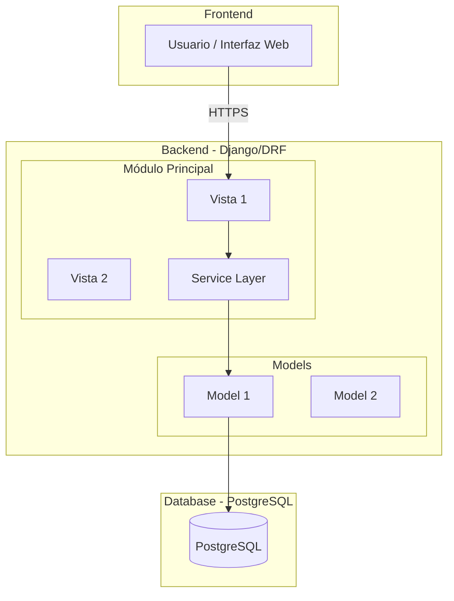
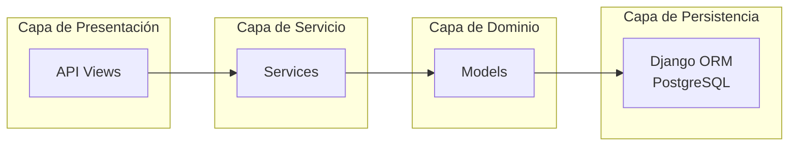
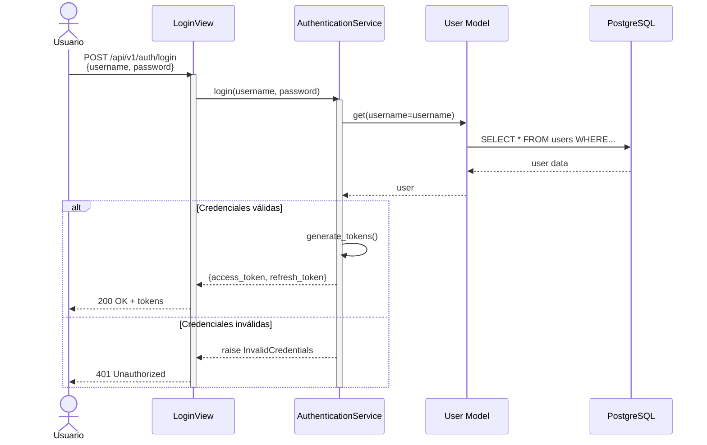
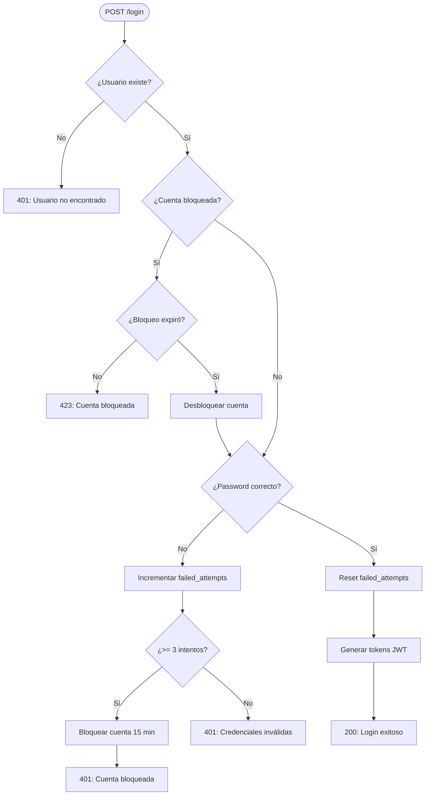
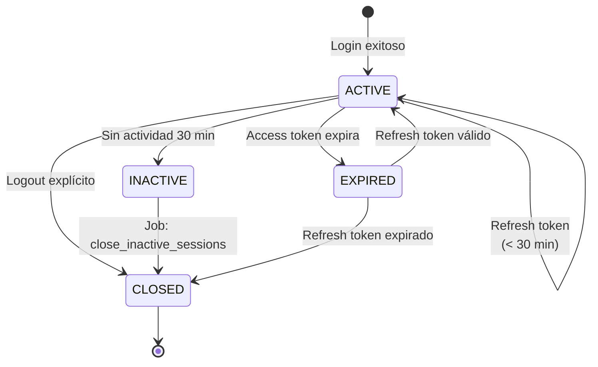
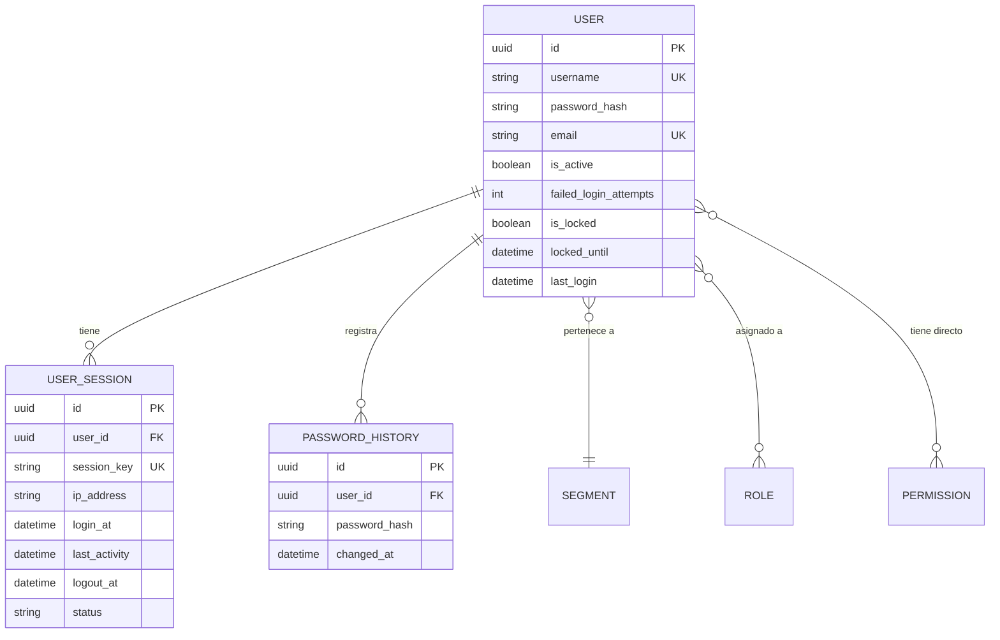

# Procedimiento: Diseño Técnico Detallado

## Propósito

Establecer el proceso para crear documentos de diseño técnico detallado que describan la arquitectura, componentes, flujos de secuencia, diagramas de estado y modelos de datos de funcionalidades o componentes del sistema IACT.

## Alcance

Aplica a todo diseño técnico de componentes, módulos o funcionalidades significativas del proyecto IACT que deriven de requisitos funcionales (RF-XXX) o requisitos de negocio (RN-XXX).

## Página padre
- [Procesos de Gobernanza](readme.md)
- [Gobernanza](../readme.md)

---

## Cuándo Usar Este Procedimiento

### OK Usar cuando:

- Se inicia el diseño de una nueva funcionalidad con ≥ 3 requisitos funcionales
- Se requiere modificación arquitectónica de componentes existentes
- Se necesita documentar diagramas de secuencia, flujo o estados
- Stakeholders solicitan especificación técnica antes de implementación
- Se implementan componentes críticos de seguridad o RBAC

### NO No usar para:

- Cambios triviales o refactoring sin impacto arquitectónico
- Documentación de APIs (usar `plantilla_api_reference.md`)
- Documentación de apps Django (usar `plantilla_django_app.md`)
- Bug fixes sin cambios de diseño

---

## Roles y Responsabilidades

| Rol | Responsabilidad |
|-----|-----------------|
| **Tech Lead / Arquitecto** | Crear y aprobar el documento de diseño técnico |
| **BA (Business Analyst)** | Validar trazabilidad a requisitos de negocio |
| **Desarrollador Asignado** | Revisar factibilidad técnica y esfuerzo |
| **QA Lead** | Validar criterios de aceptación y testabilidad |
| **Product Owner** | Aprobar alcance y prioridad del diseño |

---

## Proceso Paso a Paso

### FASE 1: Preparación y Análisis de Requisitos

#### 1.1 Identificar Requisitos Origen

**Entrada:**
- Lista de requisitos funcionales (RF-XXX)
- Requisitos de negocio (RN-XXX)
- Necesidades (N-XXX) si aplica

**Acción:**
```markdown
# Ejemplo de trazabilidad upward en frontmatter
---
trazabilidad_upward:
  - N-001  # Necesidad: Autenticación segura
  - RN-001 # Requisito de negocio: Sistema de login
  - RF-005 # Requisito funcional: Login con credenciales locales
  - RF-006 # Requisito funcional: Logout y cierre de sesión
  - RF-007 # Requisito funcional: Refresh token
---
```

**Salida:**
- Mapa de requisitos validado
- Confirmación de alcance con Product Owner

**Checklist:**
- [ ] Todos los RF-XXX tienen trazabilidad a RN-XXX o N-XXX
- [ ] Se identificaron dependencias con otros componentes
- [ ] Restricciones técnicas documentadas (ver `restricciones_y_lineamientos.md`)

---

#### 1.2 Crear Documento Base

**Acción:**

1. Crear archivo en `docs/implementacion/{dominio}/diseno/`
   - Nomenclatura: `DISENO_TECNICO_{COMPONENTE}.md`
   - Ejemplo: `DISENO_TECNICO_AUTENTICACION.md`

2. Incluir header estándar:

```markdown
# Diseño Técnico: {Nombre del Componente}

**Versión:** 1.0
**Fecha:** {YYYY-MM-DD}
**Componente:** {Nombre + número si aplica}
**Estado:** En Diseño | Aprobado | Implementado

---

## NOTA Tabla de Contenidos

1. [Arquitectura General](#1-arquitectura-general)
2. [Diagramas de Secuencia](#2-diagramas-de-secuencia)
3. [Diagramas de Flujo](#3-diagramas-de-flujo)
4. [Diagramas de Estados](#4-diagramas-de-estados)
5. [Modelo de Datos](#5-modelo-de-datos)
6. [Arquitectura de Componentes](#6-arquitectura-de-componentes)
7. [Trazabilidad a Requisitos](#7-trazabilidad-a-requisitos)
```

**Checklist:**
- [ ] Nombre de archivo sigue convención `DISENO_TECNICO_{COMPONENTE}.md`
- [ ] Header incluye versión, fecha, componente, estado
- [ ] Tabla de contenidos completa con links funcionales

---

### FASE 2: Documentar Arquitectura y Diagramas

#### 2.1 Arquitectura General

**Descripción:**
Documentar la vista de alto nivel del componente usando **diagramas Mermaid**.

**Formato requerido:**

```markdown
## 1. Arquitectura General

### 1.1 Vista de Alto Nivel



### 1.2 Capas de la Aplicación


```

**Checklist:**
- [ ] Diagrama de alto nivel incluye frontend, backend, database
- [ ] Diagrama de capas sigue patrón Presentación -> Servicio -> Dominio -> Persistencia
- [ ] Subgrafos agrupan componentes relacionados
- [ ] Estilos visuales aplicados (fill colors)

---

#### 2.2 Diagramas de Secuencia

**Descripción:**
Documentar flujos de interacción paso a paso para cada requisito funcional.

**Regla obligatoria:**
- **1 diagrama de secuencia por cada RF-XXX**
- Título del diagrama debe incluir el ID del requisito

**Formato requerido:**

```markdown
## 2. Diagramas de Secuencia

### 2.1 RF-005: Login con Credenciales Locales


```

**Elementos obligatorios:**
- `actor` para usuarios finales
- `participant` para componentes del sistema
- `activate` / `deactivate` para mostrar scope de ejecución
- `alt` / `else` / `end` para flujos condicionales
- Anotaciones de códigos HTTP (200, 401, 403, 404, 500)

**Checklist:**
- [ ] 1 diagrama por cada RF-XXX principal
- [ ] Incluye casos de éxito (happy path)
- [ ] Incluye casos de error (validaciones, excepciones)
- [ ] Muestra interacción con base de datos
- [ ] Nombres de participantes coinciden con código real

---

#### 2.3 Diagramas de Flujo

**Descripción:**
Documentar lógica de decisión compleja con flowcharts.

**Formato requerido:**

```markdown
## 3. Diagramas de Flujo

### 3.1 Flujo de Validación de Credenciales


```

**Checklist:**
- [ ] Usa `flowchart TD` (top-down) o `LR` (left-right)
- [ ] Decisiones en rombos `{¿Pregunta?}`
- [ ] Procesos en rectángulos `[Acción]`
- [ ] Inicio/fin en óvalos `([Inicio])`
- [ ] Códigos HTTP en nodos de salida

---

#### 2.4 Diagramas de Estados

**Descripción:**
Documentar ciclo de vida de entidades con estados bien definidos.

**Formato requerido:**

```markdown
## 4. Diagramas de Estados

### 4.1 Estados de UserSession


```

**Checklist:**
- [ ] Estados en MAYÚSCULAS
- [ ] Transiciones con triggers claros
- [ ] Estado inicial `[*]` y final `[*]` definidos
- [ ] Transiciones reflexivas cuando aplica (ACTIVE -> ACTIVE)

---

#### 2.5 Modelo de Datos

**Descripción:**
Documentar estructura de tablas PostgreSQL con relaciones.

**Formato requerido:**

```markdown
## 5. Modelo de Datos

### 5.1 Diagrama ER


```

**Elementos obligatorios:**
- Tipos de datos PostgreSQL (`uuid`, `string`, `int`, `boolean`, `datetime`, `jsonb`)
- Claves primarias marcadas con `PK`
- Claves foráneas marcadas con `FK`
- Unique keys marcadas con `UK`
- Cardinalidad correcta (`||--o{`, `}o--||`, etc.)

**Checklist:**
- [ ] Todas las tablas incluyen `id uuid PK`
- [ ] Foreign keys referencian tablas correctas
- [ ] Campos de auditoría incluidos (created_at, updated_at)
- [ ] Índices importantes documentados en notas

---

### FASE 3: Trazabilidad a Requisitos

#### 3.1 Matriz de Trazabilidad

**Descripción:**
Crear tabla que mapee cada componente/diagrama a sus requisitos origen.

**Formato requerido:**

```markdown
## 7. Trazabilidad a Requisitos

### 7.1 Matriz de Trazabilidad Forward (Requisitos -> Diseño)

| Requisito | Tipo | Título | Componentes de Diseño |
|-----------|------|--------|-----------------------|
| N-001 | Necesidad | Autenticación segura del sistema | Arquitectura General, AuthenticationService |
| RN-001 | Negocio | Sistema de login con credenciales locales | LoginView, TokenService |
| RF-005 | Funcional | Login con credenciales locales | Diagrama 2.1, Flujo 3.1 |
| RF-006 | Funcional | Logout y cierre de sesión | Diagrama 2.2, Estados 4.1 |
| RF-007 | Funcional | Refresh token | Diagrama 2.3, TokenService |
| RNF-001 | No Funcional | Tiempo de respuesta < 200ms | Rate limiting, Índices DB |

### 7.2 Matriz de Trazabilidad Backward (Diseño -> Tests)

| Componente de Diseño | Test ID | Ubicación del Test |
|----------------------|---------|-------------------|
| Diagrama 2.1 - Login | TEST-005 | `backend/tests/test_auth_login.py` |
| Diagrama 2.2 - Logout | TEST-006 | `backend/tests/test_auth_logout.py` |
| Diagrama 2.3 - Refresh | TEST-007 | `backend/tests/test_auth_refresh.py` |
| Flujo 3.1 - Validación | TEST-008 | `backend/tests/test_validation_flow.py` |
| Estados 4.1 - UserSession | TEST-009 | `backend/tests/test_session_states.py` |
```

**Checklist:**
- [ ] Matriz Forward: Todos los RF-XXX mapeados a secciones del diseño
- [ ] Matriz Backward: Todos los diagramas tienen tests asociados
- [ ] IDs de tests son trazables (TEST-XXX)
- [ ] Ubicaciones de tests son rutas reales en el proyecto

---

### FASE 4: Revisión y Aprobación

#### 4.1 Checklist de Completitud

Antes de solicitar revisión, validar:

**Estructura:**
- [ ] Header completo (versión, fecha, componente, estado)
- [ ] Tabla de contenidos con enlaces funcionales
- [ ] Secciones 1-7 completas

**Diagramas:**
- [ ] Arquitectura general (alto nivel + capas)
- [ ] ≥ 1 diagrama de secuencia por RF-XXX principal
- [ ] ≥ 1 diagrama de flujo para lógica compleja
- [ ] Diagrama de estados si aplica
- [ ] Modelo de datos ER completo

**Trazabilidad:**
- [ ] Matriz Forward: Requisitos -> Diseño
- [ ] Matriz Backward: Diseño -> Tests
- [ ] Todos los RF-XXX cubiertos
- [ ] Test IDs asignados

**Calidad:**
- [ ] Diagramas Mermaid renderizan correctamente
- [ ] Nombres coinciden con código real (views, services, models)
- [ ] Sin TODOs pendientes
- [ ] Sin placeholders tipo "FILL THIS"

---

#### 4.2 Proceso de Revisión

**Revisor 1: BA Lead**
- Valida trazabilidad upward (Diseño -> Requisitos)
- Confirma que todos los RF-XXX están cubiertos
- Aprueba alcance y prioridad

**Revisor 2: Tech Lead**
- Valida factibilidad técnica
- Revisa patrones arquitectónicos
- Aprueba decisiones de diseño

**Revisor 3: QA Lead**
- Valida trazabilidad downward (Diseño -> Tests)
- Confirma criterios de aceptación medibles
- Aprueba estrategia de testing

**Aprobación final:** Product Owner

---

#### 4.3 Cambio de Estado

Una vez aprobado:

1. Actualizar estado en header:
```markdown
**Estado:** Aprobado
**Fecha de Aprobación:** {YYYY-MM-DD}
**Aprobadores:** {Lista de nombres}
```

2. Crear ADR si hay decisiones arquitectónicas importantes:
   - Ubicación: `docs/arquitectura/adr/`
   - Ver plantilla: `plantilla_adr.md`

3. Notificar al equipo de desarrollo para inicio de implementación

---

## Herramientas y Referencias

### Herramientas Obligatorias

| Herramienta | Uso |
|-------------|-----|
| **Mermaid** | Todos los diagramas (sequence, flowchart, stateDiagram, erDiagram) |
| **Markdown** | Formato del documento |
| **Git** | Control de versiones del diseño |

### Plantillas Relacionadas

- `plantillas/plantilla_sad.md` - Software Architecture Document
- `plantillas/plantilla_tdd.md` - Technical Design Document
- `plantillas/plantilla_api_reference.md` - Para endpoints REST

### Referencias Externas

- **UML 2.5**: [OMG UML Specification](https://www.omg.org/spec/UML/2.5/)
- **C4 Model**: [c4model.com](https://c4model.com/)
- **ISO/IEC/IEEE 42010:2011**: Architecture description standard
- **Mermaid Docs**: [mermaid.js.org](https://mermaid.js.org/)

---

## Ejemplos del Proyecto

### Ejemplo Real: Sistema de Autenticación

**Ubicación:** `docs/implementacion/backend/diseno/DISENO_TECNICO_AUTENTICACION.md`

**Características destacadas:**
- 6 secciones completas con diagramas Mermaid
- Trazabilidad a RF-005, RF-006, RF-007
- 3 diagramas de secuencia detallados
- Modelo ER con 4 tablas relacionadas
- Estados de UserSession documentados

**Usar como referencia para:**
- Estructura de documento completo
- Diagramas de secuencia con casos de error
- Modelado de estados de sesión

---

## Métricas de Calidad

### KPIs del Proceso

| Métrica | Target | Medición |
|---------|--------|----------|
| Tiempo de creación de diseño | < 2 semanas | Fecha creación -> Fecha aprobación |
| % de requisitos cubiertos | 100% | (RF mapeados / RF totales) × 100 |
| % de diseños con tests trazables | 100% | (Diagramas con TEST-XXX / Total diagramas) × 100 |
| Ciclos de revisión | ≤ 2 | Número de rondas de feedback |

---

## Preguntas Frecuentes (FAQ)

### ¿Cuándo crear un diagrama de estados?

Cuando la entidad tiene:
- ≥ 3 estados distintos
- Transiciones de estado con reglas de negocio
- Ciclo de vida claramente definido

**Ejemplos:** UserSession, Order, Ticket, Workflow

---

### ¿Cuántos diagramas de secuencia son necesarios?

**Regla:** Mínimo 1 por cada RF-XXX principal.

Si un RF-XXX tiene múltiples escenarios complejos (ej: RF-010 con RBAC de 3 niveles), crear 1 diagrama por escenario.

---

### ¿Qué hacer si el diseño cambia durante implementación?

1. Documentar el cambio en un ADR (`arquitectura/adr/`)
2. Actualizar el documento de diseño técnico
3. Incrementar versión (1.0 -> 1.1)
4. Actualizar matriz de trazabilidad si cambian componentes

---

### ¿Cómo manejar diseños cross-domain (backend + frontend)?

**Opción A:** Documento único en `docs/implementacion/backend/diseno/` con sección específica de frontend

**Opción B:** Documentos separados con referencias cruzadas:
- `backend/diseno/DISENO_TECNICO_AUTH_BACKEND.md`
- `frontend/diseno/DISENO_TECNICO_AUTH_FRONTEND.md`

Incluir enlaces bidireccionales en ambos documentos.

---

## Control de Versiones

| Versión | Fecha | Cambios | Autor |
|---------|-------|---------|-------|
| 1.0.0 | 2025-11-04 | Creación inicial del procedimiento | Equipo Arquitectura |

---

## Aprobaciones

| Rol | Nombre | Fecha | Firma |
|-----|--------|-------|-------|
| Tech Lead | [Pendiente] | - | - |
| BA Lead | [Pendiente] | - | - |
| QA Lead | [Pendiente] | - | - |
